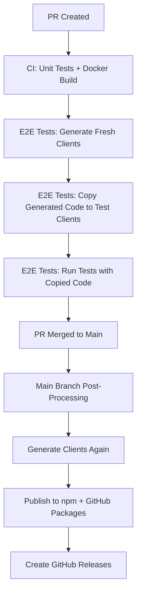
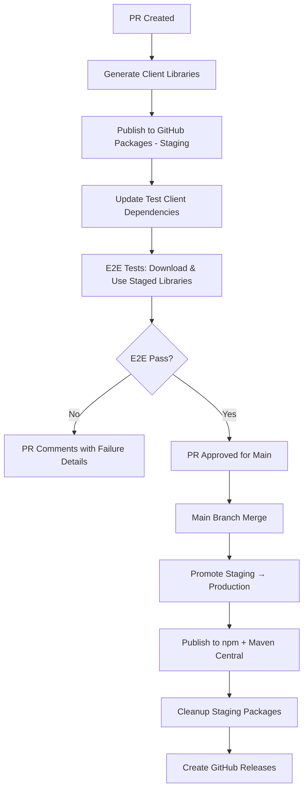

# OpenAPI Client Library Refactor Implementation Plan

## Overview

This document outlines a comprehensive plan to refactor the OpenAPI client generation and publishing workflow from a file-copying approach to a Docker-inspired staging → production architecture using GitHub Packages.

## Current State Analysis (December 2024)

### Current Architecture: Main-Branch-Only Publishing

#### Workflow Flow


#### Key Files & Components
- **OpenAPI Spec**: `/webauthn-server/src/main/resources/openapi/documentation.yaml`
- **Generation Config**: `/webauthn-server/build.gradle.kts` (lines 210-301)
- **TypeScript Output**: `/build/generated-clients/typescript/` → `/web-test-client/generated-client/`
- **Android Output**: `/build/generated-clients/android/` → `/android-test-client/client-library/`
- **Publishing Workflow**: `.github/workflows/main-branch-post-processing.yml`
- **Version Management**: `/scripts/core/version-manager.sh`

#### Current Strengths
✅ **Robust E2E Integration**: Generated clients thoroughly tested before publishing  
✅ **Centralized Configuration**: Single point of control for versions and package names  
✅ **Security**: No public publishing until main branch merge  
✅ **Automated Documentation**: GitHub releases with usage examples  

#### Current Pain Points
❌ **No PR Testing**: Client publishing issues only discovered after main merge  
❌ **Redundant Generation**: 2-3x client generation (E2E + main publishing)  
❌ **File Copying**: Manual copying instead of proper package management  
❌ **No Pre-validation**: Publishing failures require hotfixes  
❌ **Limited Registry Strategy**: Android only on GitHub Packages  

## Proposed Architecture: Docker-Inspired Staging → Production

### Core Concept
Mirror the Docker workflow pattern:
1. **Build** → Generate client libraries
2. **Stage** → Publish to GitHub Packages (staging)
3. **Test** → E2E tests use staged packages
4. **Promote** → Publish to production registries if tests pass
5. **Cleanup** → Remove staging artifacts

### New Workflow Flow


### Repository Structure (Monorepo Approach)
```
mpo-api-authn-server/ (current repo - unchanged)
├── webauthn-server/           # API server + OpenAPI generation
├── web-test-client/           # E2E test app (uses published TypeScript lib)
├── android-test-client/       # E2E test app (uses published Android lib)
├── build/generated-clients/   # Generated library code (temporary)
├── docs/                      # Documentation (including this file)
└── .github/workflows/         # CI/CD workflows

Published to GitHub Packages:
├── @vmenon25/mpo-webauthn-client-staging@pr-X.Y    # TypeScript staging
├── @vmenon25/mpo-webauthn-client@1.0.Z             # TypeScript production
├── com.vmenon.mpo.api.authn:client-staging:pr-X.Y  # Android staging
└── com.vmenon.mpo.api.authn:client:1.0.Z           # Android production
```

## Implementation Plan

### Phase 1: Foundation Setup (1-2 weeks)

#### 1.1 GitHub Packages Configuration
**Objective**: Set up staging package repositories and authentication

**Tasks**:
- [ ] Configure GitHub Packages for npm staging packages
- [ ] Configure GitHub Packages for Maven staging packages  
- [ ] Set up authentication tokens for package publishing
- [ ] Test basic package publishing to GitHub Packages

**Technical Details**:
```yaml
# Staging Package Names:
TypeScript: @vmenon25/mpo-webauthn-client-staging@pr-123.456
Android: com.vmenon.mpo.api.authn:mpo-webauthn-client-staging:pr-123.456

# Production Package Names (unchanged):
TypeScript: @vmenon25/mpo-webauthn-client@1.0.32
Android: com.vmenon.mpo.api.authn:mpo-webauthn-client:1.0.32
```

#### 1.2 Version Strategy Design
**Objective**: Define version patterns for staging vs production

**PR Staging Versions**:
- Pattern: `pr-{PR_NUMBER}.{RUN_NUMBER}`
- Example: `pr-123.456` (PR #123, GitHub run #456)
- Unique per PR and workflow run

**Production Versions**:
- Pattern: `{MAJOR}.{MINOR}.{PATCH}` (semantic versioning)
- Example: `1.0.32`
- Managed by existing version-manager.sh script

### Phase 2: Client Library Publishing Workflow (2-3 weeks)

#### 2.1 Create Client Publishing Workflow
**Objective**: Build new callable workflow for client library publishing

**New File**: `.github/workflows/client-publish.yml`
```yaml
name: Client Library Publishing

on:
  workflow_call:
    inputs:
      publish-type:
        description: 'Publishing type (staging/production)'
        required: true
        type: string
      client-version:
        description: 'Version for client libraries'
        required: true
        type: string
      pr-number:
        description: 'PR number (for staging only)'
        required: false
        type: string

jobs:
  publish-client-libraries:
    runs-on: ubuntu-latest
    steps:
      - name: Generate client libraries
      - name: Publish TypeScript to GitHub Packages
      - name: Publish Android to GitHub Packages  
      - name: Set outputs for calling workflows
```

#### 2.2 Update Build Configuration
**Objective**: Modify Gradle and npm configs for dual publishing

**Files to Update**:
- `webauthn-server/build.gradle.kts`: Add GitHub Packages Maven configuration
- Generated `package.json`: Add staging vs production package names
- Add publishing tasks for both staging and production targets

**Technical Implementation**:
```kotlin
// webauthn-server/build.gradle.kts additions:
publishing {
    repositories {
        maven {
            name = "GitHubPackages"
            url = uri("https://maven.pkg.github.com/vmenon25/mpo-api-authn-server")
            credentials {
                username = System.getenv("GITHUB_ACTOR")
                password = System.getenv("GITHUB_TOKEN")
            }
        }
    }
}
```

### Phase 3: Test Client Migration (2-3 weeks)

#### 3.1 Web Test Client Migration
**Objective**: Update web-test-client to use published TypeScript packages

**Current State**:
```typescript
// web-test-client/src/main.ts (current):
import { DefaultApi } from './generated-client/api'
```

**Target State**:
```typescript
// web-test-client/src/main.ts (after refactor):
import { DefaultApi } from '@vmenon25/mpo-webauthn-client-staging'
```

**Implementation Steps**:
- [ ] Update `web-test-client/package.json` to include staging dependency
- [ ] Add GitHub Packages npm registry configuration
- [ ] Update import statements throughout web-test-client
- [ ] Add environment variable for switching between staging/production packages
- [ ] Remove generated-client directory and file copying logic

**Package Configuration**:
```json
{
  "name": "web-test-client",
  "dependencies": {
    "@vmenon25/mpo-webauthn-client-staging": "pr-123.456"
  },
  "publishConfig": {
    "@vmenon25:registry": "https://npm.pkg.github.com"
  }
}
```

#### 3.2 Android Test Client Migration
**Objective**: Update android-test-client to use published Android packages

**Current State**:
```kotlin
// Uses copied files in client-library/src/main/java/
```

**Target State**:
```kotlin
// build.gradle.kts:
dependencies {
    implementation("com.vmenon.mpo.api.authn:mpo-webauthn-client-staging:pr-123.456")
}
```

**Implementation Steps**:
- [ ] Update `android-test-client/build.gradle.kts` repository configuration
- [ ] Add GitHub Packages Maven repository
- [ ] Update dependency declarations
- [ ] Add environment variable for switching between staging/production packages
- [ ] Remove client-library directory and file copying logic

**Repository Configuration**:
```kotlin
repositories {
    maven {
        name = "GitHubPackages"
        url = uri("https://maven.pkg.github.com/vmenon25/mpo-api-authn-server")
        credentials {
            username = project.findProperty("gpr.user") ?: System.getenv("USERNAME")
            password = project.findProperty("gpr.key") ?: System.getenv("TOKEN")
        }
    }
}
```

### Phase 4: Workflow Integration (2 weeks)

#### 4.1 Update E2E Test Workflows
**Objective**: Integrate client publishing with E2E testing

**Files to Update**:
- `.github/workflows/web-e2e-tests.yml`
- `.github/workflows/android-e2e-tests.yml`
- `.github/workflows/build-and-test.yml`

**New E2E Flow**:
```yaml
# Updated web-e2e-tests.yml:
jobs:
  web-e2e-tests:
    steps:
      - name: Resolve client library version
        # Get staged package version for this PR
      
      - name: Update client dependency
        # Update package.json with staged package version
      
      - name: Install dependencies  
        run: npm install  # Downloads staged package from GitHub Packages
      
      - name: Run E2E tests
        # Tests use real published package, not copied files
```

#### 4.2 Update Main Branch Publishing
**Objective**: Convert main branch publishing to promotion workflow

**File to Update**: `.github/workflows/main-branch-post-processing.yml`

**New Flow**:
```yaml
jobs:
  promote-client-libraries:
    steps:
      - name: Identify successful staging packages
        # Find staging packages that passed E2E tests
      
      - name: Promote to production registries
        # Republish staging packages to npm + Maven Central
      
      - name: Cleanup staging packages
        # Remove staging packages from GitHub Packages
      
      - name: Create GitHub releases
        # Document new production versions
```

### Phase 5: Cleanup & Documentation (1 week)

#### 5.1 Remove Legacy Code
**Objective**: Clean up old file copying approach

**Tasks**:
- [ ] Remove `copyGeneratedClientToLibrary` Gradle tasks
- [ ] Remove `copyGeneratedTsClientToWebTestClient` Gradle tasks
- [ ] Delete `/web-test-client/generated-client/` directory
- [ ] Delete `/android-test-client/client-library/src/main/java/` generated code
- [ ] Update `.gitignore` to remove generated client exclusions
- [ ] Remove client generation from E2E workflows

#### 5.2 Update Documentation
**Objective**: Document new workflow and update guides

**Documentation Updates**:
- [ ] Update `CLAUDE.md` with new workflow overview
- [ ] Update `web-test-client/README.md` with new dependency approach
- [ ] Update `android-test-client/README.md` with new dependency approach  
- [ ] Create migration guide for external library consumers
- [ ] Update API documentation with new package installation instructions

## Benefits Analysis

### 🎯 Primary Benefits

#### 1. PR Testing Capability
- **Before**: Client publishing issues discovered after main merge
- **After**: All publishing issues caught in PR phase
- **Impact**: Eliminates main branch hotfixes for client publishing

#### 2. Performance Improvements
- **Before**: 2-3x client generation (E2E + main publishing)
- **After**: 1x generation with package caching
- **Impact**: 50%+ reduction in E2E workflow execution time

#### 3. Proper Package Management
- **Before**: File copying between generated and test clients
- **After**: Standard npm/Gradle dependency management
- **Impact**: Better version control, easier dependency resolution

#### 4. Architecture Consistency
- **Before**: Different patterns for Docker (staging→production) vs clients (main-only)
- **After**: Consistent staging→production pattern for all artifacts
- **Impact**: Simplified mental model, consistent troubleshooting

### 📊 Success Metrics

1. **PR Testing**: 100% of client publishing issues caught in PRs
2. **Performance**: 50%+ reduction in E2E workflow time
3. **Reliability**: Zero main branch publishing failures due to client issues
4. **Developer Experience**: Test clients use standard dependency management
5. **Architecture**: Consistent staging→production pattern

## Risk Analysis & Mitigation

### 🚨 High-Risk Areas

#### 1. GitHub Packages Authentication
**Risk**: Authentication failures blocking PR testing
**Mitigation**: 
- Comprehensive authentication testing in development
- Fallback to file copying during transition period
- Clear troubleshooting documentation

#### 2. Dependency Resolution
**Risk**: Version conflicts or resolution failures in test clients
**Mitigation**:
- Lock file management for consistent dependency resolution
- Version pinning during development
- Clear error messaging for resolution failures

#### 3. Package Cleanup
**Risk**: Accumulation of staging packages in GitHub Packages
**Mitigation**:
- Automated cleanup workflows
- Monitoring for failed cleanup operations
- Manual cleanup procedures as backup

### 📋 Rollback Plan

#### Phase-by-Phase Rollback
1. **Phase 1-2**: No impact on existing system - can abandon safely
2. **Phase 3**: Feature flag to switch between package deps and file copying
3. **Phase 4-5**: Keep legacy workflows alongside new ones during transition
4. **Full Rollback**: Revert test client changes, re-enable file copying

#### Rollback Triggers
- Authentication failures preventing PR testing
- Significant performance degradation
- Reliability issues with package publishing
- Complex troubleshooting requirements

## Implementation Timeline

### Total Duration: 8-11 weeks

```
Week 1-2:  Phase 1 - Foundation Setup
Week 3-5:  Phase 2 - Client Publishing Workflow  
Week 6-8:  Phase 3 - Test Client Migration
Week 9-10: Phase 4 - Workflow Integration
Week 11:   Phase 5 - Cleanup & Documentation
```

### Milestones
- **Week 2**: Basic package publishing working
- **Week 5**: PR client publishing functional  
- **Week 8**: Test clients using published packages
- **Week 10**: Full workflow integration complete
- **Week 11**: Documentation and cleanup finished

## Next Steps

1. **Planning Review**: Validate this implementation plan with stakeholders
2. **Environment Setup**: Create development branch for implementation
3. **Phase 1 Start**: Begin GitHub Packages configuration
4. **Progress Tracking**: Use GitHub Projects or similar for milestone tracking
5. **Regular Reviews**: Weekly progress reviews and plan adjustments

---

*This implementation plan is designed to be comprehensive and self-contained for future implementation by Claude or other developers. All technical details, configurations, and step-by-step instructions are included for reference.*