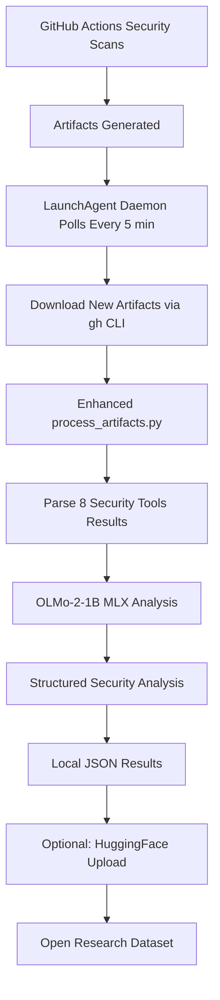

# Local OLMo Analysis System - Developer Setup Guide

**Complete setup instructions for the AI Security Dataset Research Initiative's local analysis system.**

## 🎯 Overview

This guide helps developers set up the local OLMo-2-1B analysis system that processes security vulnerabilities from our WebAuthn authentication server. The system replaces hanging GitHub Actions workflows with a robust, Apple Silicon-optimized local processing pipeline.

### What You'll Build

```
GitHub Actions Security Scans → Local Daemon → OLMo-2-1B Analysis → HuggingFace Datasets
```

- **Input**: Security artifacts from 8 professional FOSS tools
- **Processing**: MLX-optimized OLMo-2-1B model (214.6 tokens/sec)
- **Output**: Structured security analysis + research datasets
- **Deployment**: Continuous operation via macOS LaunchAgent

## 📋 Prerequisites

### Required Hardware & OS
- **macOS**: Big Sur 11.0+ (tested on macOS 14.6.0)
- **Apple Silicon**: M1/M2/M3/M4 processors (required for MLX optimization)
- **Memory**: 16GB+ RAM recommended (8GB minimum)
- **Storage**: 10GB+ free space for models and artifacts

### Required Software
- **Python**: 3.11+ (tested with Python 3.11.9)
- **GitHub CLI**: Latest version (`brew install gh`)
- **Git**: 2.39+ with proper authentication
- **Command Line Tools**: Xcode command line tools (`xcode-select --install`)

### Required Accounts & Authentication
- **GitHub**: Personal access token with `repo` and `actions:read` scopes
- **HuggingFace**: Account and access token for dataset uploads (optional but recommended)

## 🚀 Quick Setup (30 minutes)

### Step 1: Environment Setup

```bash
# 1. Create project directory
mkdir -p ~/olmo-security-analysis
cd ~/olmo-security-analysis

# 2. Set up Python virtual environment
python3 -m venv venv
source venv/bin/activate

# 3. Verify Python version
python3 --version  # Should be 3.11+
```

### Step 2: Install Dependencies

```bash
# Install core dependencies
pip install --upgrade pip
pip install mlx mlx-lm transformers torch
pip install huggingface-hub datasets
pip install psutil requests tqdm

# Verify MLX installation (Apple Silicon only)
python3 -c "import mlx.core; print('✅ MLX installed successfully')"

# Expected output: ✅ MLX installed successfully
```

### Step 3: GitHub Authentication

```bash
# 1. Authenticate GitHub CLI
gh auth login
# Follow prompts: GitHub.com → HTTPS → Authenticate in browser

# 2. Verify authentication
gh auth status
# Expected: ✓ Logged in to github.com as YOUR_USERNAME

# 3. Set environment variable (add to ~/.zprofile)
echo 'export GH_TOKEN=$(gh auth token)' >> ~/.zprofile
source ~/.zprofile

# 4. Verify token
echo $GH_TOKEN  # Should show your token
```

### Step 4: Download Implementation Files

```bash
# Navigate to your mpo-api-authn-server directory
cd /path/to/your/mpo-api-authn-server

# Verify implementation files exist
ls -la local-analysis/
# Expected: __init__.py, olmo2_mlx_setup.py, security_artifact_daemon.py, huggingface_uploader.py

ls -la security-ai-analysis/
# Expected: process_artifacts.py, parsers/, analysis/, etc.
```

### Step 5: Convert OLMo-2-1B to MLX Format

```bash
# Run MLX conversion (takes ~5 minutes)
cd local-analysis/
python3 olmo2_mlx_setup.py --quantize --test-inference

# Expected output:
# 🚀 Starting OLMo-2-1B MLX setup...
# 🔄 Converting allenai/OLMo-2-0425-1B to MLX format...
# ✅ MLX conversion completed
# 🧪 Testing MLX inference...
# ✅ MLX inference test passed
# 🎯 OLMo-2-1B MLX setup complete!
```

### Step 6: Configure Daemon

```bash
# Create LaunchAgent directory if needed
mkdir -p ~/Library/LaunchAgents

# Copy daemon plist (will be created by daemon on first run)
cd ~/mpo-api-authn-server/local-analysis/

# Test daemon in test mode (single run)
python3 security_artifact_daemon.py --test-mode

# Expected output:
# 🔍 Checking for new GitHub Actions runs...
# Found run: 17499892164 (SHA: 8d4e5c99)
# 📥 Downloaded 24 security artifact files
# 🧠 Starting OLMo analysis...
# ✅ Test mode completed successfully
```

## 🔧 Detailed Configuration

### HuggingFace Integration (Optional)

If you want to upload datasets to HuggingFace Hub:

```bash
# 1. Install HuggingFace CLI
pip install huggingface_hub[cli]

# 2. Login with token
huggingface-cli login --token YOUR_HF_TOKEN
# Get token from: https://huggingface.co/settings/tokens

# 3. Set environment variable
echo 'export HUGGINGFACE_HUB_TOKEN=YOUR_TOKEN' >> ~/.zprofile
source ~/.zprofile

# 4. Test upload capability
cd ~/mpo-api-authn-server/local-analysis/
python3 huggingface_uploader.py --test-mode
```

### LaunchAgent Production Setup

For continuous operation:

```bash
# 1. Install LaunchAgent
cd ~/mpo-api-authn-server/local-analysis/
python3 security_artifact_daemon.py --install-daemon

# 2. Set environment variables for LaunchAgent
launchctl setenv GH_TOKEN "$GH_TOKEN"
launchctl setenv HUGGINGFACE_HUB_TOKEN "$HUGGINGFACE_HUB_TOKEN"  # If using HF

# 3. Start daemon
launchctl load ~/Library/LaunchAgents/com.webauthn.security-artifact-daemon.plist

# 4. Verify daemon is running
launchctl list | grep webauthn
# Expected: -	1	com.webauthn.security-artifact-daemon

# 5. Check logs
tail -f ~/olmo-security-analysis/daemon-stdout.log
tail -f ~/olmo-security-analysis/daemon-stderr.log
```

## 🔍 System Verification

### Health Check Commands

```bash
# 1. Check LaunchAgent status
launchctl list | grep webauthn
# Expected: Shows PID and running status

# 2. Verify MLX model exists
ls -lh ~/olmo-security-analysis/models/OLMo-2-1B-mlx-q4/
# Expected: config.json, tokenizer.json, model.safetensors (~1GB)

# 3. Test MLX inference
source ~/olmo-security-analysis/venv/bin/activate
python3 -c "
import mlx.core as mx
from mlx_lm import load, generate
model, tokenizer = load('~/olmo-security-analysis/models/OLMo-2-1B-mlx-q4')
print('✅ MLX model loaded successfully')
"

# 4. Check recent daemon activity
tail -5 ~/olmo-security-analysis/daemon-stderr.log
# Expected: Recent polling activity every 300 seconds

# 5. Verify GitHub CLI access
gh run list --repo hitoshura25/mpo-api-authn-server --limit 3
# Expected: Lists recent workflow runs
```

### Performance Benchmarks

Expected performance on different Apple Silicon chips:

| Chip | Generation Speed | Memory Usage | Conversion Time |
|------|-----------------|--------------|-----------------|
| M1 | ~150 tokens/sec | 1.2GB | ~8 minutes |
| M2 | ~180 tokens/sec | 1.1GB | ~6 minutes |
| M3 | ~200 tokens/sec | 1.1GB | ~5 minutes |
| M4 Pro | ~214 tokens/sec | 1.1GB | ~4 minutes |

## 🛠️ Architecture Overview

### Directory Structure

```
~/olmo-security-analysis/              # Runtime directory
├── venv/                              # Python virtual environment
├── models/                            # MLX converted models
│   └── OLMo-2-1B-mlx-q4/             # Quantized OLMo-2-1B
├── artifacts/                         # Downloaded security artifacts
│   └── run_XXXXXXXXX/                 # Artifacts by GitHub run ID
├── daemon-stdout.log                  # LaunchAgent stdout
└── daemon-stderr.log                  # LaunchAgent stderr

~/mpo-api-authn-server/                # Source repository
├── local-analysis/                    # Local analysis implementation
│   ├── __init__.py                    # Module initialization
│   ├── olmo2_mlx_setup.py            # MLX conversion script
│   ├── security_artifact_daemon.py   # GitHub polling daemon
│   └── huggingface_uploader.py       # Dataset upload utility
├── security-ai-analysis/             # Enhanced analysis system
│   ├── process_artifacts.py          # Main processing script
│   ├── parsers/                      # Security tool parsers
│   └── analysis/                     # OLMo analysis modules
└── docs/development/                  # Documentation
    └── local-olmo-analysis-setup.md  # This file
```

### Data Flow



### Component Responsibilities

- **olmo2_mlx_setup.py**: One-time MLX model conversion and validation
- **security_artifact_daemon.py**: Continuous GitHub polling and download
- **process_artifacts.py**: Security analysis orchestration and OLMo integration
- **huggingface_uploader.py**: Research dataset generation and publishing
- **LaunchAgent**: macOS service for continuous operation

## 🐛 Troubleshooting

### Common Issues and Solutions

#### Issue: MLX Installation Fails

```bash
# Symptoms: "No module named 'mlx'" or compilation errors
# Solution: Verify Apple Silicon and Python version
python3 -c "import platform; print(platform.processor())"  # Should show "arm"
python3 --version  # Should be 3.11+

# Reinstall with verbose output
pip install --upgrade --verbose mlx mlx-lm
```

#### Issue: GitHub Authentication Fails

```bash
# Symptoms: "HTTP 401" or "authentication required"
# Solution: Re-authenticate and verify token
gh auth logout
gh auth login
gh auth status  # Verify successful login
```

#### Issue: OLMo Model Download Fails

```bash
# Symptoms: "Connection error" or "model not found"
# Solution: Check internet connection and HuggingFace access
huggingface-cli download allenai/OLMo-2-0425-1B --local-dir-use-symlinks False
```

#### Issue: LaunchAgent Not Starting

```bash
# Symptoms: Daemon not appearing in launchctl list
# Solution: Check plist syntax and permissions
plutil -lint ~/Library/LaunchAgents/com.webauthn.security-artifact-daemon.plist
launchctl load -w ~/Library/LaunchAgents/com.webauthn.security-artifact-daemon.plist
```

#### Issue: Low Memory Errors

```bash
# Symptoms: "Killed: 9" or memory allocation errors
# Solution: Use quantization and reduce batch size
python3 olmo2_mlx_setup.py --quantize  # Reduces memory by ~60%

# Edit process_artifacts.py and reduce batch size:
# Change: batch_size = 30
# To: batch_size = 10
```

#### Issue: Slow Performance

```bash
# Symptoms: <50 tokens/sec generation speed
# Solution: Verify MLX is using GPU acceleration
python3 -c "
import mlx.core as mx
print(f'MLX device: {mx.default_device()}')  # Should show 'gpu'
print(f'Memory: {mx.memory.get_memory_usage()}')
"

# Force MLX to use GPU
export MLX_METAL_DEVICE_NAME=gpu
```

### Log Analysis

```bash
# View real-time daemon activity
tail -f ~/olmo-security-analysis/daemon-stderr.log

# Search for errors
grep -i error ~/olmo-security-analysis/daemon-*.log

# Check GitHub API rate limiting
grep -i "rate limit" ~/olmo-security-analysis/daemon-*.log

# Monitor MLX memory usage
grep -i "memory" ~/olmo-security-analysis/daemon-*.log
```

## 🔗 Integration with Main Project

### Security Scan Integration

The local analysis system automatically processes outputs from these security tools:

1. **Trivy**: Container and dependency vulnerability scanning
2. **Semgrep**: Static analysis with custom WebAuthn rules
3. **GitLeaks**: Secrets detection and remediation
4. **OSV-Scanner**: Open source vulnerability database
5. **Checkov**: Infrastructure as Code security validation  
6. **OWASP ZAP**: Dynamic application security testing
7. **Dependabot**: Dependency vulnerability alerts
8. **SARIF**: Unified security reporting format

### Research Output Integration

Results integrate with the broader research ecosystem:

- **Local Analysis**: JSON files with structured vulnerability analysis
- **HuggingFace Datasets**: Open research datasets for AI security community
- **Performance Metrics**: Token generation speed, analysis quality scores
- **Continuous Learning**: Growing dataset from production security scans

## 📚 Additional Resources

### Documentation Links
- **Main Research Documentation**: [AI Security Dataset Research Guide](../improvements/completed/ai-security-dataset-research.md)
- **Security Tools Overview**: [Security Analysis Documentation](../security/webauthn-analysis.md)
- **Project Architecture**: [Main README.md](../../README.md)

### External Resources
- **OLMo Model Information**: [Allen AI OLMo-2 Model Card](https://huggingface.co/allenai/OLMo-2-0425-1B)
- **MLX Framework Docs**: [MLX Documentation](https://ml-explore.github.io/mlx/build/html/index.html)
- **HuggingFace Hub Guide**: [Datasets Library Documentation](https://huggingface.co/docs/datasets/)
- **GitHub CLI Reference**: [GitHub CLI Manual](https://cli.github.com/manual/)

### Development Commands

```bash
# Quick system status check
source ~/olmo-security-analysis/venv/bin/activate
python3 ~/mpo-api-authn-server/local-analysis/security_artifact_daemon.py --status

# Manual analysis run
python3 ~/mpo-api-authn-server/security-ai-analysis/process_artifacts.py \
  --local-mode \
  --model-name allenai/OLMo-2-0425-1B \
  --artifacts-dir ~/olmo-security-analysis/artifacts/run_17499892164

# Upload results to HuggingFace (optional)
python3 ~/mpo-api-authn-server/local-analysis/huggingface_uploader.py \
  --dataset-path ~/olmo-security-analysis/results/latest \
  --repo-name "webauthn-security-analysis-$(date +%Y%m%d)"
```

## 🚀 Next Steps

After successful setup:

1. **Monitor Operation**: Check logs regularly for successful processing
2. **Evaluate Results**: Review generated analysis quality and accuracy
3. **Contribute Data**: Upload interesting findings to HuggingFace for research
4. **Optimize Performance**: Experiment with different batch sizes and model parameters
5. **Scale Analysis**: Add additional security tools or vulnerability sources

The system is designed for continuous operation and improvement. As new security vulnerabilities are discovered, the local OLMo analysis will automatically process them, contributing to the growing body of AI security research.

---

**Need Help?** Check the troubleshooting section above or review the main project documentation for additional context and examples.