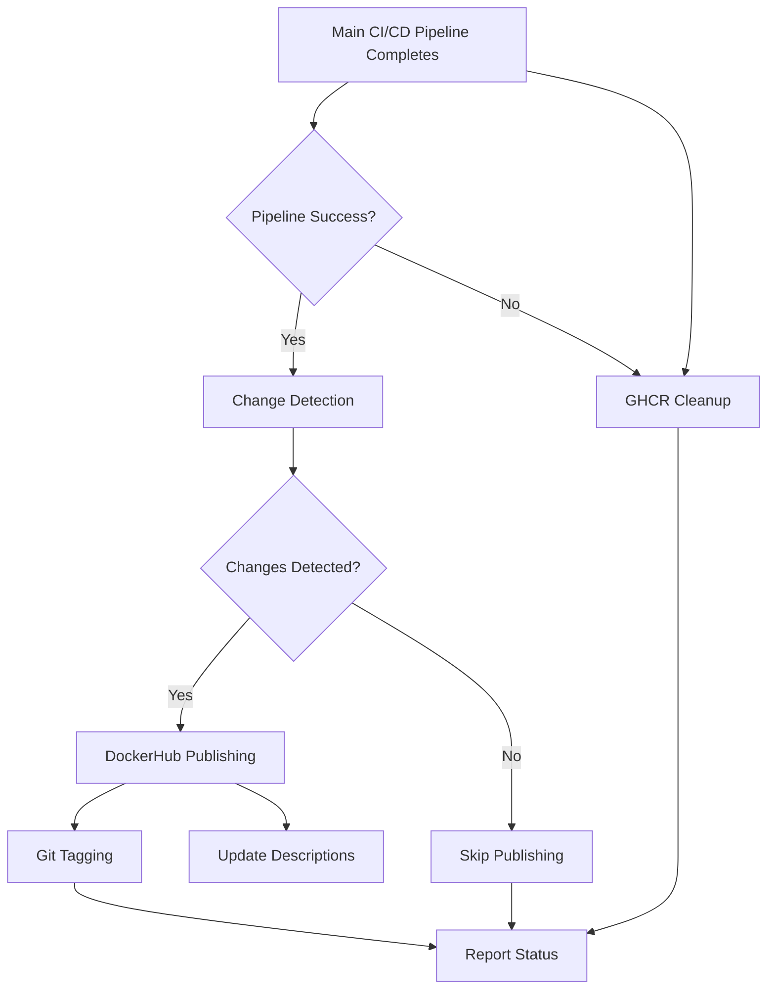

# Main Branch Post-Processing Workflow

This workflow implements Docker publishing optimization for the WebAuthn server project.

## Overview

The `main-branch-post-processing.yml` workflow runs after the main CI/CD pipeline completes and handles:

### Phase 1: Basic Optimization
- **GHCR Cleanup**: Automatically removes old image versions to prevent registry bloat
- **Change Detection**: Compares Docker manifest digests between GHCR and DockerHub
- **Both Images**: Handles both `webauthn-server` and `webauthn-test-credentials-service`

### Phase 2: DockerHub Publishing + Git Tagging  
- **Conditional Publishing**: Only publishes to DockerHub when images have actually changed
- **Repository Descriptions**: Updates DockerHub repository descriptions automatically
- **Git Tagging**: Creates timestamp-based tags for successful publishes

## Required Secrets

Before enabling this workflow, ensure the following GitHub secrets are configured:

### DockerHub Authentication
- `DOCKER_HUB_USERNAME`: DockerHub username for `hitoshura25`
- `DOCKER_HUB_TOKEN`: DockerHub access token (not password!)

### Creating DockerHub Access Token
1. Log in to DockerHub
2. Go to Account Settings → Security
3. Create New Access Token with "Read, Write, Delete" permissions
4. Copy the token and add it as `DOCKER_HUB_TOKEN` secret in GitHub

## Workflow Architecture



## Job Details

### 1. cleanup-ghcr
- **Always runs** (regardless of CI/CD success/failure)
- Keeps latest 5 versions, deletes older ones
- Prevents registry storage bloat
- Uses GitHub CLI to interact with packages API

### 2. detect-changes  
- **Only runs on CI/CD success**
- Compares Docker manifest digests between registries
- Handles first-time publishing (when DockerHub image doesn't exist)
- Sets outputs for conditional publishing

### 3. publish-dockerhub
- **Only runs when changes detected**
- Pulls images from GHCR, re-tags and pushes to DockerHub
- Updates repository descriptions using README files
- Publishes both images if changed

### 4. tag-repository
- **Only runs on successful DockerHub publish**
- Creates timestamp-based git tags
- Format: `dockerhub-publish-YYYYMMDD-HHMMSS`
- Includes commit message with publish details

### 5. report-post-processing-status
- **Always runs** with comprehensive status reporting
- Shows results of all jobs
- Indicates what was published and why

## Testing Strategy

### Local Testing
The workflow uses standard Docker commands that can be tested locally:

```bash
# Test change detection logic
GHCR_DIGEST=$(docker buildx imagetools inspect ghcr.io/hitoshura25/webauthn-server:latest --format '{{.Manifest.Digest}}')
DOCKERHUB_DIGEST=$(docker buildx imagetools inspect hitoshura25/webauthn-server:latest --format '{{.Manifest.Digest}}')

if [ "$DOCKERHUB_DIGEST" != "$GHCR_DIGEST" ]; then
  echo "Changes detected"
else
  echo "No changes"
fi
```

### Edge Cases Handled
- **First-time publishing**: When DockerHub images don't exist yet
- **GHCR cleanup failures**: Uses `continue-on-error` to prevent workflow failure
- **Missing DockerHub credentials**: Graceful failure with clear error messages
- **Description update failures**: Non-critical, won't fail the workflow
- **Git tagging failures**: Only runs after successful publishing

## Performance Benefits

- **Registry Optimization**: Automatic cleanup prevents storage bloat
- **Bandwidth Efficiency**: Only publishes when changes detected  
- **Storage Efficiency**: Maintains clean registries
- **Historical Tracking**: Git tags provide publish history

## Security Considerations

- **Minimal Permissions**: Each job requests only required permissions
- **Secret Management**: Uses GitHub secrets for DockerHub credentials
- **Registry Authentication**: Secure login actions for both registries
- **Token Scope**: DockerHub token should have minimal required permissions

## Monitoring

The workflow provides comprehensive logging:

```
📊 Change Detection Summary:
WebAuthn Server changed: true
Test Credentials Service changed: false
🚀 DockerHub publishing needed

🚀 Publishing WebAuthn Server to DockerHub...
✅ WebAuthn Server successfully published to DockerHub

🏷️ Created and pushed tag: dockerhub-publish-20240806-143052
```

## Troubleshooting

### Common Issues

1. **Missing DockerHub Credentials**
   - Ensure `DOCKER_HUB_USERNAME` and `DOCKER_HUB_TOKEN` secrets are set
   - Verify token has correct permissions

2. **GHCR Authentication Failures**
   - Workflow uses `GITHUB_TOKEN` automatically
   - Ensure workflow has `packages: write` permission

3. **Change Detection False Positives**
   - Digests are compared at manifest level, very reliable
   - Check if multi-platform builds are causing digest differences

4. **Git Tagging Failures**
   - Ensure workflow has `contents: write` permission
   - Check if repository protection rules block automated commits

### Debugging Commands

```bash
# Check image digests manually
docker buildx imagetools inspect ghcr.io/hitoshura25/webauthn-server:latest --format '{{json .}}'

# List GHCR packages
gh api /orgs/hitoshura25/packages/container/webauthn-server/versions

# Check DockerHub repository
curl -s https://hub.docker.com/v2/repositories/hitoshura25/webauthn-server/
```

## Future Enhancements

Potential improvements for future versions:
- Multi-tag support (latest, version tags, etc.)
- Slack/email notifications for publishes
- Integration with GitHub Releases
- Support for additional registries
- Performance metrics collection