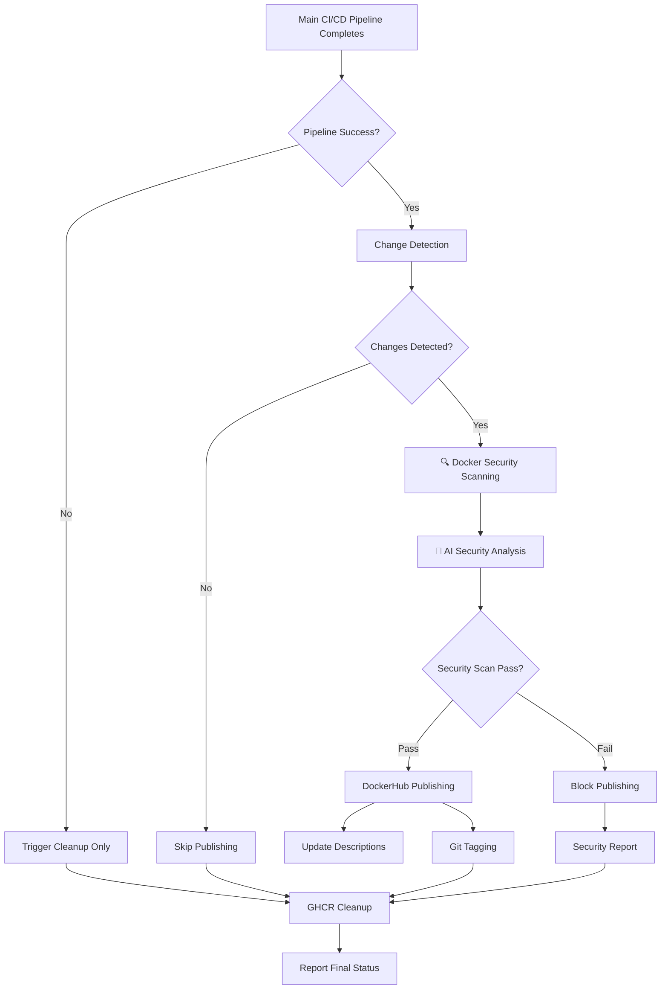

# Main Branch Post-Processing Workflow - AI-Enhanced Security & Publishing

This workflow implements comprehensive Docker security scanning, AI-enhanced vulnerability analysis, and optimized publishing for the WebAuthn server project.

## Overview

The `main-branch-post-processing.yml` workflow runs after the main CI/CD pipeline completes and handles:

### Phase 1: Change Detection & Security Scanning

- **Change Detection**: Compares Docker manifest digests between GHCR and DockerHub
- **Comprehensive Security Scanning**: Multi-layer vulnerability detection (OS, dependencies, secrets, configurations)
- **AI-Enhanced Vulnerability Analysis**: Anthropic-powered security analysis of scan results
- **Both Images**: Handles both `webauthn-server` and `webauthn-test-credentials-service`

### Phase 2: Security-Gated Publishing + Tagging

- **Security Gate**: Publishing only proceeds if security scans pass
- **Conditional Publishing**: Only publishes to DockerHub when images have actually changed AND pass security checks
- **Repository Descriptions**: Updates DockerHub repository descriptions automatically
- **Git Tagging**: Creates timestamp-based tags for successful publishes

### Phase 3: Comprehensive Reporting

- **Status Reporting**: Detailed status reporting for all operations
- **Production Preservation**: Production packages are never automatically cleaned up

## Required Secrets

Before enabling this workflow, ensure the following GitHub secrets are configured:

### DockerHub Authentication

- `DOCKER_USERNAME`: DockerHub username for `hitoshura25`
- `DOCKER_PASSWORD`: DockerHub access token (not password!)

### AI Security Analysis

- `ANTHROPIC_API_KEY`: API key for Anthropic Claude security analysis (optional but recommended for enhanced analysis)

**Note**: If AI API key is not provided, the workflow will still perform standard security scanning without AI-enhanced analysis.

### Creating DockerHub Access Token

1. Log in to DockerHub
2. Go to Account Settings → Security
3. Create New Access Token with "Read, Write, Delete" permissions
4. Copy the token and add it as `DOCKER_PASSWORD` secret in GitHub

## 🔒 Enhanced Workflow Architecture with AI Security



### 🔍 Security Scanning Features

- **Multi-Layer Scanning**: OS vulnerabilities, dependency issues, secrets detection, configuration analysis
- **SARIF Integration**: Results uploaded to GitHub Security tab
- **AI-Enhanced Analysis**: Anthropic Claude analyzes scan results for intelligent insights
- **Critical Vulnerability Blocking**: High-severity issues prevent DockerHub publishing
- **Comprehensive Reporting**: Detailed security analysis artifacts

## Job Details

### 1. detect-changes

- **Only runs on CI/CD success**
- Compares Docker manifest digests between registries
- Handles first-time publishing (when DockerHub image doesn't exist)
- Sets outputs for conditional security scanning and publishing

### 2. docker-security-scan

- **Only runs when changes detected**
- **Multi-layer scanning**: OS vulnerabilities, dependencies, secrets, configurations
- Uses industry-standard tools (Trivy, etc.)
- Generates SARIF reports for GitHub Security integration
- Blocks pipeline on critical vulnerabilities

### 3. ai-security-analysis

- **AI-powered vulnerability analysis** using Anthropic Claude
- Intelligent risk assessment and prioritization
- Context-aware security recommendations
- Generates detailed analysis artifacts

### 4. publish-dockerhub

- **Only runs when security scans pass**
- Pulls images from GHCR, re-tags and pushes to DockerHub
- Updates repository descriptions using README files
- Publishes both images if they pass security gates


### 5. tag-repository

- **Only runs on successful DockerHub publish**
- Creates timestamp-based git tags
- Format: `dockerhub-publish-YYYYMMDD-HHMMSS`
- Includes commit message with publish details

### 6. report-post-processing-status

- **Always runs** with comprehensive status reporting
- Shows results of all jobs
- Indicates what was published and why

## Testing Strategy

### Local Testing

The workflow uses standard Docker commands that can be tested locally:

```bash
# Test change detection logic
GHCR_DIGEST=$(docker buildx imagetools inspect ghcr.io/hitoshura25/webauthn-server:latest --format '{{.Manifest.Digest}}')
DOCKERHUB_DIGEST=$(docker buildx imagetools inspect hitoshura25/webauthn-server:latest --format '{{.Manifest.Digest}}')

if [ "$DOCKERHUB_DIGEST" != "$GHCR_DIGEST" ]; then
  echo "Changes detected"
else
  echo "No changes"
fi
```

### Edge Cases Handled

- **First-time publishing**: When DockerHub images don't exist yet
- **GHCR cleanup failures**: Uses `continue-on-error` to prevent workflow failure
- **Missing DockerHub credentials**: Graceful failure with clear error messages
- **Description update failures**: Non-critical, won't fail the workflow
- **Git tagging failures**: Only runs after successful publishing

## Performance Benefits

- **Bandwidth Efficiency**: Only publishes when changes detected
- **Storage Efficiency**: Maintains clean registries
- **Historical Tracking**: Git tags provide publish history

## 🔒 Enhanced Security Considerations

### Docker Security Scanning
- **Multi-layer vulnerability detection**: OS, dependencies, secrets, configurations
- **Critical vulnerability blocking**: High-severity issues prevent publishing
- **SARIF integration**: Results uploaded to GitHub Security for tracking
- **AI-enhanced analysis**: Intelligent vulnerability assessment and prioritization

### Access Control & Permissions
- **Minimal Permissions**: Each job requests only required permissions
- **Secret Management**: Uses GitHub secrets for DockerHub credentials
- **Registry Authentication**: Secure login actions for both registries
- **Token Scope**: DockerHub token should have minimal required permissions

### AI Analysis Security
- **Anthropic API integration**: Secure API key management
- **Data handling**: Scan results processed securely for analysis
- **Analysis artifacts**: Security analysis results stored as workflow artifacts

## Monitoring

The workflow provides comprehensive logging:

```
📊 Change Detection Summary:
WebAuthn Server changed: true
Test Credentials Service changed: false
🚀 DockerHub publishing needed

🚀 Publishing WebAuthn Server to DockerHub...
✅ WebAuthn Server successfully published to DockerHub

🏷️ Created and pushed tag: dockerhub-publish-20240806-143052
```

## Troubleshooting

### Common Issues

1. **Missing DockerHub Credentials**
    - Ensure `DOCKER_USERNAME` and `DOCKER_PASSWORD` secrets are set
    - Verify token has correct permissions


3. **Change Detection False Positives**
    - Digests are compared at manifest level, very reliable
    - Check if multi-platform builds are causing digest differences

4. **Git Tagging Failures**
    - Ensure workflow has `contents: write` permission
    - Check if repository protection rules block automated commits

### Debugging Commands

```bash
# Check image digests manually
docker buildx imagetools inspect ghcr.io/hitoshura25/webauthn-server:latest --format '{{json .}}'


# Check DockerHub repository
curl -s https://hub.docker.com/v2/repositories/hitoshura25/webauthn-server/
```

## Future Enhancements

Potential improvements for future versions:

- Multi-tag support (latest, version tags, etc.)
- Slack/email notifications for publishes
- Integration with GitHub Releases
- Support for additional registries
- Performance metrics collection
