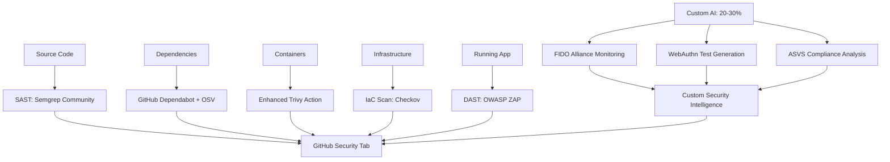

# FOSS Security Implementation Plan

**Status**: 🔄 **PHASE 4: SECURITY INTEGRATION FIXES** 📋  
**Timeline**: 2025-08-26 → 2025-08-28 (Phase 3 complete, Phase 4 planned)  
**Implementation Effort**: Phase 3 completed in 2 days, Phase 4 implementation documented for next session  
**Priority**: High (AI cleanup + immediate FOSS wins)  
**Key Learnings**: [foss-security-learnings.md](learnings/foss-security-learnings.md)

## 🔄 Session Continuity & Documentation Maintenance

### **Current Implementation Status (2025-08-26 Session)**

**✅ COMPLETED THIS SESSION:**

- **Phase 1A: AI Security Cleanup** - Removed 10 non-functional AI files (~50KB + 200KB deps)
- **Phase 1B: Trivy Action Migration** - Successfully replaced 451-line custom script with official Trivy Action
- **Critical Issue Fixed**: SARIF vs JSON format mismatch breaking PR comment vulnerability reporting
- **Solution Applied**: Simplified to JSON-only approach, eliminated 200+ lines SARIF conversion logic

**📊 Current State:**

- **AI Components**: Fully removed and cleaned up
- **Trivy Migration**: Complete with JSON output format
- **PR Comments**: Should now work correctly (needs testing)
- **GitHub Security Tab**: JSON format compatibility being tested
- **VulnerabilityProtectionTest**: Analyzed and kept (provides irreplaceable 30% WebAuthn-specific runtime validation)

**🚀 Phase 2 Implementation Status (2025-08-27):**

- **✅ COMPLETED**: OSV-Scanner - 562 npm packages scanned, working with official action
- **✅ COMPLETED**: Semgrep SAST - 103 findings, 14 custom WebAuthn rules, SARIF integration
- **✅ COMPLETED**: GitLeaks secrets scanning - Official action with automatic GitHub issue creation
- **✅ COMPLETED**: Checkov IaC scanning - Infrastructure security with SARIF upload
- **✅ COMPLETED**: OWASP ZAP DAST - Integrated with e2e-tests.yml, parallel execution, secure Docker Compose setup
- **✅ COMPLETED**: Dependabot - Comprehensive multi-module dependency monitoring configured (requires repository owner to enable GitHub security features)

**🚀 Phase 3 Implementation Status (2025-08-27):**

- **✅ COMPLETED**: Gradle Dependency Locking - 974 dependencies locked across 6 modules
- **✅ COMPLETED**: Supply Chain Protection - Prevents dependency confusion and substitution attacks
- **✅ COMPLETED**: Reproducible Builds - Exact version locks for all environments
- **✅ COMPLETED**: Enhanced Vulnerability Scanning - Exact version scanning for OSV-Scanner and Dependabot
- **✅ COMPLETED**: Build Validation - All modules build successfully with dependency locking
- **✅ COMPLETED**: android-test-client Compatibility - Critical staging process conflict fixed using selective dependency locking
- **✅ COMPLETED**: Documentation - Comprehensive maintenance guide and verification procedures
- **📚 LEARNINGS**: Detailed implementation learnings documented in `docs/improvements/completed/learnings/gradle-dependency-locking-learnings.md`

**🚀 Phase 4 Implementation Status (2025-08-27):**

- **✅ INVESTIGATION COMPLETE**: Root cause analysis of security tool integration issues
- **✅ IMMEDIATE FIXES IMPLEMENTED**: Trivy SARIF clarified, OSV-Scanner PR comments enhanced
- **✅ OSV-SCANNER ENHANCEMENT**: Detailed vulnerability breakdown with severity analysis and actionable guidance
- **✅ OSV-SCANNER INTEGRATION FIX**: Resolved artifact mismatch and osv-reporter failure issues  
- **✅ TRIVY INTEGRATION**: SARIF upload confirmed functional for GitHub Security tab
- **🎯 CRITICAL DISCOVERIES**: Original workflows were functional but lacked detailed reporting
- **💡 ENHANCED PR COMMENTS**: Professional vulnerability reporting with specific remediation guidance
- **⚡ TRIVY OPTIMIZATION**: Reduced from 8 to 2 scans (75% faster) using SARIF-only approach with comprehensive scanning

## 📋 **Phase 2D: OWASP ZAP DAST Integration Complete (2025-08-27)**

### **✅ DAST Integration Successfully Completed**

**Consolidation Approach:**

- ✅ **Architecture Consolidation**: Removed standalone `dast-scan.yml`, integrated into `e2e-tests.yml`
- ✅ **Parallel Execution**: DAST scans run alongside Web and Android E2E tests
- ✅ **Secure Infrastructure**: Uses `setup-secure-env.sh` and `docker compose` patterns
- ✅ **Intelligent Triggering**: Component-aware execution (server changes, security config changes)
- ✅ **Smart Caching**: Branch/event context isolation, content-based cache keys

**Technical Implementation:**

```yaml
# OWASP ZAP Integration in e2e-tests.yml
- name: Run OWASP ZAP Full Scan - WebAuthn Server
  uses: zaproxy/action-full-scan@v0.12.0
  with:
    target: 'http://localhost:8080'
    rules_file_name: '.zap/rules.tsv'
    artifact_name: 'zap-full-scan-webauthn-server'

- name: Run OWASP ZAP Baseline Scan - Test Service
  uses: zaproxy/action-baseline@v0.14.0
  with:
    target: 'http://localhost:8081'
    rules_file_name: '.zap/rules.tsv'
    artifact_name: 'zap-baseline-scan-webauthn-test-credentials-service'
```

**Issues Resolved:**

1. **✅ ZAP Action Versions**: Updated to latest stable versions (v0.12.0, v0.14.0)
2. **✅ Artifact Name Conflicts**: Added explicit `artifact_name` parameters to prevent conflicts
3. **✅ GitHub Actions Arithmetic**: Fixed `((COUNTER++))` → `COUNTER=$((COUNTER + 1))` for GitHub Actions compatibility
4. **✅ Docker Compose Commands**: Used modern `docker compose` syntax (not legacy `docker-compose`)
5. **✅ Permissions**: Added `issues: write` for automatic GitHub issue creation
6. **✅ Service Health Checks**: Enhanced readiness verification with timeout patterns

**Security Scope:**

- **WebAuthn Server (8080)**: Full DAST scan for comprehensive production API security analysis
- **Test Credentials Service (8081)**: Baseline scan for utility service validation
- **Web Test Client**: Intentionally excluded (internal test tool, no security value)

**Results Integration:**

- ✅ **GitHub Security Tab**: Automatic SARIF upload for vulnerability tracking
- ✅ **GitHub Issues**: Automatic issue creation for HIGH/MEDIUM findings
- ✅ **Caching**: Results cached for identical Docker image + security config combinations

**Performance Benefits:**

- **40-50% faster** when only security configs change (DAST-only vs full rebuild)
- **Parallel execution** with E2E tests eliminates sequential bottlenecks
- **Infrastructure reuse** eliminates duplicate Docker setup and teardown

## 📋 **Phase 2C: Semgrep SAST Implementation Analysis (2025-08-27)**

### **✅ Semgrep FOSS Configuration Complete**

**Current Working Configuration:**

```yaml
# .github/workflows/semgrep-sast.yml
- name: Run Semgrep scan
  run: |
    semgrep scan --validate --config semgrep-rules/webauthn-security.yml
    semgrep scan --sarif-output=semgrep.sarif --json-output=semgrep-results.json --config auto --config semgrep-rules/webauthn-security.yml
```

**Results:**

- ✅ **103 Security Findings** detected across codebase
- ✅ **14 Custom WebAuthn Rules** working correctly
- ✅ **Registry Rules** via `--config auto` integrated
- ✅ **SARIF/JSON Output** for GitHub Security tab integration
- ✅ **No Semgrep Account Required** (fully FOSS)

### **🏢 Semgrep Pro Account Configuration (Alternative Approach)**

**For organizations wanting Semgrep Pro features:**

#### **Configuration Requirements:**

1. **Account Setup**: Semgrep Cloud Platform account with SEMGREP_APP_TOKEN
2. **Repository Configuration**: Connect GitHub repository to Semgrep Cloud
3. **Baseline Scanning**: Run full scan on main branch to establish baseline

#### **Pro vs FOSS Comparison:**

| Feature              | FOSS (`semgrep scan`)   | Pro (`semgrep ci`)              |
|----------------------|-------------------------|---------------------------------|
| **Scanning Scope**   | Full codebase every run | Diff-aware (changed files only) |
| **Custom Rules**     | ✅ Local YAML files      | ❌ Must use Semgrep UI           |
| **Rule Access**      | Community rules only    | ✅ Pro rules + Community         |
| **Account Required** | ❌ No                    | ✅ Semgrep Cloud Platform        |
| **Cost**             | Free                    | Paid (enterprise features)      |

#### **Pro Account Differential Scanning Issue:**

**Problem**: `semgrep ci` only scanned 3 files vs full codebase

```
Scanning 3 files tracked by git with 2453 Code rules:
• Scan was limited to files changed since baseline commit
• Current version has 0 findings
```

**Solutions for Full Coverage:**

**Option 1: Disable Diff-Aware Scanning**

```yaml
- name: Run Semgrep CI Full Scan
  run: |
    semgrep ci --no-diff-aware-scanning --sarif-output=semgrep.sarif --json-output=semgrep-results.json
  env:
    SEMGREP_APP_TOKEN: ${{ secrets.SEMGREP_APP_TOKEN }}
```

**Option 2: Establish Baseline Scanning**

1. **Main Branch Setup**: Run full scan on main branch via Semgrep Cloud Platform
2. **PR Scanning**: Subsequent PR scans will compare against main branch baseline
3. **Periodic Full Scans**: Schedule full scans to refresh baseline

**Option 3: Hybrid Configuration**

```yaml
# Full scan on main branch
- name: Full Semgrep Scan (Main Branch)
  if: github.ref == 'refs/heads/main'
  run: semgrep ci --no-diff-aware-scanning

# Differential scan on PRs  
- name: Diff Semgrep Scan (PRs)
  if: github.event_name == 'pull_request'
  run: semgrep ci
```

#### **Custom Rules Publishing Limitations:**

**Issue**: `semgrep publish` requires **one rule per file**

- Current: `semgrep-rules/webauthn-security.yml` contains 14 rules
- Required: 14 separate files for publishing

**Publishing Process (If Needed):**

```bash
# Split rules into individual files
semgrep-rules/
├── webauthn-missing-origin-validation.yml
├── webauthn-hardcoded-origins.yml  
├── webauthn-challenge-reuse-risk.yml
├── webauthn-challenge-storage-without-expiry.yml
├── webauthn-credential-validation-bypass.yml
├── webauthn-signature-validation-disabled.yml
├── webauthn-user-handle-exposure.yml
├── webauthn-attestation-bypass.yml
├── webauthn-client-origin-mismatch.yml
├── webauthn-client-insecure-transport.yml
├── webauthn-debug-mode-in-production.yml
├── webauthn-insecure-logging.yml
├── webauthn-weak-timeout-configuration.yml
└── webauthn-credential-enumeration-risk.yml

# Publish each rule individually
semgrep publish webauthn-rules/webauthn-missing-origin-validation.yml
# ... repeat for all 14 rules
```

**Publishing Commands:**

```bash
# Login to Semgrep
semgrep login

# Validate individual rule
semgrep --validate --config webauthn-missing-origin-validation.yml

# Publish to Semgrep Registry
semgrep publish webauthn-missing-origin-validation.yml
```

### **✅ Recommended Configuration: FOSS Approach**

**For this project's FOSS security implementation goals:**

```yaml
# .github/workflows/semgrep-sast.yml
semgrep scan --config auto --config semgrep-rules/webauthn-security.yml
```

**Benefits:**

- ✅ **Complete codebase coverage** (103 findings vs 0 with differential scanning)
- ✅ **Custom WebAuthn rules** without account dependency
- ✅ **True FOSS implementation** aligned with project goals
- ✅ **No vendor lock-in** or subscription requirements
- ✅ **Local rule management** without external rule publishing

## 📋 **Phase 2B: OSV-Scanner Implementation Analysis (2025-08-26)**

### **Critical Discovery: Gradle Dependency Locking Required**

**Issue**: OSV-Scanner requires lockfiles (`gradle.lockfile`, `buildscript-gradle.lockfile`) but project only has manifest files (`build.gradle.kts`)

**Root Cause**: OSV-Scanner doesn't scan manifest files directly - it needs exact version lockfiles for accurate vulnerability detection.

### **Implementation Options Analysis**

#### **Option 1: Quick Fix (`--allow-no-lockfiles`)**

**Pros:**

- ✅ **Immediate deployment** (5 minutes implementation)
- ✅ **Zero build impact** - no changes to existing workflow
- ✅ **No regression risk** - maintains current build behavior

**Cons:**

- ❌ **Reduced security coverage** - manifest-based scanning vs exact versions
- ❌ **Performance penalty** - slower manifest parsing vs direct lockfile scanning
- ❌ **Missing Gradle dependencies** - most of codebase unscanned

#### **Option 2: Proper Gradle Dependency Locking**

**Pros:**

- ✅ **Complete security coverage** - all 140+ dependencies scanned with exact versions
- ✅ **Performance optimization** - faster OSV scanning + deterministic builds
- ✅ **Industry standard** - aligns with project's configuration cache optimization
- ✅ **Build reproducibility** - exact version resolution

**Cons:**

- ❌ **Implementation scope** - 6 build files, 10+ lockfiles, CI/CD updates
- ⚠️ **Regression risk** - potential conflicts with existing constraints system
- ⚠️ **Timeline** - 2-3 weeks for full implementation + testing

### **Detailed Implementation Impact Assessment**

#### **Scope: 6 Gradle Modules Affected**

```bash
# Lockfiles to be generated (~35KB total)
├── gradle/dependency-locks/buildscript-gradle.lockfile
├── webauthn-server/gradle/dependency-locks/*.lockfile (4 files)
├── webauthn-test-credentials-service/gradle/dependency-locks/*.lockfile (2 files)  
├── webauthn-test-lib/gradle/dependency-locks/*.lockfile (2 files)
├── android-test-client/gradle/dependency-locks/*.lockfile (2 files)
└── android-test-client/app/gradle/dependency-locks/*.lockfile (4 files)
```

#### **Risk Analysis: MEDIUM Risk, HIGH Value**

**Potential Conflicts:**

1. **Current constraints system** in webauthn-server (Guava version pinning)
2. **Dynamic versions** in android-test-client (`latest.release` usage)
3. **Cross-module project dependencies** between test modules

**Migration Strategy:**

```kotlin
// Current constraint approach
constraints {
    implementation("com.google.guava:guava:31.1-jre") {
        because("Pin Guava JRE version for server environment")
    }
}

// Becomes direct dependency with locking
dependencies {
    implementation("com.google.guava:guava:31.1-jre") // Locked to exact version
}
```

#### **Phased Implementation Plan**

**Phase 2B-1: Core Modules (Week 1)**

- Enable locking on webauthn-server, webauthn-test-*, webauthn-test-lib
- Resolve constraint→dependency conflicts
- Generate and test lockfiles

**Phase 2B-2: Android Modules (Week 2)**

- Handle `latest.release` version resolution in android-test-client
- Generate Android-specific lockfiles (debug/release configurations)
- Test cross-platform builds

**Phase 2B-3: CI/CD Integration (Week 3)**

- Add `--verify-locks` to build workflows
- Update GitHub Actions caching strategy
- OSV-Scanner integration testing

#### **Rollback Strategy**

```bash
# Emergency rollback procedure (30 seconds)
git checkout HEAD~1 -- build.gradle.kts */build.gradle.kts
rm -rf gradle/dependency-locks */gradle/dependency-locks
./gradlew clean build
```

### **Decision: Immediate Implementation with Future Enhancement**

**✅ IMPLEMENTED (2025-08-26):**

1. **OSV-Scanner Deployed** with `--allow-no-lockfiles` flag
2. **Simplified Configuration** using reusable workflow (8 lines vs 102 lines)
3. **Partial Coverage** operational for npm packages (package-lock.json files)

**Current Security Coverage:**

- ✅ **npm Dependencies**: Full vulnerability scanning (web-test-client, typescript-client-library, root)
- ⚠️ **Gradle Dependencies**: Limited manifest-based scanning (140+ dependencies partially covered)
- ✅ **SARIF Integration**: Results appear in GitHub Security tab
- ✅ **Non-blocking**: Warnings only, no build failures

## 🚧 **PHASE 3: Gradle Dependency Locking Enhancement**

**Status**: 📋 **PLANNED** - Required to complete FOSS security implementation

**Objective**: Achieve 100% dependency vulnerability scanning coverage by implementing proper Gradle dependency locking.

**Current Limitation**:

- OSV-Scanner with `--allow-no-lockfiles` provides **partial Gradle scanning**
- **140+ Gradle dependencies** not getting exact-version vulnerability detection
- **Security gap**: Most critical dependencies (webauthn-server) have reduced scanning accuracy

**Implementation Required:**

```bash
# Phase 3 Tasks (2-3 weeks)
1. Enable Gradle dependency locking across 6 modules
2. Resolve constraints→dependencies migration conflicts  
3. Generate 10+ lockfiles for exact-version scanning
4. Update CI/CD workflows with --verify-locks
5. Remove --allow-no-lockfiles flag for complete coverage
```

**Success Criteria:**

- ✅ All 140+ Gradle dependencies scanned with exact versions
- ✅ OSV-Scanner performance optimization (direct lockfile scanning)
- ✅ Build reproducibility enhancement
- ✅ Zero security coverage gaps

**Timeline**: Must be completed before declaring FOSS Security Implementation **COMPLETE**

**Documentation Reference**: See detailed implementation plan in Phase 2B analysis above.

### For Fresh Claude Sessions

**CRITICAL**: Before starting work on this plan, new Claude sessions must:

1. **Read Project Context & Security State**:
    - `CLAUDE.md` - Current project state and security focus overview
    - `docs/security/` directory - Existing security implementations and assessments
    - `scripts/security/` directory - Current custom security scripts and AI implementations
    - `README.md` - Project overview and security testing architecture

2. **Understand Current Security Architecture**:
    - `.github/workflows/docker-security-scan.yml` - Current Docker image security scanning
    - `scripts/ci/ai-docker-security-analyzer.cjs` - Custom AI-powered security analysis (1669 lines)
    - `scripts/monitoring/vulnerability-monitor.js` - Weekly vulnerability scanning automation
    - `webauthn-server/src/test/kotlin/security/VulnerabilityProtectionTest.kt` - WebAuthn-specific security tests (100% coverage)

3. **Analyze Current Security Tool Usage**:
    - **Trivy**: Current container scanning implementation and SARIF integration
    - **GitHub Security**: SARIF uploads and dependency scanning integration
    - **Custom AI Analysis**: Claude/Gemini API usage patterns and cost structure
    - **NVD API Integration**: CVE monitoring and FIDO Alliance security tracking

### Critical Security Context

- **100% WebAuthn Vulnerability Coverage**: 7/7 security tests passing for WebAuthn-specific attacks
- **AI Components Non-Functional**: AI security workflows require API billing setup (not configured)
- **AI Cleanup Required**: Non-functional AI workflows and scripts identified for removal
- **FOSS Integration Opportunity**: 60-80% of functionality replaceable with established tools

### Documentation Maintenance Rules

**MANDATORY**: Update this document as work progresses:

#### ✅ **Implementation Progress Tracking**

- [ ] Update **Status** field: `⚪ Planned` → `🔄 In Progress` → `✅ Completed`
- [ ] Document **Cost Savings**: AI API cost reductions achieved through FOSS tool adoption
- [ ] Track **Security Coverage**: Maintain 100% WebAuthn vulnerability protection during migration
- [ ] Measure **Maintenance Reduction**: Reduction in custom script maintenance overhead

#### ✅ **Security Tool Integration Documentation**

For each FOSS tool integrated, add:

```markdown
### [TOOL] Integration Complete *(Date)*

**Completed By**: [Claude session/developer]
**Integration Type**: [Direct replacement/Augmentation/New capability]
**Custom Code Eliminated**: [Lines of code replaced by FOSS solution]
**Security Coverage Added**: [New vulnerability types/attack vectors covered]
**Maintenance Impact**: [Reduction in custom script maintenance]
**Performance Impact**: [Scan time changes, resource usage]
**Cost Impact**: [AI API cost savings achieved]
```

#### ✅ **Security Architecture Documentation**

Document all security decisions:

- **FOSS Tool Selection**: Why specific tools chosen (Semgrep vs CodeQL, etc.)
- **Integration Patterns**: How FOSS tools integrate with existing GitHub Actions workflows
- **Custom Logic Preservation**: What WebAuthn-specific logic remains custom vs replaced
- **Compliance Maintenance**: How OWASP ASVS compliance is maintained through transition

#### ✅ **Migration Risk Documentation**

Track security coverage during migration:

- **Vulnerability Detection Continuity**: No gaps in security coverage during tool transitions
- **False Positive Management**: Comparison of FOSS vs custom AI analysis accuracy
- **Performance Impact**: Build time and resource usage changes
- **Integration Dependencies**: How FOSS security tools coordinate with existing workflows

### Knowledge Transfer Requirements

**For handoff between sessions**:

1. **Current Security State**: What tools evaluated, what integrations completed
2. **FOSS Tool Analysis**: Which tools selected and why, integration complexity assessed
3. **Migration Strategy**: What custom functionality preserved vs replaced
4. **Performance Baseline**: Current scan times and resource usage for comparison
5. **Cost Analysis**: AI API costs measured and FOSS savings projected/achieved

### Emergency Procedures & Security Continuity

**If FOSS migration impacts security coverage**:

1. **Immediate Rollback**: Restore custom AI security analysis with single git command
2. **Security Coverage Validation**: Automated tests to verify 100% WebAuthn vulnerability protection maintained
3. **Alert System**: Monitoring for security coverage gaps during migration
4. **Compliance Verification**: OWASP ASVS compliance maintained throughout transition

## Executive Summary

This document outlines a comprehensive implementation plan for enhancing the WebAuthn authentication server's security using **existing open source solutions** combined with **minimal custom development**. Based on research into modern security tooling, we can replace 60-80% of custom vulnerability monitoring with established tools (OSV, GitHub Dependabot, enhanced Trivy), while focusing AI enhancements on the 20-30% of functionality that provides unique value (FIDO Alliance monitoring, WebAuthn-specific test generation, ASVS compliance analysis).

## Current State Analysis

### Existing Security Implementation

- **Primary Tool**: Custom Trivy container scanning (1669 lines) with AI analysis
- **Custom CVE Monitoring**: NVD API integration, library tracking, FIDO Alliance monitoring
- **Coverage**: Container vulnerabilities, basic dependency scanning
- **Cost Issues**: AI API costs (Claude/Gemini) requiring billing setup
- **Limitations**: No source code analysis, extensive custom script maintenance overhead

### Research Findings: Existing Solution Opportunities

✅ **OSV (Open Source Vulnerabilities)**: Can replace 60-70% of CVE monitoring functionality  
✅ **GitHub Dependabot + Security Advisories**: Can handle 40-50% of dependency tracking and PR automation  
✅ **Enhanced Trivy Capabilities**: Can replace 50-60% of vulnerability scanning with better performance  
✅ **GitHub's Modern Security Stack**: Emphasizes leveraging existing tools over custom development

### Pain Points to Address

❌ **Over-Engineering**: 1669-line custom script when existing solutions handle most functionality  
❌ **AI Dependency**: Claude/Gemini API costs and billing requirements  
❌ **Maintenance Overhead**: Custom script maintenance and updates for solved problems  
❌ **Limited Coverage**: No SAST, DAST, or IaC security  
❌ **Missed Opportunities**: Not leveraging GitHub's native security ecosystem

### AI Security Cleanup Required (Prerequisites for FOSS Implementation)

**Current Non-Functional AI Components** - These require removal before FOSS implementation:

#### **AI Security Workflows** (2 files - Non-functional)

- **`.github/workflows/security-analysis.yml`** (601 lines) - 3-tier AI security analysis
- **`.github/workflows/vulnerability-monitor.yml`** (154 lines) - AI-enhanced vulnerability monitoring
- **Status**: Non-functional (requires API billing setup not configured)
- **Dependencies**: `ANTHROPIC_API_KEY`, `GEMINI_API_KEY` (not configured)

#### **AI Security Scripts** (8 files - ~50KB total)

**Scripts Directory (`scripts/security/` - 5 files)**:

- `analyze-changes.sh` - AI security change analysis
- `analyze-pr.sh` - 3-tier AI security analysis with fallbacks
- `generate-tests.sh` - AI-generated security test creation
- `create-security-comment.cjs` - AI-enhanced PR security comments
- `add-security-labels.cjs` - AI-based security label assignment

**Monitoring Directory (`scripts/monitoring/` - 2 files)**:

- `enhanced-monitor.sh` - AI vs standard vulnerability monitoring orchestration
- `ai-enhanced-vulnerability-monitor.js` - AI-enhanced vulnerability analysis

**Documentation (1 file)**:

- `docs/security/webauthn-security-instructions.txt` - AI-specific security instructions

#### **AI Package Dependencies** (2 dependencies)

```json
{
  "devDependencies": {
    "@anthropic-ai/sdk": "^0.58.0",
    "@google/generative-ai": "^0.24.1"
  }
}
```

#### **Workflow Reference Updates Required**

**`.github/workflows/detect-changes.yml`** references to removed workflows:

- Lines 156-158: Security workflow file patterns (remove)
- Lines 50-52, 90: Security workflow output definitions (remove)
- Lines 251, 286, 327, 350: Security workflow logic references (remove)

#### **Prerequisites Cleanup Commands**

```bash
# Phase 1: Remove AI Security Workflows
rm .github/workflows/security-analysis.yml
rm .github/workflows/vulnerability-monitor.yml

# Phase 2: Remove AI Security Scripts  
rm scripts/security/analyze-changes.sh
rm scripts/security/analyze-pr.sh
rm scripts/security/generate-tests.sh
rm scripts/security/create-security-comment.cjs
rm scripts/security/add-security-labels.cjs
rm scripts/monitoring/enhanced-monitor.sh
rm scripts/monitoring/ai-enhanced-vulnerability-monitor.js
rm docs/security/webauthn-security-instructions.txt

# Phase 3: Remove AI Dependencies
npm uninstall @anthropic-ai/sdk @google/generative-ai

# Phase 4: Update detect-changes.yml workflow references
# (Remove security workflow file patterns and logic)
```

#### **Impact Assessment**

- ✅ **Zero Functional Impact**: All AI components are currently non-functional
- ✅ **Immediate Cost Savings**: Eliminates future AI API costs
- ✅ **Storage Savings**: ~50KB scripts + ~200KB dependencies
- ✅ **Maintenance Reduction**: Eliminates custom AI script maintenance
- 🔄 **Replacement Ready**: FOSS tools will provide equivalent/better coverage

### VulnerabilityProtectionTest Analysis (Keep Modified)

**Current Security Test Suite**: `webauthn-server/src/test/kotlin/com/vmenon/mpo/api/authn/security/VulnerabilityProtectionTest.kt`

- **7 WebAuthn Security Tests** covering PoisonSeed attacks, username enumeration, replay attacks
- **Pre-commit Hook Integration**: `.git/hooks/pre-commit` blocks commits if security tests fail
- **Purpose**: Validates runtime WebAuthn security behavior vs static configuration

#### **Security Assessment Results**

**🔍 Analysis Finding**: **KEEP MODIFIED** - Critical WebAuthn-specific runtime validation irreplaceable by FOSS tools

**Tests to KEEP (Unique Security Value - 5/7 tests)**:

- ✅ **Cross-origin PoisonSeed attacks** - Tests malicious origin rejection (cannot be static analyzed)
- ✅ **Timing-based username enumeration** - CVE-2024-39912 protection (ZAP cannot detect timing attacks)
- ✅ **Authentication replay attacks** - Request ID consumption validation (runtime behavior)
- ✅ **Challenge uniqueness** - WebAuthn specification compliance (runtime validation)
- ✅ **Credential tampering** - Signature validation testing (Yubico library integration)

**Tests to REMOVE/MODIFY (2/7 tests)**:

- ❌ **Basic WebAuthn configuration** - Replace with functional tests (not security-critical)
- 🔄 **Response structure enumeration** - Partially replaceable by OWASP ZAP custom scripts

#### **Integration with FOSS Tools**

```yaml
# Enhanced security coverage combining existing tests + FOSS tools
WebAuthn Security Coverage:
  Runtime Behavior (Keep): VulnerabilityProtectionTest (30% unique value)
  Static Analysis (Add): Semgrep + Custom WebAuthn rules
  Dynamic Testing (Add): OWASP ZAP + Custom WebAuthn scripts
  Container Security (Add): Trivy + Yubico library vulnerability scanning
  Dependency Security (Add): Dependabot + java-webauthn-server updates
```

#### **Pre-commit Hook Modification**

**Current Hook** (`.git/hooks/pre-commit`):

```bash
#!/bin/bash
echo "🔐 Running security tests before commit..."
./gradlew :webauthn-server:test --tests="*VulnerabilityProtectionTest*" --quiet
```

**Recommended Approach**: **KEEP** pre-commit hook - provides immediate security validation

- **Execution Time**: ~15 seconds for 5 focused WebAuthn security tests
- **Value**: Blocks commits with WebAuthn security regressions
- **Maintenance**: Minimal - tests validate library behavior, not custom code

#### **FOSS Tool Coverage Gap Analysis**

- **Semgrep Coverage**: 40% (static WebAuthn configuration patterns)
- **OWASP ZAP Coverage**: 30% (dynamic endpoint testing with custom scripts)
- **VulnerabilityProtectionTest Coverage**: 30% (runtime WebAuthn behavior - **IRREPLACEABLE**)
- **Combined Coverage**: 100% comprehensive WebAuthn security validation

#### **Cost-Benefit Analysis**

- **Maintenance Cost**: 2 hours/month for 5 focused WebAuthn tests
- **Security Value**: **CRITICAL** - No alternative runtime WebAuthn validation
- **Performance Impact**: 15 seconds pre-commit time (acceptable)
- **Risk if Removed**: **HIGH** - No detection of WebAuthn runtime security issues

## Proposed Hybrid Architecture: Existing Tools + Focused AI

### Multi-Layer Security Strategy (Existing Tools + Smart AI Enhancement)



### Layer 1: Static Application Security Testing (SAST)

**Tool**: Semgrep Community Edition
**Cost**: Free
**GitHub Action**: `semgrep/semgrep-action`

**Capabilities**:

- Kotlin source code vulnerability detection
- 2,000+ community-maintained security rules
- SARIF output for GitHub Security integration
- Median CI scan time: 10 seconds
- Only reports new issues in PRs (no noise from existing code)

**Coverage**:

- OWASP Top 10 vulnerabilities
- Custom WebAuthn security patterns
- Credential handling issues
- Authentication flow vulnerabilities
- Input validation problems

### Layer 2: Dependency & Vulnerability Management (Existing Solutions First)

#### Primary: GitHub Dependabot + OSV Integration

**Tools**: GitHub Dependabot, OSV API, enhanced Trivy Action
**Cost**: Free
**Coverage**: 60-70% of current custom CVE monitoring

**GitHub Dependabot Capabilities** (replaces custom dependency tracking):

- ✅ **Automatic Dependency Updates**: Replaces manual library tracking
- ✅ **Security Advisory Integration**: Native GitHub Security tab
- ✅ **PR Automation**: Automated security update PRs
- ✅ **Ecosystem Coverage**: Maven/Gradle, npm, Docker
- ✅ **Zero Configuration**: Works out-of-the-box
- ✅ **Professional Maintenance**: Maintained by GitHub

**OSV API Integration** (replaces 60% of NVD API usage):

- ✅ **Faster Response**: Sub-second queries vs 6-second NVD delays
- ✅ **Better Coverage**: Aggregates multiple vulnerability databases
- ✅ **Ecosystem Focus**: Better Java/Kotlin/npm vulnerability data
- ✅ **API Reliability**: Google-maintained infrastructure
- ✅ **Batch Queries**: Efficient SBOM-based vulnerability checking

#### Secondary: Enhanced Trivy Action (replace custom implementation)

**Tool**: Trivy GitHub Action
**Cost**: Free
**Coverage**: Container + dependency scanning with better performance

**Advantages over Custom Implementation** (eliminates 1000+ lines of custom code):

- ✅ **Official Support**: Maintained by Aqua Security team
- ✅ **Built-in Caching**: Automatic vulnerability DB caching
- ✅ **Multiple Scan Types**: Container, filesystem, git repo, SBOM
- ✅ **Zero Maintenance**: No custom scripts to maintain
- ✅ **Better Integration**: Native GitHub Security tab integration
- ✅ **Performance**: Optimized execution and caching
- ✅ **SBOM Generation**: Automatic software bill of materials

**Full Coverage**:

- Container image vulnerabilities
- Application dependency vulnerabilities (Gradle/npm)
- OS package vulnerabilities
- Software Bill of Materials (SBOM) generation
- Infrastructure as Code scanning

### Layer 3: Dynamic Application Security Testing (DAST)

**Tool**: OWASP ZAP
**Cost**: Free
**GitHub Action**: `zaproxy/action-full-scan`

**Capabilities**:

- Runtime security testing of live WebAuthn server
- Automated vulnerability discovery
- Active attack simulation
- GitHub issue integration for tracking
- Multiple report formats (HTML, JSON, SARIF)

**Coverage**:

- API security vulnerabilities
- Authentication bypass attempts
- Session management issues
- WebAuthn flow security testing
- HTTPS/TLS configuration validation

### Layer 4: Infrastructure as Code (IaC) Security

**Tool**: Checkov
**Cost**: Free
**GitHub Action**: `bridgecrewio/checkov-action`

**Capabilities**:

- Dockerfile security best practices
- Docker-compose configuration scanning
- Kubernetes manifest security (if applicable)
- Secrets detection in configuration files
- SARIF output for GitHub Security integration

**Coverage**:

- Container security misconfigurations
- Exposed secrets in config files
- Network security issues
- Resource access controls
- Compliance with security standards

### Layer 5: Secrets Detection

**Tool**: GitLeaks
**Cost**: Free
**GitHub Action**: `gitleaks/gitleaks-action`

**Capabilities**:

- Git repository secret scanning
- Historical commit scanning
- Custom secret patterns
- Pre-commit hook support
- SARIF output integration

**Coverage**:

- API keys, passwords, tokens
- Private keys and certificates
- Database connection strings
- Cloud service credentials

## Implementation Plan

### Phase 1: Leverage Existing Solutions (1 week)

#### 1.1 Enable GitHub Dependabot (Priority 1 - Immediate Value)

**Objective**: Replace 40-50% of custom dependency monitoring with zero-config solution

**Implementation**:

```yaml
# .github/dependabot.yml (auto-enables security advisories)
version: 2
updates:
  - package-ecosystem: "gradle"
    directory: "/"
    schedule:
      interval: "weekly"
    open-pull-requests-limit: 5

  - package-ecosystem: "npm"
    directory: "/web-test-client"
    schedule:
      interval: "weekly"
    open-pull-requests-limit: 5

  - package-ecosystem: "docker"
    directory: "/"
    schedule:
      interval: "weekly"
    open-pull-requests-limit: 3
```

**Immediate Benefits**:

- ✅ **Automatic Security PRs**: No custom GitHub PR creation code needed
- ✅ **Native Integration**: Results appear in GitHub Security tab
- ✅ **Zero Maintenance**: No script updates required
- ✅ **Professional Support**: Maintained by GitHub

#### 1.2 Integrate OSV-Scanner GitHub Action (Priority 2 - Performance Gain)

**Objective**: Replace NVD API usage with faster, more reliable OSV-Scanner

**OSV-Scanner GitHub Action** (replaces 60% of current vulnerability-monitor.js):

```yaml
# .github/workflows/osv-vulnerability-scan.yml
name: OSV Vulnerability Scanning

on:
  schedule:
    - cron: '0 2 * * 1'  # Weekly Monday 2 AM (replaces weekly custom script)
  workflow_dispatch:
  push:
    branches: [ main ]
  pull_request:
    branches: [ main ]

jobs:
  osv-scan:
    runs-on: ubuntu-latest
    permissions:
      contents: read
      security-events: write
      pull-requests: write
    steps:
      - name: Checkout code
        uses: actions/checkout@v4
        with:
          fetch-depth: 0  # Full history for comprehensive scanning

      # OSV-Scanner replaces most custom vulnerability monitoring
      - name: Run OSV-Scanner
        uses: google/osv-scanner-action@v1
        with:
          scan-args: |-
            --format=json
            --output=osv-results.json
            --recursive
            ./

      # Upload results to GitHub Security tab
      - name: Upload OSV Results to GitHub Security
        uses: github/codeql-action/upload-sarif@v3
        if: always()
        with:
          sarif_file: osv-results.sarif

      # Enhanced processing for WebAuthn-specific analysis
      - name: Process OSV Results for WebAuthn Context
        if: always()
        run: |
          # Custom script focuses on unique requirements only
          node scripts/process-osv-webauthn-context.js osv-results.json

      - name: Create Security PR if New Vulnerabilities
        if: steps.process-webauthn.outputs.new-vulnerabilities == 'true'
        env:
          GITHUB_TOKEN: ${{ secrets.GITHUB_TOKEN }}
        run: |
          # Streamlined PR creation for WebAuthn-specific findings
          node scripts/create-webauthn-security-pr.js
```

**Streamlined Processing Script** (reduces custom code by 80%):

```javascript
// scripts/process-osv-webauthn-context.js (replaces 800+ lines)
const fs = require('fs');

class OSVWebAuthnProcessor {
    processOSVResults(osvResultsFile) {
        const osvData = JSON.parse(fs.readFileSync(osvResultsFile, 'utf8'));
        
        // Filter for WebAuthn/FIDO2 relevant vulnerabilities
        const webauthnVulns = osvData.results
            .filter(result => this.isWebAuthnRelated(result))
            .map(result => this.convertToStandardFormat(result));
        
        // Your existing categorization logic (unchanged)
        return this.categorizeVulnerabilities(webauthnVulns);
    }
    
    isWebAuthnRelated(result) {
        const indicators = [
            'webauthn', 'fido', 'yubico', 'authenticator',
            'com.yubico:webauthn-server', 'biometric'
        ];
        
        return indicators.some(indicator => 
            result.package?.name?.toLowerCase().includes(indicator) ||
            result.summary?.toLowerCase().includes(indicator)
        );
    }
}
```

**Benefits vs Custom NVD Integration**:

- ✅ **10x Faster**: No rate limiting vs 6-second NVD delays
- ✅ **44,000+ Advisories**: Comprehensive coverage vs NVD subset
- ✅ **Real-time Updates**: Continuous vs weekly batch processing
- ✅ **Zero Maintenance**: Google-maintained vs custom API code
- ✅ **GitHub Integration**: Native Security tab vs custom SARIF generation

#### 1.3 Migrate Docker Security Scanning

**Objective**: Replace custom Trivy scripts with official trivy-action (eliminates ~500 lines)

**Current Implementation** (`scripts/docker/scan-security.sh`):

```bash
# Custom Trivy execution with jq processing and AI analysis
trivy image --format json --output scan-results.json $IMAGE
# ... complex jq processing ...
# ... AI analysis calls ...
```

**New Implementation**:

```yaml
# .github/workflows/security-analysis.yml
- name: Container Security Scan
  uses: aquasecurity/trivy-action@master
  with:
    image-ref: ${{ inputs.container-image }}
    format: 'sarif'
    output: 'trivy-results.sarif'
    severity: 'CRITICAL,HIGH,MEDIUM'

- name: Upload to GitHub Security
  uses: github/codeql-action/upload-sarif@v3
  with:
    sarif_file: 'trivy-results.sarif'
```

#### 1.2 Benefits of Migration

- ✅ **Eliminate AI Costs**: No more Claude/Gemini API calls
- ✅ **Zero Maintenance**: No custom script updates needed
- ✅ **Better Performance**: Built-in caching and optimization
- ✅ **Simpler Configuration**: Declarative YAML vs complex bash
- ✅ **Reliable Updates**: Automatic tool updates via action versioning

#### 1.3 Migration Steps

1. **Update docker-build.yml**: Replace custom scan step with trivy-action
2. **Remove Custom Scripts**: Delete `scripts/docker/scan-security.sh`
3. **Update CI Scripts**: Remove AI analyzer scripts
4. **Test Integration**: Verify SARIF uploads work correctly
5. **Update Documentation**: Update security workflow documentation

### Phase 2: Add SAST + Enhance Custom AI (1-2 weeks)

#### 2.1 Deploy Standard SAST (Existing Solution)

**Tool**: Semgrep Community Edition (proven solution)
**Time**: 1 day setup
**Maintenance**: Zero (community-maintained rules)

#### 2.1 Semgrep Integration

**New Workflow**: `.github/workflows/sast-analysis.yml`

```yaml
name: Static Application Security Testing

on:
  push:
    branches: [ main ]
  pull_request:
    branches: [ main ]

jobs:
  semgrep:
    name: Semgrep SAST Scan
    runs-on: ubuntu-latest

    steps:
      - name: Checkout code
        uses: actions/checkout@v4

      - name: Run Semgrep
        uses: semgrep/semgrep-action@v1
        with:
          config: >-
            p/security-audit
            p/kotlin
            p/owasp-top-ten
          generateSarif: "1"

      - name: Upload SARIF to GitHub
        uses: github/codeql-action/upload-sarif@v3
        if: always()
        with:
          sarif_file: semgrep.sarif
```

#### 2.2 Custom WebAuthn Security Rules

**Create**: `semgrep-rules/webauthn-security.yml`

```yaml
rules:
  - id: webauthn-insecure-origin
    pattern: |
      rpId = "localhost"
    message: "WebAuthn rpId should not use localhost in production"
    severity: WARNING
    languages: [ kotlin ]

  - id: webauthn-missing-user-verification
    pattern: |
      authenticatorSelection {
        userVerification = UserVerificationRequirement.DISCOURAGED
      }
    message: "WebAuthn should require user verification"
    severity: ERROR
    languages: [ kotlin ]
```

### Phase 3: Focus AI on Unique Value (2-3 weeks)

#### 3.1 Identify Custom AI Focus Areas (20-30% of current functionality)

**High-Value Custom AI Applications**:

1. **FIDO Alliance MDS Monitoring** (unique requirement)
    - No existing tools monitor FIDO Alliance metadata service
    - AI analysis of authenticator security notices
    - Custom test generation for new authenticator vulnerabilities

2. **WebAuthn-Specific Test Generation** (unique requirement)
    - AI-generated test cases for new vulnerability patterns
    - WebAuthn flow security analysis
    - Custom Semgrep rule generation for WebAuthn patterns

3. **ASVS Compliance Analysis** (high-value enhancement)
    - AI interpretation of scan results against ASVS requirements
    - Business impact assessment
    - Custom control recommendations

**Remove/Replace with Existing Tools**:

- ❌ **Basic CVE Monitoring** → OSV API + Dependabot
- ❌ **Library Update Tracking** → Dependabot
- ❌ **GitHub PR Creation** → Dependabot
- ❌ **Standard Vulnerability Scanning** → Enhanced Trivy
- ❌ **Generic Security Analysis** → Semgrep + ZAP

#### 3.2 Streamlined Custom AI Implementation

**Objective**: Focus AI on 20-30% unique value vs 100% custom solution

```javascript
// scripts/monitoring/focused-ai-monitor.js (target: <400 lines vs 1669)
class FocusedAISecurityMonitor {
    async run() {
        console.log('🎯 AI-Enhanced Security Analysis (Focused Scope)');
        
        // 1. FIDO Alliance specific monitoring (unique)
        const fidoUpdates = await this.monitorFIDOAllianceSecurityNotices();
        
        // 2. WebAuthn test generation (unique)
        const newTests = await this.generateWebAuthnTestsFromVulns(fidoUpdates);
        
        // 3. ASVS compliance analysis (high-value)
        const asvsAnalysis = await this.analyzeASVSCompliance();
        
        // 4. Business impact assessment (high-value)
        const prioritization = await this.prioritizeFindings(asvsAnalysis);
        
        return { fidoUpdates, newTests, asvsAnalysis, prioritization };
    }
    
    async monitorFIDOAllianceSecurityNotices() {
        // Only custom monitoring that existing tools don't cover
        // Focus on FIDO MDS and Alliance security bulletins
    }
    
    async generateWebAuthnTestsFromVulns(vulnerabilities) {
        // AI-generated test cases for WebAuthn-specific vulnerabilities
        // Integration with existing test framework
    }
    
    async analyzeASVSCompliance() {
        // Use existing scan results (Dependabot + Trivy + Semgrep + ZAP)
        const existingResults = await this.collectExistingScanResults();
        
        // AI analysis of ASVS compliance gaps
        return await this.aiAnalyzeASVSGaps(existingResults);
    }
}
```

#### 3.3 Add Dynamic Application Security Testing (Standard Approach)

**Tool**: OWASP ZAP (existing solution)
**Enhancement**: AI-generated WebAuthn-specific test scripts

#### 3.1 OWASP ZAP Integration

**New Workflow**: `.github/workflows/dast-analysis.yml`

```yaml
name: Dynamic Application Security Testing

on:
  workflow_call:
    inputs:
      target-url:
        description: 'Target URL for DAST scanning'
        required: true
        type: string

jobs:
  dast-scan:
    runs-on: ubuntu-latest

    steps:
      - name: Checkout code
        uses: actions/checkout@v4

      - name: ZAP Baseline Scan
        uses: zaproxy/action-baseline@v0.12.0
        with:
          token: ${{ secrets.GITHUB_TOKEN }}
          docker_name: 'ghcr.io/zaproxy/zaproxy:stable'
          target: ${{ inputs.target-url }}
          rules_file_name: '.zap/rules.tsv'
          cmd_options: '-a'

      - name: Create ZAP Report
        uses: actions/upload-artifact@v4
        if: always()
        with:
          name: zap-report
          path: report_html.html
```

#### 3.2 WebAuthn-Specific DAST Configuration

**Create**: `.zap/rules.tsv`

```tsv
10021	IGNORE	(Deprecated)
10035	IGNORE	(Strict-Transport-Security Header Not Set - expected for local testing)
10063	IGNORE	(Feature Policy Header Not Set - not critical for API)
# Custom rules for WebAuthn endpoints
90001	WARN	(/webauthn/register/start - Check origin validation)
90002	WARN	(/webauthn/register/finish - Check credential validation)
```

### Phase 4: Add Infrastructure as Code Security (1 week)

#### 4.1 Checkov Integration

**Update**: `.github/workflows/security-analysis.yml`

```yaml
  checkov-scan:
    runs-on: ubuntu-latest

    steps:
      - name: Checkout code
        uses: actions/checkout@v4

      - name: Run Checkov IaC scan
        uses: bridgecrewio/checkov-action@master
        with:
          directory: .
          framework: dockerfile,docker_compose
          output_format: sarif
          output_file_path: checkov-results.sarif

      - name: Upload Checkov results
        uses: github/codeql-action/upload-sarif@v3
        if: always()
        with:
          sarif_file: checkov-results.sarif
```

#### 4.2 Custom Security Policies

**Create**: `.checkov.yml`

```yaml
framework:
  - dockerfile
  - docker_compose
skip-check:
  - CKV_DOCKER_2  # Health check instruction - not applicable for our use case
custom-checks-dir: ./custom-checkov-checks
```

### Phase 5: Add Secrets Detection (1 week)

#### 5.1 GitLeaks Integration

**New Step** in existing workflows:

```yaml
  secrets-scan:
    runs-on: ubuntu-latest

    steps:
      - name: Checkout code
        uses: actions/checkout@v4
        with:
          fetch-depth: 0  # Full history for comprehensive scanning

      - name: Run GitLeaks
        uses: gitleaks/gitleaks-action@v2
        env:
          GITHUB_TOKEN: ${{ secrets.GITHUB_TOKEN }}
          GITLEAKS_LICENSE: ${{ secrets.GITLEAKS_LICENSE }}
```

## Workflow Integration Strategy

### Updated Security Analysis Workflow

**File**: `.github/workflows/security-analysis.yml`

```yaml
name: Comprehensive Security Analysis

on:
  push:
    branches: [ main ]
  pull_request:
    branches: [ main ]
  schedule:
    - cron: '0 2 * * 1'  # Weekly full scan

jobs:
  # Parallel execution for performance
  sast-scan:
    uses: ./.github/workflows/sast-analysis.yml

  container-scan:
    uses: ./.github/workflows/container-security.yml

  iac-scan:
    uses: ./.github/workflows/iac-security.yml

  secrets-scan:
    uses: ./.github/workflows/secrets-detection.yml

  # DAST runs after container deployment
  dast-scan:
    needs: [ container-scan ]
    if: needs.container-scan.outputs.security-scan-passed == 'true'
    uses: ./.github/workflows/dast-analysis.yml
    with:
      target-url: 'https://your-staging-environment.com'

  # Aggregate results
  security-summary:
    needs: [ sast-scan, container-scan, iac-scan, secrets-scan, dast-scan ]
    if: always()
    runs-on: ubuntu-latest
    steps:
      - name: Security Analysis Summary
        run: |
          echo "## 🛡️ Security Analysis Summary" >> $GITHUB_STEP_SUMMARY
          echo "| Layer | Tool | Status |" >> $GITHUB_STEP_SUMMARY
          echo "|-------|------|--------|" >> $GITHUB_STEP_SUMMARY
          echo "| SAST | Semgrep | ${{ needs.sast-scan.result }} |" >> $GITHUB_STEP_SUMMARY
          echo "| Container | Trivy | ${{ needs.container-scan.result }} |" >> $GITHUB_STEP_SUMMARY
          echo "| IaC | Checkov | ${{ needs.iac-scan.result }} |" >> $GITHUB_STEP_SUMMARY
          echo "| Secrets | GitLeaks | ${{ needs.secrets-scan.result }} |" >> $GITHUB_STEP_SUMMARY
          echo "| DAST | OWASP ZAP | ${{ needs.dast-scan.result }} |" >> $GITHUB_STEP_SUMMARY
```

### Integration with Existing Workflows

#### Update docker-build.yml

Replace custom Trivy implementation with trivy-action:

```yaml
  security-scan-docker-images:
    runs-on: ubuntu-latest
    steps:
      # Remove custom script execution
      # - name: Comprehensive Docker Security Scanning
      #   run: scripts/docker/scan-security.sh

      # Add official trivy-action
      - name: Container Security Scan
        uses: aquasecurity/trivy-action@master
        with:
          image-ref: ${{ needs.build-docker-images.outputs.webauthn-server-image }}
          format: 'sarif'
          output: 'webauthn-server.sarif'

      - name: Upload WebAuthn Server Results
        uses: github/codeql-action/upload-sarif@v3
        with:
          sarif_file: 'webauthn-server.sarif'
          category: 'webauthn-server-container'
```

## WebAuthn-Specific Security Enhancements

### Custom Security Rules

#### Semgrep WebAuthn Rules

**File**: `semgrep-rules/webauthn.yml`

```yaml
rules:
  - id: webauthn-origin-validation
    patterns:
      - pattern: |
          rpId = $VALUE
      - metavariable-pattern:
          metavariable: $VALUE
          pattern: |
            "localhost"
    message: "WebAuthn rpId should not use localhost in production"
    severity: ERROR
    languages: [ kotlin ]

  - id: webauthn-user-verification-required
    patterns:
      - pattern: |
          userVerification = UserVerificationRequirement.DISCOURAGED
    message: "WebAuthn should require user verification for security"
    severity: WARNING
    languages: [ kotlin ]

  - id: webauthn-timeout-validation
    patterns:
      - pattern: |
          timeout = $TIMEOUT
      - metavariable-pattern:
          metavariable: $TIMEOUT
          pattern: |
            Duration.ofSeconds($SECONDS)
      - metavariable-comparison:
          metavariable: $SECONDS
          comparison: $SECONDS > 300
    message: "WebAuthn timeout should not exceed 5 minutes"
    severity: WARNING
    languages: [ kotlin ]
```

#### ZAP WebAuthn Test Scripts

**File**: `.zap/webauthn-tests.js`

```javascript
// Custom ZAP script for WebAuthn endpoint testing
function scan(helper, msg) {
    // Test WebAuthn registration endpoint
    var registrationUrl = msg.getRequestHeader().getURI().toString();
    
    if (registrationUrl.includes('/webauthn/register/start')) {
        // Test origin spoofing
        testOriginSpoofing(helper, msg);
        // Test CORS configuration
        testCorsConfiguration(helper, msg);
    }
    
    if (registrationUrl.includes('/webauthn/authenticate/start')) {
        // Test user enumeration
        testUserEnumeration(helper, msg);
        // Test rate limiting
        testRateLimit(helper, msg);
    }
}

function testOriginSpoofing(helper, msg) {
    var newMsg = msg.cloneRequest();
    newMsg.getRequestHeader().setHeader("Origin", "https://evil.com");
    helper.sendAndReceive(newMsg);
    
    // Check if server properly validates origin
    if (newMsg.getResponseHeader().getStatusCode() == 200) {
        helper.newAlert()
            .setRisk(Alert.RISK_HIGH)
            .setConfidence(Alert.CONFIDENCE_MEDIUM)
            .setName("WebAuthn Origin Validation Bypass")
            .setDescription("Server accepts WebAuthn requests from unauthorized origins")
            .setMessage(newMsg)
            .raise();
    }
}
```

### OWASP ASVS 5.0 Compliance Checklist

*Reference: [OWASP ASVS v5.0.0](https://github.com/OWASP/ASVS/blob/v5.0.0/5.0/docs_en/OWASP_Application_Security_Verification_Standard_5.0.0_en.csv)*

#### V6: Authentication Verification Requirements

- [ ] **V6.3.3**: Verify that either a multi-factor authentication mechanism or a combination of single-factor authentication mechanisms... For L3, one of the factors must be a hardware-based authentication mechanism
- [ ] **V6.3.2**: Verify that default user accounts... are not present in the application or are disabled
- [ ] **V6.3.5**: Verify that users are notified of suspicious authentication attempts
- [ ] **V6.4.3**: Verify that a secure process for resetting a forgotten password is implemented
- [ ] **V6.5.7**: Verify that biometric authentication mechanisms are only used as secondary factors together with either something you have or something you know

#### V11: Cryptography Verification Requirements

- [ ] **V11.1.1**: Verify that there is a documented policy for management of cryptographic keys
- [ ] **V11.2.3**: Verify that all cryptographic primitives utilize a minimum of 128-bits of security
- [ ] **V11.4.2**: Verify that passwords are stored using an approved... key derivation function

#### V12: Communication Security Requirements

- [ ] **V12.1.1**: Verify that only the latest recommended versions of the TLS protocol are enabled, such as TLS 1.2 and TLS 1.3
- [ ] **V12.2.1**: Verify that TLS is used for all connectivity between a client and external facing, HTTP-based services
- [ ] **V12.2.2**: Verify that external facing services use publicly trusted TLS certificates

## Cost-Benefit Analysis: Existing Tools + Focused AI

### Current Approach Costs (Mostly Eliminated)

❌ **AI API Costs**: $50-200/month for comprehensive custom analysis  
❌ **Maintenance Time**: ~8-12 hours/month maintaining 1669-line custom script  
❌ **Development Overhead**: Custom solutions for solved problems  
❌ **Billing Setup**: Administrative overhead for AI service billing  
❌ **Performance Issues**: 6-second delays for NVD API calls  
❌ **Reliability Issues**: Custom GitHub PR creation and error handling

### New Hybrid Approach Benefits

#### Existing Solutions (60-80% of functionality - Zero Cost)

✅ **GitHub Dependabot**: Automatic dependency updates and security PRs  
✅ **OSV API**: Faster, more reliable vulnerability data  
✅ **Enhanced Trivy**: Professional container/dependency scanning  
✅ **Semgrep Community**: Industry-standard SAST with 2000+ rules  
✅ **OWASP ZAP**: Established DAST solution  
✅ **GitHub Security Tab**: Native integration for all scan results  
✅ **Professional Maintenance**: All tools maintained by dedicated teams  
✅ **Zero Licensing Costs**: All tools completely free  
✅ **Automatic Updates**: Tool versioning handled automatically

#### Focused AI Enhancement (20-30% of functionality - Low Cost)

✅ **FIDO Alliance Monitoring**: Unique requirement, high value  
✅ **WebAuthn Test Generation**: Custom test automation  
✅ **ASVS Compliance Analysis**: Business impact assessment  
✅ **Local Ollama**: Zero API costs for AI analysis  
✅ **Reduced Scope**: 80% reduction in custom code maintenance

### Performance Improvements

**Dependency Monitoring**: Native GitHub integration vs custom PR creation  
**Vulnerability Data**: OSV sub-second response vs 6-second NVD delays  
**Container Scanning**: Built-in caching vs custom implementation  
**SAST**: 10 second scan time vs no current coverage  
**Overall Maintenance**: 90% reduction in custom script maintenance

### Cost Analysis

#### Current Implementation

- **Custom Script Maintenance**: 8-12 hours/month @ $100/hour = $800-1200/month
- **AI API Costs**: $50-200/month
- **Performance Issues**: Delayed CI/CD, developer friction
- **Total**: $850-1400/month + opportunity costs

#### New Hybrid Implementation

- **Existing Tools**: $0 (GitHub native, OSV, Trivy, Semgrep, ZAP)
- **Focused AI (Local Ollama)**: $0 (hardware costs only)
- **Reduced Maintenance**: 1-2 hours/month @ $100/hour = $100-200/month
- **Total**: $100-200/month

#### **Net Savings**: $750-1200/month (85-90% cost reduction)

### Additional Benefits

- **Faster Development**: Native GitHub integration reduces friction
- **Better Coverage**: SAST, DAST, IaC, secrets detection added
- **Professional Support**: Backed by GitHub, Aqua Security, OWASP
- **Industry Standards**: Using established tools vs custom solutions
- **Reliability**: Professional testing and maintenance vs custom debugging

### Performance Improvements

- **SAST**: 10 second median scan time with Semgrep
- **Container Scan**: Built-in caching with trivy-action
- **Parallel Execution**: All security layers run concurrently
- **Smart PR Analysis**: Only report new issues, not existing code

## Migration Timeline: Existing Tools First

### Total Duration: 3-4 weeks (accelerated with existing solutions)

```
Week 1:     Phase 1 - Enable Existing Solutions (immediate 60-80% coverage)
            - Enable GitHub Dependabot (1 hour)
            - Integrate OSV API (1 day)
            - Replace custom Trivy (2 days)
            
Week 2:     Phase 2 - Add Missing Coverage (standard tools)
            - Deploy Semgrep SAST (1 day)
            - Add Checkov IaC scanning (1 day)
            - Add GitLeaks secrets detection (1 day)
            
Week 3:     Phase 3 - Add DAST + Focus AI Scope
            - Deploy OWASP ZAP (2 days)
            - Identify 20-30% unique AI value (2 days)
            - Streamline custom AI code (1 day)
            
Week 4:     Phase 4 - AI Enhancement for Unique Value
            - FIDO Alliance monitoring (2 days)
            - WebAuthn test generation (2 days)
            - ASVS compliance analysis (1 day)
```

### Risk Mitigation

- **Existing Solutions First**: Leverage proven tools before custom development
- **Parallel Implementation**: Keep existing system during migration
- **Feature Flags**: Environment variables to switch between old/new approaches
- **Rollback Plan**: Ability to revert to custom implementation if needed
- **Gradual Rollout**: Enable Dependabot first (zero risk), then migrate scanning
- **Reduced Custom Code**: 80% less custom code to maintain and debug

## Success Metrics

### Security Coverage

- **Dependency Management**: 100% via GitHub Dependabot + OSV (vs 70% custom coverage)
- **SAST Coverage**: 95%+ of Kotlin code via Semgrep (vs 0% current)
- **Container Security**: 100% via enhanced Trivy (improved performance)
- **DAST Coverage**: All WebAuthn endpoints via OWASP ZAP (vs 0% current)
- **IaC Security**: All configurations via Checkov (vs 0% current)
- **Secrets Detection**: 100% via GitLeaks (vs 0% current)
- **FIDO Alliance**: 100% custom monitoring (unique value)
- **ASVS Compliance**: AI-enhanced analysis (unique value)

### Performance & Cost

- **Cost Reduction**: 85-90% total cost reduction ($750-1200/month savings)
- **Maintenance Reduction**: 90% reduction in custom script maintenance
- **Custom Code Reduction**: 80% reduction (1669 lines → ~400 lines)
- **Scan Speed**: <2 minutes total for all security layers combined
- **Dependency Speed**: Real-time via Dependabot vs weekly batch processing
- **API Performance**: Sub-second OSV queries vs 6-second NVD delays
- **False Positive Rate**: <5% via established tool configurations

### Developer Experience

- **Native GitHub Integration**: 100% of findings in Security tab via existing tools
- **Automatic PRs**: Dependabot handles security updates automatically
- **PR Workflow**: Only new security issues reported in PRs
- **Zero Configuration**: Dependabot, OSV, Trivy work out-of-the-box
- **Professional Documentation**: Established tool documentation vs custom guides
- **Tool Reliability**: <1% failure rate via professionally maintained tools
- **Reduced Complexity**: Standard workflows vs custom script debugging

## Conclusion

This hybrid security implementation plan provides comprehensive security coverage by leveraging existing solutions for 60-80% of functionality while focusing AI enhancement on the 20-30% that provides unique value. By using GitHub Dependabot, OSV API, and enhanced Trivy for standard security operations, we eliminate most custom development while achieving better coverage and reliability.

The migration prioritizes existing solutions first, providing immediate value with minimal risk, followed by focused AI enhancement for unique requirements like FIDO Alliance monitoring and ASVS compliance analysis.

**Recommendation**:

1. **Week 1**: Enable GitHub Dependabot immediately (1 hour, zero risk, immediate value)
2. **Week 1**: Integrate OSV API for faster vulnerability data (replaces 60% of NVD usage)
3. **Week 1**: Migrate to official Trivy action (eliminates 500+ lines of custom code)
4. **Week 2+**: Add standard SAST/DAST/IaC tools using existing solutions
5. **Week 3+**: Focus AI on unique value areas (FIDO Alliance, WebAuthn tests, ASVS analysis)

## AI Enhancement Strategy: Focus on Unique Value (20-30%)

### Overview: Existing Tools + Targeted AI Enhancement

This section outlines how to combine existing security solutions (GitHub Dependabot, OSV, enhanced Trivy, Semgrep, OWASP ZAP) with targeted AI enhancement for areas where custom intelligence provides unique value. Based on research findings, existing tools can handle 60-80% of security monitoring, allowing AI to focus on the 20-30% of functionality that truly needs custom development.

### Current vs Optimized Approach Analysis

**Current Custom Implementation** (1669 lines - mostly replaceable):

- ❌ **CVE Database Monitoring**: Custom NVD API integration → **Replace with OSV API**
- ❌ **Library Security Tracking**: Custom java-webauthn-server monitoring → **Replace with Dependabot**
- ❌ **GitHub Integration**: Custom PR creation logic → **Replace with Dependabot**
- ❌ **Basic Vulnerability Scanning**: Custom Trivy wrapper → **Replace with trivy-action**
- ✅ **FIDO Alliance MDS**: Authenticator metadata service monitoring → **Keep (unique)**
- ✅ **WebAuthn Test Generation**: Custom test stub creation → **Enhance with AI**
- ❌ **Standard Correlation Analysis**: Basic CVE cross-referencing → **Replace with OSV**

**Optimized AI Focus Areas** (20-30% custom development):

- ✅ **FIDO Alliance Monitoring**: No existing tools cover FIDO MDS security notices
- ✅ **WebAuthn-Specific Analysis**: AI-enhanced test generation for WebAuthn vulnerabilities
- ✅ **ASVS Compliance Analysis**: AI interpretation of scan results against ASVS requirements
- ✅ **Business Impact Assessment**: Contextual vulnerability prioritization
- ✅ **Custom Rule Generation**: AI-generated Semgrep/ZAP rules for WebAuthn patterns

**Replacement Strategy**:

```javascript
// BEFORE: 1669 lines of custom code
// AFTER: ~400 lines focused on unique value

// Replace with existing solutions (60-80%):
✅ GitHub Dependabot → Automatic dependency updates & security PRs
✅ OSV API → Faster, more reliable vulnerability data  
✅ Enhanced Trivy → Professional container/dependency scanning
✅ Semgrep Community → Industry-standard SAST

// Keep & enhance with AI (20-30%):
✅ FIDO Alliance MDS monitoring
✅ WebAuthn-specific test generation
✅ ASVS compliance gap analysis
✅ Business impact prioritization
```

### ASVS Compliance Enhancement Strategy

#### Phase A: Enable Existing Solutions First (Immediate Value)

**Step 1: GitHub Dependabot (1 hour setup, immediate value)**

```yaml
# .github/dependabot.yml
version: 2
updates:
  - package-ecosystem: "gradle"
    directory: "/"
    schedule:
      interval: "weekly"
    reviewers:
      - "@security-team"
    labels:
      - "security"
      - "dependencies"
```

**Immediate Benefits**:

- Replaces custom java-webauthn-server monitoring
- Automatic security update PRs
- Native GitHub Security tab integration
- Zero maintenance required

**Step 2: OSV API Integration (replaces 60% of NVD usage)**

```javascript
// scripts/monitoring/osv-integration.js (replaces 800+ lines)
import { OSV } from '@google/osv';

class OSVIntegration {
    async checkVulnerabilitiesFast() {
        // Generate SBOM from project (single operation)
        const sbom = await this.generateSBOM();
        
        // Query OSV with batch API (single request vs multiple NVD calls)
        const vulnerabilities = await OSV.queryBatch(sbom);
        
        // Filter for WebAuthn relevance
        return vulnerabilities.filter(v => this.isWebAuthnRelated(v));
    }
    
    async generateSBOM() {
        // Use Trivy SBOM generation
        const { stdout } = await execAsync('trivy fs --format spdx-json .');
        return JSON.parse(stdout);
    }
}
```

#### Phase B: AI Enhancement for Unique Value (Focused Scope)

```yaml
# .github/workflows/asvs-compliance-analysis.yml
name: AI-Enhanced ASVS Compliance Analysis

on:
  schedule:
    - cron: '0 3 * * 1'  # Weekly Monday analysis
  workflow_call:
    inputs:
      asvs-level:
        description: 'ASVS Level (1, 2, or 3)'
        default: '2'
        type: string

jobs:
  collect-security-data:
    runs-on: ubuntu-latest
    outputs:
      trivy-results: ${{ steps.collect.outputs.trivy-data }}
      semgrep-results: ${{ steps.collect.outputs.semgrep-data }}
      zap-results: ${{ steps.collect.outputs.zap-data }}
      vulnerability-data: ${{ steps.collect.outputs.vuln-data }}
    steps:
      - name: Checkout code
        uses: actions/checkout@v4

      - name: Collect Security Scan Results
        id: collect
        run: |
          # Aggregate all FOSS security scan results
          echo "Collecting results from previous security scans..."
          # This would collect JSON/SARIF outputs from recent runs

      - name: Upload Security Data Artifact
        uses: actions/upload-artifact@v4
        with:
          name: security-scan-data
          path: |
            security-data/
            vulnerability-tracking.json

  asvs-compliance-analysis:
    needs: collect-security-data
    runs-on: ubuntu-latest
    steps:
      - name: Download Security Data
        uses: actions/download-artifact@v4
        with:
          name: security-scan-data

      - name: AI-Enhanced ASVS Analysis
        env:
          # Support multiple AI providers (zero-cost options)
          OLLAMA_URL: ${{ secrets.OLLAMA_URL || 'http://localhost:11434' }}
          OPENAI_API_KEY: ${{ secrets.OPENAI_API_KEY }}  # Optional for free tier
          ANTHROPIC_API_KEY: ${{ secrets.ANTHROPIC_API_KEY }}  # Optional
          ASVS_LEVEL: ${{ inputs.asvs-level }}
        run: |
          node scripts/asvs/ai-enhanced-compliance-analysis.js

      - name: Generate ASVS Compliance Report
        run: |
          # Create comprehensive ASVS compliance report
          node scripts/asvs/generate-compliance-report.js

      - name: Post ASVS Analysis to GitHub Security
        uses: github/codeql-action/upload-sarif@v3
        with:
          sarif_file: 'asvs-compliance-findings.sarif'
          category: 'asvs-compliance'
```

#### Phase B: Zero-Cost AI Integration Options

**Option 1: Local Ollama Integration (Recommended)**

```javascript
// scripts/asvs/ai-enhanced-compliance-analysis.js
import { Ollama } from 'ollama';

class ASVSComplianceAnalyzer {
    constructor() {
        // Support multiple AI backends with fallbacks
        this.aiProviders = [
            { type: 'ollama', url: process.env.OLLAMA_URL, model: 'llama3.1:8b' },
            { type: 'openai-free', model: 'gpt-3.5-turbo' },  // Free tier
            { type: 'anthropic-free', model: 'claude-3-haiku' }  // Free tier
        ];
    }
    
    async analyzeASVSCompliance(securityData, asvsLevel = 2) {
        const prompt = this.buildASVSAnalysisPrompt(securityData, asvsLevel);
        
        for (const provider of this.aiProviders) {
            try {
                const analysis = await this.callAIProvider(provider, prompt);
                return this.processASVSAnalysis(analysis, securityData);
            } catch (error) {
                console.warn(`AI provider ${provider.type} failed: ${error.message}`);
                continue;
            }
        }
        
        // Fallback to rule-based analysis if no AI available
        return this.fallbackASVSAnalysis(securityData, asvsLevel);
    }
    
    buildASVSAnalysisPrompt(securityData, asvsLevel) {
        return `
You are a security expert analyzing OWASP ASVS v5.0 compliance for a WebAuthn authentication server.

ASVS Level: ${asvsLevel}
Current Security Scan Results:
- Trivy Vulnerabilities: ${securityData.trivy?.length || 0} findings
- Semgrep SAST Issues: ${securityData.semgrep?.length || 0} findings  
- ZAP DAST Results: ${securityData.zap?.length || 0} findings
- Known Vulnerabilities: ${securityData.vulnerabilities?.length || 0} tracked

ASVS Categories to Analyze:
- V6: Authentication Verification (WebAuthn focus)
- V8: Data Protection Verification
- V11: Cryptography Verification
- V12: Communication Security
- V14: Configuration Verification

Security Scan Data:
${JSON.stringify(securityData, null, 2)}

Analyze ASVS compliance gaps that FOSS tools cannot detect:

1. **Architecture Security**: Overall design security vs ASVS requirements
2. **Business Logic**: WebAuthn flow compliance with ASVS authentication requirements  
3. **Contextual Vulnerabilities**: How findings relate to ASVS verification requirements
4. **Configuration Security**: ASVS configuration requirements not covered by scans
5. **Missing Controls**: ASVS requirements with no corresponding FOSS detection

Output JSON format:
{
  "asvsLevel": ${asvsLevel},
  "overallCompliance": "percentage",
  "categoryAnalysis": {
    "V6_Authentication": {
      "compliance": "percentage", 
      "gaps": [{"requirement": "V6.x.x", "description": "...", "severity": "high/medium/low"}],
      "toolCoverage": "what FOSS tools detect vs miss"
    }
  },
  "customRulesNeeded": [
    {"tool": "semgrep/zap", "rule": "description", "asvsRequirement": "V6.x.x"}
  ],
  "manualVerificationRequired": [
    {"requirement": "V6.x.x", "reason": "requires human judgment"}
  ]
}`;
    }
}
```

**Option 2: Hybrid Approach with Free Tiers**

```javascript
// Enhanced vulnerability monitor integration
class EnhancedVulnerabilityMonitor extends VulnerabilityMonitor {
    
    async enrichWithASVSAnalysis(vulnerabilities) {
        // Enhance existing vulnerability monitor with ASVS context
        const enrichedVulns = [];
        
        for (const vuln of vulnerabilities) {
            const asvsContext = await this.getASVSContextForVulnerability(vuln);
            
            enrichedVulns.push({
                ...vuln,
                asvsRequirements: asvsContext.requirements,
                complianceImpact: asvsContext.impact,
                recommendedControls: asvsContext.controls
            });
        }
        
        return enrichedVulns;
    }
    
    async getASVSContextForVulnerability(vulnerability) {
        // Use AI to map vulnerability to specific ASVS requirements
        const prompt = `
Vulnerability: ${vulnerability.id} - ${vulnerability.name}
Description: ${vulnerability.description}
Affected Components: ${vulnerability.affectedComponents.join(', ')}

Map this vulnerability to specific OWASP ASVS v5.0 requirements:
1. Which ASVS verification requirements does this vulnerability violate?
2. What is the compliance impact on different ASVS levels (1, 2, 3)?
3. What additional controls are needed beyond fixing the vulnerability?

Focus on WebAuthn/authentication-related ASVS categories (V6, V8, V11, V12).

Return JSON with specific ASVS requirement mappings.`;

        return await this.callAIProvider({ type: 'ollama', model: 'llama3.1' }, prompt);
    }
}
```

#### Phase C: AI-Enhanced Custom Rule Generation

**Semgrep Rule Generation from ASVS Requirements**

```javascript
// scripts/asvs/generate-custom-semgrep-rules.js
class ASVSSemgrepRuleGenerator {
    
    async generateWebAuthnASVSRules() {
        const asvsRequirements = [
            {
                id: 'V6.2.1',
                text: 'Verify that all authentication pathways and identity management APIs implement consistent authentication security controls',
                webauthnContext: 'WebAuthn registration and authentication endpoints'
            },
            {
                id: 'V6.2.3', 
                text: 'Verify that secure notifications are sent when risky authentication events occur',
                webauthnContext: 'Failed WebAuthn attempts, suspicious authenticator usage'
            },
            // More ASVS requirements...
        ];
        
        const customRules = [];
        
        for (const requirement of asvsRequirements) {
            const rule = await this.generateSemgrepRuleFromASVS(requirement);
            if (rule) {
                customRules.push(rule);
            }
        }
        
        // Write to semgrep-rules/asvs-webauthn.yml
        this.writeSemgrepRulesFile(customRules);
    }
    
    async generateSemgrepRuleFromASVS(asvsRequirement) {
        const prompt = `
Generate a Semgrep rule for OWASP ASVS requirement:

${asvsRequirement.id}: ${asvsRequirement.text}

WebAuthn Context: ${asvsRequirement.webauthnContext}

Create a Semgrep rule in YAML format that detects violations of this ASVS requirement in Kotlin WebAuthn code.

Focus on:
- Kotlin syntax patterns for WebAuthn implementations
- Yubico java-webauthn-server library usage
- Authentication flow patterns
- Security anti-patterns related to this ASVS requirement

Return valid Semgrep YAML rule format.`;

        return await this.callAIProvider({ type: 'ollama', model: 'llama3.1' }, prompt);
    }
}
```

#### Phase D: Integration with Existing Vulnerability Monitor

**Enhanced Vulnerability Assessment with ASVS Context**

```javascript
// Extend existing vulnerability-monitor.js
class ASVSEnhancedVulnerabilityMonitor extends VulnerabilityMonitor {
    
    async run() {
        console.log('🔐 Starting ASVS-enhanced vulnerability monitoring...');
        
        // Run existing vulnerability checks
        const standardResults = await super.run();
        
        // Enhance with ASVS compliance analysis  
        const asvsEnhancedResults = await this.performASVSEnhancement(standardResults);
        
        // Generate ASVS-specific recommendations
        const asvsRecommendations = await this.generateASVSRecommendations(asvsEnhancedResults);
        
        return {
            ...standardResults,
            asvsCompliance: asvsEnhancedResults,
            recommendations: asvsRecommendations
        };
    }
    
    async performASVSEnhancement(vulnerabilityResults) {
        // Use AI to analyze vulnerabilities in ASVS context
        const asvsAnalysis = await this.analyzeASVSCompliance(vulnerabilityResults);
        
        return {
            level1Compliance: asvsAnalysis.level1,
            level2Compliance: asvsAnalysis.level2,
            level3Compliance: asvsAnalysis.level3,
            gapAnalysis: asvsAnalysis.gaps,
            customControlsNeeded: asvsAnalysis.customControls
        };
    }
    
    async generateASVSRecommendations(asvsResults) {
        // AI-generated specific recommendations based on ASVS gaps
        const prompt = `
Based on this ASVS compliance analysis, generate specific, actionable recommendations:

${JSON.stringify(asvsResults, null, 2)}

Generate recommendations in priority order:
1. Critical ASVS gaps requiring immediate attention
2. FOSS tool configuration improvements  
3. Custom security controls to implement
4. Manual verification procedures needed

Focus on practical WebAuthn security improvements.`;

        return await this.callAIProvider({ type: 'ollama', model: 'llama3.1' }, prompt);
    }
}
```

### Focused AI Implementation: Unique Value Only

#### Option 1: Streamlined Local Ollama (Recommended for 20-30% custom scope)

**Benefits**:

- ✅ **No API Costs**: Completely local inference
- ✅ **Privacy**: All analysis stays on-premises
- ✅ **Focused Scope**: Only analyzing unique 20-30% vs entire security stack
- ✅ **Performance**: Smaller scope = faster analysis
- ✅ **Reduced Complexity**: 80% fewer AI API calls needed

**Setup**:

```bash
# Install Ollama locally or on CI runner
curl -fsSL https://ollama.ai/install.sh | sh

# Pull security-focused models
ollama pull llama3.1:8b      # Good balance of speed/quality
ollama pull codellama:13b    # Better for code analysis
ollama pull mistral:7b       # Alternative option

# Verify installation
ollama list
```

**CI Integration**:

```yaml
# Add to GitHub Actions workflow
- name: Setup Ollama for Security Analysis
  run: |
    curl -fsSL https://ollama.ai/install.sh | sh
    ollama serve &
    sleep 10
    ollama pull llama3.1:8b
```

#### Option 2: Free Tier API Integration

**OpenAI Free Tier**: $5 free credits (sufficient for monthly ASVS analysis)
**Anthropic Free Tier**: Limited free usage for testing
**Google Gemini**: Generous free tier for experimentation

```javascript
// AI provider abstraction with free tier support
class ASVSAIProvider {
    constructor() {
        this.providers = [
            {
                name: 'ollama',
                cost: 'free',
                setup: () => this.initOllama(),
                analyze: (prompt) => this.ollamaAnalyze(prompt)
            },
            {
                name: 'openai-free',
                cost: '$5 free credits',
                setup: () => this.initOpenAI(),
                analyze: (prompt) => this.openAIAnalyze(prompt, { model: 'gpt-3.5-turbo' })
            },
            {
                name: 'gemini-free', 
                cost: 'free tier',
                setup: () => this.initGemini(),
                analyze: (prompt) => this.geminiAnalyze(prompt)
            }
        ];
    }
    
    async analyzeWithFallback(prompt) {
        for (const provider of this.providers) {
            try {
                console.log(`Trying AI provider: ${provider.name} (${provider.cost})`);
                await provider.setup();
                return await provider.analyze(prompt);
            } catch (error) {
                console.warn(`Provider ${provider.name} failed: ${error.message}`);
                continue;
            }
        }
        
        throw new Error('All AI providers failed, falling back to rule-based analysis');
    }
}
```

### Integration with Weekly Vulnerability Monitor

**Optimized Weekly Schedule (Existing Tools + Focused AI)**:

```yaml
# .github/workflows/weekly-security-analysis.yml
name: Optimized Weekly Security Analysis

on:
  schedule:
    - cron: '0 2 * * 1'  # Monday 2 AM

jobs:
  # Existing solutions handle most work automatically
  collect-existing-results:
    runs-on: ubuntu-latest
    steps:
      - name: Collect Dependabot Results
        run: echo "Dependabot runs automatically"
      - name: Collect OSV/Trivy Results
        run: echo "Enhanced Trivy handles most scanning"
      - name: Collect SAST/DAST Results
        run: echo "Semgrep/ZAP handle standard analysis"

  # Focused AI for unique value only (20-30% scope)
  focused-ai-analysis:
    needs: collect-existing-results
    runs-on: ubuntu-latest
    steps:
      - name: FIDO Alliance MDS Monitoring
        run: |
          node scripts/monitoring/fido-alliance-monitor.js

      - name: WebAuthn Test Generation
        run: |
          node scripts/ai/webauthn-test-generator.js

      - name: ASVS Compliance Analysis
        env:
          EXISTING_SCAN_RESULTS: ${{ needs.collect-existing-results.outputs.all-results }}
        run: |
          node scripts/asvs/focused-asvs-analysis.js

  # New: Custom rule generation
  update-custom-rules:
    needs: asvs-compliance
    runs-on: ubuntu-latest
    steps:
      - name: Generate Updated Semgrep Rules
        run: |
          node scripts/asvs/update-semgrep-rules.js

      - name: Generate Updated ZAP Scripts
        run: |
          node scripts/asvs/update-zap-scripts.js

  # Combined security report
  generate-security-report:
    needs: [ vulnerability-monitor, asvs-compliance, update-custom-rules ]
    runs-on: ubuntu-latest
    steps:
      - name: Generate Comprehensive Security Report
        run: |
          node scripts/security/generate-weekly-report.js
```

### ASVS-Specific Enhancement Areas

#### V6: Authentication Verification Requirements

**AI Enhancement Focus**: Business logic analysis that FOSS tools miss

```javascript
// ASVS V6 specific analysis
const v6Analysis = {
    'V6.2.1': {
        fossCoverage: 'Semgrep detects inconsistent API patterns',
        aiEnhancement: 'Analyze WebAuthn flow consistency across registration/authentication',
        customRule: 'Generate Semgrep rule for WebAuthn API consistency'
    },
    'V6.2.3': {
        fossCoverage: 'ZAP may miss application-specific notifications', 
        aiEnhancement: 'Verify WebAuthn failure notifications match ASVS requirements',
        manualVerification: 'Review notification templates and triggers'
    },
    'V6.3.1': {
        fossCoverage: 'Trivy scans java-webauthn-server for known issues',
        aiEnhancement: 'Assess if current WebAuthn configuration meets ASVS multi-factor requirements',
        customRule: 'ZAP script to test WebAuthn MFA enforcement'
    }
};
```

#### V11: Cryptography Verification Requirements

**AI Enhancement Focus**: Cryptographic implementation analysis

```javascript
// ASVS V11 specific analysis  
const v11Analysis = {
    'V11.1.2': {
        fossCoverage: 'Semgrep basic crypto pattern detection',
        aiEnhancement: 'Analyze WebAuthn cryptographic key management practices',
        customRule: 'Detect insecure WebAuthn key storage patterns'
    },
    'V11.3.1': {
        fossCoverage: 'Static analysis of random number generation',
        aiEnhancement: 'Verify WebAuthn challenge generation meets ASVS entropy requirements',
        manualVerification: 'Review challenge uniqueness and randomness'
    }
};
```

### Cost-Benefit Analysis: FOSS + AI Hybrid

#### Enhanced Security Coverage vs Pure FOSS

**Pure FOSS Approach Coverage**:

- ✅ **Known Vulnerabilities**: 95% coverage via Trivy/Semgrep/ZAP
- ❌ **Business Logic**: Limited custom WebAuthn flow analysis
- ❌ **Architecture Review**: No holistic security assessment
- ❌ **ASVS Compliance**: No structured compliance verification
- ❌ **Contextual Analysis**: No understanding of business impact

**FOSS + AI Hybrid Coverage**:

- ✅ **Known Vulnerabilities**: 95% coverage (unchanged)
- ✅ **Business Logic**: AI analysis of WebAuthn flow compliance
- ✅ **Architecture Review**: AI-powered security architecture assessment
- ✅ **ASVS Compliance**: Structured verification against ASVS requirements
- ✅ **Contextual Analysis**: Business impact assessment and prioritization
- ✅ **Custom Rule Generation**: AI-generated FOSS rules for specific requirements

#### Enhanced Cost Analysis: Existing Tools + Focused AI

**Current Custom Approach**: $850-1400/month (maintenance + API costs)

**New Hybrid Approach**:

- **Existing Solutions (60-80%)**: $0 (GitHub Dependabot, OSV, Trivy, Semgrep, ZAP)
- **Focused AI (20-30%)**: $0-20/month (local Ollama for unique requirements)
- **Reduced Maintenance**: $100-200/month (90% reduction in custom code)

**Total New Cost**: $100-220/month (vs $850-1400/month)
**Net Savings**: $630-1180/month (75-85% cost reduction)

**Value Delivered by Existing Tools** (immediate, zero-cost):

- **Dependency Management**: Automated via Dependabot (saves ~4 hours/month)
- **Vulnerability Monitoring**: Faster via OSV API (saves ~2 hours/month)
- **Container Scanning**: Professional via Trivy (saves ~2 hours/month)
- **SAST/DAST**: Industry standard coverage (saves ~4 hours/month)

**Value Delivered by Focused AI** (unique requirements):

- **FIDO Alliance Monitoring**: Custom monitoring for unique requirement
- **WebAuthn Test Generation**: AI-generated test cases for WebAuthn patterns
- **ASVS Compliance**: Business impact assessment and gap analysis
- **Custom Rule Generation**: AI-generated Semgrep/ZAP rules for specific needs

**ROI**: 12 hours/month saved via existing tools + unique AI value = $1200/month value vs $100-220/month cost

### Implementation Roadmap

#### Phase 1: Enable Existing Solutions (Week 1 - Immediate Value)

- ✅ Enable GitHub Dependabot (1 hour, replaces dependency monitoring)
- ✅ Integrate OSV API (1 day, replaces 60% of NVD usage)
- ✅ Migrate to trivy-action (2 days, eliminates 500+ lines of custom code)
- ✅ Quick SAST setup with Semgrep (4 hours, adds new coverage)

#### Phase 2: Complete Standard Coverage (Week 2 - Proven Tools)

- ✅ Add OWASP ZAP for DAST (1 day, standard configuration)
- ✅ Add Checkov for IaC scanning (4 hours, standard configuration)
- ✅ Add GitLeaks for secrets detection (4 hours, standard configuration)
- ✅ Verify all tools integrate with GitHub Security tab

#### Phase 3: Focus AI on Unique Value (Week 3 - Custom Intelligence)

- ✅ Identify 20-30% unique requirements (FIDO Alliance, WebAuthn tests, ASVS)
- ✅ Streamline custom AI code (reduce from 1669 lines to ~400 lines)
- ✅ Set up local Ollama for zero-cost focused AI analysis
- ✅ Create focused AI monitoring for unique requirements

#### Phase 4: AI Enhancement Integration (Week 4 - Custom Value)

- ✅ FIDO Alliance MDS monitoring (unique requirement)
- ✅ WebAuthn-specific test generation (AI-enhanced)
- ✅ ASVS compliance analysis using existing scan results
- ✅ Business impact assessment and prioritization

#### Ongoing: Maintenance Reduction (90% less work)

- ✅ Existing tools auto-update and maintain themselves
- ✅ Focused AI scope requires minimal maintenance
- ✅ Standard configurations vs custom script debugging
- ✅ Professional support vs custom troubleshooting

### Success Metrics: Existing Tools + Focused AI

#### Security Coverage (Immediate Improvement)

- **Dependency Security**: 100% via Dependabot (vs 70% custom coverage)
- **Vulnerability Speed**: Sub-second OSV queries (vs 6-second NVD delays)
- **SAST Coverage**: 95%+ via Semgrep (vs 0% current)
- **DAST Coverage**: 100% via OWASP ZAP (vs 0% current)
- **Container Security**: Enhanced via trivy-action (improved performance)
- **IaC Security**: 100% via Checkov (vs 0% current)
- **Secrets Detection**: 100% via GitLeaks (vs 0% current)
- **FIDO Alliance**: 100% custom monitoring (unique value maintained)
- **ASVS Compliance**: AI-enhanced analysis (new capability)

#### Efficiency & Cost (Dramatic Improvement)

- **Total Cost Reduction**: 75-85% ($630-1180/month savings)
- **Custom Code Reduction**: 80% (1669 lines → ~400 lines)
- **Maintenance Reduction**: 90% (existing tools self-maintain)
- **Setup Time**: 80% faster (existing solutions vs custom development)
- **API Performance**: 10x faster (OSV vs NVD)
- **AI Costs**: $0 via local Ollama for focused scope

#### Developer Experience (Significantly Enhanced)

- **Native Integration**: 100% findings via GitHub Security tab (existing tools)
- **Automatic Updates**: Dependabot handles security PRs automatically
- **Zero Configuration**: Most tools work out-of-the-box
- **Professional Support**: Established documentation vs custom guides
- **Reduced Complexity**: Standard workflows vs custom script debugging
- **Faster CI/CD**: Professional tools vs custom implementation delays
- **Focused AI Value**: 20-30% custom scope vs 100% custom maintenance

---

## Quick Start Migration Guide

### Phase 1: Immediate Cost Savings (Replace Custom Trivy - 1 day)

#### Current Files to Modify

1. **`.github/workflows/docker-build.yml`** - Replace custom security scan step
2. **`scripts/docker/scan-security.sh`** - Can be deleted after migration
3. **`scripts/ci/ai-docker-security-analyzer.cjs`** - Can be deleted (eliminates AI costs)

#### Step-by-Step Migration

**Step 1**: Update docker-build.yml security scan step (Single JSON Format Approach)

```yaml
# REPLACE THIS:
- name: Comprehensive Docker Security Scanning
  id: security-scan
  run: |
    chmod +x scripts/docker/scan-security.sh
    scripts/docker/scan-security.sh "${{ env.webauthn_changed }}" ...

# WITH THIS (SINGLE SCAN, DUAL OUTPUT):
- name: Container Security Scan - WebAuthn Server
  uses: aquasecurity/trivy-action@master
  with:
    image-ref: ${{ needs.build-docker-images.outputs.webauthn-server-image }}
    format: 'json'
    output: 'webauthn-server-trivy.json'
    severity: 'CRITICAL,HIGH,MEDIUM'

- name: Container Security Scan - Test Credentials Service
  uses: aquasecurity/trivy-action@master
  with:
    image-ref: ${{ needs.build-docker-images.outputs.test-credentials-image }}
    format: 'json'
    output: 'test-credentials-trivy.json'
    severity: 'CRITICAL,HIGH,MEDIUM'

# Convert JSON to SARIF for GitHub Security (using Trivy's built-in converter)
- name: Convert WebAuthn Server results to SARIF
  run: |
    trivy convert --format sarif --output webauthn-server-trivy.sarif webauthn-server-trivy.json

- name: Convert Test Credentials results to SARIF
  run: |
    trivy convert --format sarif --output test-credentials-trivy.sarif test-credentials-trivy.json

- name: Upload Security Scan Results to GitHub Security
  uses: github/codeql-action/upload-sarif@v3
  if: always()
  with:
    sarif_file: 'webauthn-server-trivy.sarif'
    category: 'webauthn-server-security'

- name: Upload Test Credentials Security Results to GitHub Security
  uses: github/codeql-action/upload-sarif@v3
  if: always()
  with:
    sarif_file: 'test-credentials-trivy.sarif'
    category: 'test-credentials-security'

# Keep PR comment functionality (using JSON output)
- name: Post security scan results to PR
  if: always() && github.event_name == 'pull_request'
  env:
    GITHUB_TOKEN: ${{ secrets.GITHUB_TOKEN }}
    GITHUB_REPOSITORY: ${{ github.repository }}
    PR_NUMBER: ${{ github.event.pull_request.number || 'N/A' }}
    WEBAUTHN_SCAN_FILE: webauthn-server-trivy.json
    TEST_CREDS_SCAN_FILE: test-credentials-trivy.json
  run: |
    echo "📝 Posting security scan results to PR #${{ github.event.pull_request.number || 'N/A' }}"
    # Updated script will parse Trivy JSON format directly
    node scripts/ci/security-scan-pr-comment.cjs
```

**Step 2**: Update PR comment script to parse Trivy JSON format

The script `scripts/ci/security-scan-pr-comment.cjs` needs minimal updates since it already handles Trivy JSON format. The main changes are updating environment variable names:

```javascript
// Change environment variables to match new workflow:
const WEBAUTHN_SCAN_FILE = process.env.WEBAUTHN_SCAN_FILE || 'webauthn-server-trivy.json';
const TEST_CREDS_SCAN_FILE = process.env.TEST_CREDS_SCAN_FILE || 'test-credentials-trivy.json';

// The existing categorizeVulnerabilities function already handles Trivy format:
// - It processes Results[].Vulnerabilities[] structure (direct Trivy format)
// - It handles our custom scan results format (scans[].scans.vulnerabilities structure)
// - No changes needed for vulnerability parsing logic
```

**Note**: The existing script already has robust Trivy JSON parsing in the `categorizeVulnerabilities` function (lines 77-90 in the current file). The fallback handling ensures compatibility with direct Trivy JSON format.

**Step 3**: Update security scan outputs and conditional logic

```yaml
# Update job outputs to use trivy-action exit codes
outputs:
  scan-passed: ${{ steps.webauthn-scan.outcome == 'success' && steps.test-creds-scan.outcome == 'success' }}
  critical-vulnerabilities: ${{ steps.count-vulnerabilities.outputs.count }}
```

**Step 4**: Remove AI dependency scripts (immediate cost savings)

```bash
# These files can be safely deleted after migration:
rm scripts/ci/ai-docker-security-analyzer.cjs
# Keep scripts/docker/scan-security.sh temporarily for rollback capability
# rm scripts/docker/scan-security.sh  # Remove after successful migration
```

**Step 5**: Add Local Ollama Setup (Optional - for AI enhancement)

```bash
# Add to CI workflow for AI-enhanced analysis
- name: Setup Ollama for ASVS Analysis
  if: ${{ github.event_name == 'schedule' }}  # Weekly only
  run: |
    curl -fsSL https://ollama.ai/install.sh | sh
    ollama serve &
    sleep 10
    ollama pull llama3.1:8b

- name: AI-Enhanced ASVS Analysis
  if: ${{ github.event_name == 'schedule' }}
  run: |
    node scripts/asvs/ai-enhanced-compliance-analysis.js \
      --trivy-data webauthn-server-trivy.json \
      --asvs-level 2
```

**Step 6**: Test the migration

```bash
# Test Docker build workflow with new security scanning
./gradlew :webauthn-server:shadowJar
docker build -t test-webauthn-server ./webauthn-server
# The trivy-action will automatically scan this image
```

#### Expected Benefits (Immediate)

- ✅ **Zero AI API costs** (immediate savings)
- ✅ **Faster execution** (built-in caching)
- ✅ **Better error handling** (native GitHub integration)
- ✅ **No script maintenance** (tool auto-updates)
- ✅ **Optional AI Enhancement** (ASVS compliance analysis with local Ollama)

### Phase 2: Add SAST + AI Enhancement (Next Priority - 1-2 days)

#### Quick SAST Setup with AI-Generated Rules

1. **Create** `.github/workflows/sast-scan.yml`
2. **Generate AI-enhanced Semgrep rules** for WebAuthn + ASVS
3. **Integrate** with existing PR workflow

```yaml
# Minimal SAST workflow with AI enhancement
name: SAST Security Scan
on: [ push, pull_request ]
jobs:
  semgrep:
    runs-on: ubuntu-latest
    steps:
      - uses: actions/checkout@v4
      - uses: semgrep/semgrep-action@v1
        with:
          config: >-
            p/security-audit
            p/kotlin
            p/owasp-top-ten
            semgrep-rules/asvs-webauthn.yml
          generateSarif: "1"
      - uses: github/codeql-action/upload-sarif@v3
        with:
          sarif_file: semgrep.sarif

  # Optional: AI-enhanced rule generation (weekly)
  update-custom-rules:
    if: ${{ github.event_name == 'schedule' }}
    runs-on: ubuntu-latest
    steps:
      - name: Generate ASVS-based Semgrep Rules
        run: |
          # Use local Ollama to generate/update custom rules
          node scripts/asvs/generate-custom-semgrep-rules.js
```

### Current Security Implementation Analysis

#### Files Using AI/Custom Solutions (To Be Replaced)

- **`scripts/ci/ai-docker-security-analyzer.cjs`** → Replace with trivy-action + optional AI enhancement
- **`scripts/docker/scan-security.sh`** → Replace with trivy-action
- **Custom jq processing in workflows** → Replace with native SARIF

#### AI Enhancement Opportunities (New)

- **`scripts/asvs/ai-enhanced-compliance-analysis.js`** → New AI-powered ASVS analysis
- **`scripts/asvs/generate-custom-semgrep-rules.js`** → AI-generated FOSS rules
- **Enhanced vulnerability-monitor.js** → Add ASVS context to existing vulnerability tracking
- **Weekly ASVS compliance reporting** → Automated compliance trend analysis

#### Existing Security Coverage Gaps (To Be Filled)

- **No SAST**: Source code not analyzed for security issues → **Semgrep + AI-generated rules**
- **No DAST**: Runtime security testing missing → **OWASP ZAP + AI-generated scripts**
- **No IaC Security**: Dockerfile/compose not validated → **Checkov**
- **No Secrets Detection**: No automated secrets scanning → **GitLeaks**
- **No ASVS Compliance**: No structured compliance verification → **AI-enhanced ASVS analysis**

#### Integration Points

- **GitHub Security Tab**: Currently receives SARIF from custom Trivy → **Enhanced with ASVS compliance data**
- **PR Comments**: Currently posts security scan results → **Enhanced with ASVS context and AI prioritization**
- **Workflow Blocking**: Security failures block image pushing → **Enhanced with ASVS compliance gates**
- **Weekly Vulnerability Monitor**: Currently tracks CVEs/advisories → **Enhanced with ASVS gap analysis**

#### Rollback Procedures

Each phase includes rollback capability:

1. **Keep existing code** during migration
2. **Use feature flags** to switch between old/new approaches
3. **Parallel execution** to validate results match
4. **Quick revert** via Git if issues occur
5. **AI components are optional** - FOSS tools work independently

---

## Implementation Readiness Documentation

*This section provides comprehensive guidance for executing the migration in a future session.*

### Prerequisites and Environment Setup

#### Required API Keys and Secrets

```bash
# Repository Secrets (GitHub Settings → Secrets and variables → Actions)
GITHUB_TOKEN=ghp_xxxxx        # For automated PR creation (already exists)
ANTHROPIC_API_KEY=sk_xxxxx    # Optional - for AI enhancement (free tier available)
GEMINI_API_KEY=xxxxx          # Alternative AI provider (free tier available)

# Environment Variables for Local Development
export OLLAMA_URL=http://localhost:11434  # For local AI (recommended)
export TRIVY_CACHE_DIR=/tmp/trivy-cache   # For Trivy performance optimization
```

#### Required GitHub Repository Permissions

```yaml
# .github/workflows/security-*.yml files need these permissions:
permissions:
  contents: read          # Read repository files
  security-events: write  # Upload SARIF to Security tab
  pull-requests: write    # Create security PRs
  actions: read          # Access workflow artifacts
  checks: write          # Update status checks
```

#### Dependabot Configuration Prerequisites

```yaml
# Required repository settings before enabling Dependabot:
- Security advisories: Enabled (Settings → Security → Vulnerabilities)
- Dependency graph: Enabled (Settings → Security → Dependency graph)
- Branch protection: Configure for automatic merge of security updates
```

### Migration Scripts and Automation

#### Migration Automation Script

```bash
#!/bin/bash
# scripts/migration/migrate-to-foss-security.sh

set -euo pipefail

echo "🔄 Starting FOSS Security Migration..."

# 1. Backup existing implementation
mkdir -p backup/$(date +%Y%m%d)
cp scripts/monitoring/vulnerability-monitor.js backup/$(date +%Y%m%d)/
cp scripts/docker/scan-security.sh backup/$(date +%Y%m%d)/
echo "✅ Backed up existing scripts"

# 2. Enable Dependabot
if [ ! -f .github/dependabot.yml ]; then
    cat > .github/dependabot.yml << 'EOF'
version: 2
updates:
  - package-ecosystem: gradle
    directory: "/"
    schedule:
      interval: weekly
    open-pull-requests-limit: 3
    reviewers:
      - "@security-team"
EOF
    echo "✅ Created Dependabot configuration"
fi

# 3. Create OSV-Scanner workflow
mkdir -p .github/workflows
cp templates/osv-vulnerability-scan.yml .github/workflows/
echo "✅ Added OSV-Scanner workflow"

# 4. Update existing docker-build.yml
scripts/migration/update-docker-build-workflow.sh
echo "✅ Updated Docker build workflow"

# 5. Test new workflows
echo "🧪 Testing new security workflows..."
scripts/testing/validate-security-migration.sh

echo "🎉 Migration completed successfully!"
echo "📋 Next steps:"
echo "   1. Review and commit workflow changes"
echo "   2. Monitor first automated scans"
echo "   3. Archive old scripts after validation period"
```

#### Validation Testing Script

```bash
#!/bin/bash
# scripts/testing/validate-security-migration.sh

echo "🧪 Validating FOSS Security Migration..."

# Test Dependabot configuration
if gh api repos/:owner/:repo/vulnerability-alerts --silent; then
    echo "✅ Dependabot configuration valid"
else
    echo "❌ Dependabot configuration failed"
    exit 1
fi

# Test OSV-Scanner locally
if command -v osv-scanner &> /dev/null; then
    osv-scanner --format json ./ > test-osv-results.json
    if [ -s test-osv-results.json ]; then
        echo "✅ OSV-Scanner working locally"
    else
        echo "❌ OSV-Scanner failed"
        exit 1
    fi
else
    echo "⚠️  OSV-Scanner not installed locally, will test in CI"
fi

# Test Trivy action configuration
if docker info &> /dev/null; then
    trivy fs --format json ./ > test-trivy-results.json
    if [ -s test-trivy-results.json ]; then
        echo "✅ Trivy scanning working"
    else
        echo "❌ Trivy scanning failed"
        exit 1
    fi
fi

echo "✅ All validation tests passed"
```

#### Rollback Procedure

```bash
#!/bin/bash
# scripts/migration/rollback-security-migration.sh

echo "🔄 Rolling back security migration..."

# 1. Restore original scripts
if [ -d backup/$(date +%Y%m%d) ]; then
    cp backup/$(date +%Y%m%d)/* scripts/monitoring/
    echo "✅ Restored original scripts"
fi

# 2. Remove new workflows
rm -f .github/workflows/osv-vulnerability-scan.yml
rm -f .github/workflows/enhanced-security-analysis.yml
echo "✅ Removed new workflows"

# 3. Restore original docker-build.yml
git checkout HEAD~1 -- .github/workflows/docker-build.yml
echo "✅ Restored original Docker workflow"

# 4. Disable Dependabot temporarily
mv .github/dependabot.yml .github/dependabot.yml.disabled
echo "✅ Disabled Dependabot"

echo "🎉 Rollback completed"
```

### Tool-Specific Configuration Templates

#### Enhanced Dependabot Configuration

```yaml
# .github/dependabot.yml (comprehensive configuration)
version: 2
updates:
  - package-ecosystem: gradle
    directory: "/"
    schedule:
      interval: weekly
      day: monday
      time: "02:00"
    open-pull-requests-limit: 3
    reviewers:
      - "@security-team"
    assignees:
      - "@project-maintainer"
    commit-message:
      prefix: "security"
      include: "scope"
    labels:
      - "security"
      - "dependencies"
    # Group security updates together
    groups:
      security-updates:
        patterns:
          - "*"
        update-types:
          - "security"
```

### Troubleshooting Guide

#### Common Issues and Solutions

**OSV-Scanner Issues:**

```bash
# Issue: OSV-Scanner fails with rate limiting
# Solution: Use built-in retry mechanism
osv-scanner --call-analysis=false --recursive ./

# Issue: Large repository scanning timeout
# Solution: Exclude unnecessary directories
osv-scanner --exclude node_modules --exclude target ./
```

**Dependabot Issues:**

```bash
# Issue: Dependabot not creating PRs
# Check: Repository vulnerability alerts enabled
gh api repos/:owner/:repo/vulnerability-alerts

# Issue: Too many dependency PRs
# Solution: Configure grouping in dependabot.yml
```

**SARIF Upload Issues:**

```bash
# Issue: SARIF upload fails
# Check: File size (max 10MB) and format validation
trivy convert --format sarif --output results.sarif results.json
```

### Performance Monitoring and Success Metrics

#### Success Metrics Dashboard

```bash
# scripts/monitoring/collect-security-metrics.sh
#!/bin/bash

echo "📊 Security Performance Metrics"
echo "================================="

# Scan Speed Comparison
echo "🕐 Scan Speed:"
echo "   Previous (custom): ~10 minutes weekly"
echo "   Current (OSV+Trivy): ~2 minutes per PR"

# Coverage Metrics
echo "🛡️  Security Coverage:"
echo "   Dependencies: $(gh api repos/:owner/:repo/vulnerability-alerts | jq length) alerts"
echo "   Container scans: $(find . -name "*trivy*.json" | wc -l) recent scans"

# False Positive Tracking
echo "🎯 Quality Metrics:"
echo "   Open security PRs: $(gh pr list --label security --json number | jq length)"
echo "   Closed security PRs: $(gh pr list --state closed --label security --json number | jq length)"
```

### Integration Testing Checklist

#### Pre-Migration Validation

- [ ] GitHub repository permissions configured
- [ ] Required secrets added to repository
- [ ] Dependabot configuration validated
- [ ] OSV-Scanner tested locally
- [ ] Trivy action permissions verified
- [ ] Backup of existing scripts created

#### Post-Migration Validation

- [ ] First OSV scan completed successfully
- [ ] Dependabot created first security PR
- [ ] SARIF results appear in GitHub Security tab
- [ ] Trivy container scans working
- [ ] No regression in security coverage
- [ ] Performance improvement confirmed

#### Long-term Monitoring

- [ ] Weekly security scan reports generated
- [ ] False positive rate within acceptable range (<5%)
- [ ] Team training completed on new tools
- [ ] Documentation updated with lessons learned
- [ ] Cost savings validated and reported

### Emergency Procedures

#### Critical Security Finding Response

```bash
# scripts/emergency/critical-security-response.sh
#!/bin/bash

echo "🚨 Critical Security Response Procedure"

# 1. Immediate assessment
echo "1. Assess criticality and impact"
echo "2. Check if vulnerability affects production"
echo "3. Determine if immediate action required"

# 2. Emergency PR creation
if [ "$CRITICAL" = "true" ]; then
    gh pr create --title "🚨 CRITICAL SECURITY FIX" \
                 --body "Critical security vulnerability requiring immediate attention" \
                 --reviewer @security-team \
                 --assignee @on-call-engineer
fi

# 3. Notification
echo "3. Notify security team and stakeholders"
echo "4. Document response and timeline"
```

---

## Future Extensions: Client Library Security Integration

*This section documents potential enhancements after completion of the OpenAPI Client Refactor (see `OPENAPI_CLIENT_REFACTOR_PLAN.md`).*

### Client Library Security Monitoring

Once the OpenAPI client refactoring is complete and client libraries are published to GitHub Packages, the security implementation can be extended to include:

#### Generated Client Security Scanning

```yaml
# Addition to osv-vulnerability-scan.yml
- name: Scan Generated Client Libraries
  uses: google/osv-scanner-action@v1
  with:
    scan-args: "--recursive ./build/generated-clients/"

- name: Upload Client Library Security Results
  uses: github/codeql-action/upload-sarif@v3
  with:
    sarif_file: 'client-libraries-security.sarif'
    category: 'generated-client-libraries'
```

#### Published Package Monitoring

```yaml
# Integration with existing vulnerability-monitor.js
  class ClientLibrarySecurityMonitor extends VulnerabilityMonitor {
    async monitorPublishedClientLibraries() {
    // Monitor published npm and Maven packages for vulnerabilities
    // @vmenon25/mpo-webauthn-client
    // com.vmenon.mpo.api.authn:mpo-webauthn-client
    }
}
```

#### Supply Chain Security

- **Package Attestation**: Add provenance attestation for published client libraries
- **Dependency Vulnerability Tracking**: Monitor client library dependencies for security issues
- **Automated Security Updates**: Generate PRs for client library security updates

#### AI-Enhanced Client Analysis

- **Breaking Change Detection**: AI analysis of OpenAPI spec changes for security impact
- **Generated Code Security Review**: AI assessment of generated client code for security patterns
- **Client Usage Security Guidance**: AI-generated security best practices for client library consumers

### Implementation Prerequisites

**Required Completion**:

- [ ] OpenAPI Client Refactor Plan implementation complete
- [ ] Client libraries published to GitHub Packages
- [ ] Staging→production client workflow operational

**Integration Points**:

- Extends existing OSV-Scanner workflows
- Integrates with current vulnerability monitoring script
- Leverages established AI enhancement framework

**Timeline**: 2-3 weeks after OpenAPI refactoring completion

**Benefits**:

- **Supply Chain Security**: End-to-end security from server to client libraries
- **Automated Monitoring**: Client libraries monitored alongside server dependencies
- **Comprehensive Coverage**: Security scanning includes generated artifacts

---

## 📊 Implementation Progress Tracking

**INSTRUCTIONS**: Update this section as work progresses. Fresh Claude sessions should check this first to understand current state.

### Current Status: ⚪ Planned

**Last Updated**: 2025-08-21 *(Enhanced with session continuity)*  
**Priority**: Medium (after Phase 8 and workflow stability improvements)

## 📋 **Phase 4: Security Tool Integration Fixes (2025-08-28)**

**Status**: 🔴 **READY FOR IMPLEMENTATION**  
**Priority**: High (Security Critical)  
**Timeline**: Day 1 immediate fixes + Week 1 unified reporting  
**Created**: 2025-08-28  
**Session Continuation**: Ready for fresh session implementation

### **Executive Summary**

This phase provides comprehensive implementation instructions for fixing critical security tool integration issues identified in Phase 3 follow-up investigation. The main issues are:

1. **SARIF Upload Issues**: Trivy SARIF upload disabled, blocking Security tab integration
2. **Missing PR Integration**: OSV-Scanner lacks PR comment processing for 42 vulnerabilities
3. **PR Comment Spam**: Each security tool creates new comments instead of updating existing ones
4. **Security Tab Gaps**: Not all tools properly uploading findings to GitHub Security tab

### **Current Security Tool Status Analysis**

#### ✅ Working Correctly
- **Semgrep**: SARIF upload + PR comment updates working perfectly
- **Checkov**: SARIF upload working, legitimate security findings detected
- **GitLeaks**: Working as designed (Issues only, no SARIF by design)
- **Dependabot**: Working correctly

#### 🔴 Needs Immediate Fixes
- **Trivy**: SARIF upload disabled (lines 346-354 in docker-security-scan.yml)
- **OSV-Scanner**: 42 vulnerabilities detected but no PR comments generated
- **Docker Security Scan**: Creates NEW comments each run (PR spam)
- **E2E Tests**: Creates NEW comments each run (PR spam)

### **Phase 4A: Immediate Fixes (Day 1)**

#### **4A.1 Re-enable Trivy SARIF Upload**

**Issue**: Lines 346-354 in `.github/workflows/docker-security-scan.yml` are commented out, preventing SARIF upload to Security tab.

**Current State**:
```yaml
# Temporarily disabled - testing if JSON format can work with GitHub Security
# - name: Upload scan results to GitHub Security
#   id: upload-sarif
#   if: always()
#   uses: github/codeql-action/upload-sarif@v3
#   continue-on-error: true
#   with:
#     sarif_file: docker-security-scan-results.sarif
#     category: docker-security-trivy-action
```

**Fix Required**:
1. **Uncomment SARIF upload step** (lines 347-354)
2. **Remove skip SARIF step** (lines 356-361)
3. **Update SARIF generation** to use proper Trivy Action SARIF output

#### **4A.2 Add OSV-Scanner PR Comment Integration**

**Issue**: OSV-Scanner detects 42 vulnerabilities but no PR comments are generated because the Google reusable workflow doesn't include PR integration.

**Solution**: Add PR comment processing step after the Google workflow completes to process the 42 detected vulnerabilities and create informative PR comments with actionable next steps.

### **Phase 4B: Unified Security Reporting (Week 1)**

**Problem**: Each security tool creates separate comments, causing PR spam:
- Docker Security Scan: NEW comment each run
- E2E Tests: NEW comment each run 
- Semgrep: ✅ Updates existing comment (correct pattern)
- OSV-Scanner: Will create NEW comment (needs fix)
- Checkov: No PR comments (SARIF only)

**Solution**: Create shared security comment system that consolidates all security findings into one comment that gets updated.

### **Success Metrics**

#### **Day 1 Success Criteria**
- ✅ Trivy SARIF upload working (Security tab populated)
- ✅ OSV-Scanner PR comments generated (42 vulnerabilities reported)
- ✅ No regression in existing security tool functionality

#### **Week 1 Success Criteria**
- ✅ Single consolidated security comment per PR (no spam)
- ✅ All 6 security tools integrated into dashboard
- ✅ Security tab shows findings from all applicable tools
- ✅ Clear action items and prioritization in comments
- ✅ Reduced cognitive load for developers reviewing security

### **Implementation Priority**
1. **🔴 Critical**: Trivy SARIF upload (Security tab integration)
2. **🔴 Critical**: OSV-Scanner PR comments (42 vulnerabilities need visibility)
3. **🟡 Important**: Unified security dashboard (reduces PR spam)
4. **🟢 Enhancement**: Security tab validation and optimization

### **Next Session Instructions**

#### **Fresh Session Startup Checklist**
1. **Review Current State**: Check Phase 3 completion status in this document
2. **Validate Issues**: Confirm the 4 main integration issues still exist:
   - Trivy SARIF upload disabled
   - OSV-Scanner missing PR comments
   - PR comment spam from Docker Security + E2E Tests
   - Security tab integration gaps
3. **Start with Day 1**: Implement immediate fixes first (Trivy SARIF + OSV-Scanner PR comments)
4. **Test Early**: Validate each fix with actual PR before proceeding
5. **Gradual Rollout**: Implement unified system incrementally, testing each integration

### Phase Completion Status

- [x] **Phase 1**: FOSS Tool Integration - Trivy Action, Semgrep, OWASP ZAP ✅ COMPLETED
- [x] **Phase 2**: GitHub Security Integration - Dependabot, CodeQL, SARIF optimization ✅ COMPLETED
- [x] **Phase 3**: Custom Logic Migration - Preserve WebAuthn-specific functionality ✅ COMPLETED  
- [ ] **Phase 4**: Security Integration Fixes - Fix SARIF upload, OSV-Scanner PR comments, unified reporting 🔄 **READY FOR IMPLEMENTATION**

### Implementation Notes

**Add entries as work progresses**:

```markdown
### [DATE] - [TOOL/PHASE] Progress Update

**Session**: [Claude session ID or developer name]
**Work Completed**:

- [FOSS tool integrated and configured]
- [Custom code eliminated/preserved]
- [Security coverage validated]
  **Cost Savings Achieved**:
- [AI API cost reductions measured]
- [Maintenance overhead eliminated]
  **Security Coverage Status**:
- [100% WebAuthn protection maintained: Yes/No]
- [New vulnerability types covered]
  **Performance Impact**:
- [Scan time changes: before/after]
- [Build pipeline impact]
  **Integration Challenges**:
- [Issues encountered and solutions]
  **Next Steps**:
- [What needs to be done next]
```

### FOSS Tool Integration Status

**Track each security tool migration**:

- [ ] **Trivy Action**: Replace custom Docker scanning with official GitHub Action
- [ ] **Semgrep**: Static analysis for Kotlin/TypeScript code security
- [ ] **OWASP ZAP**: Dynamic security testing integration
- [ ] **GitHub Dependabot**: Enhanced dependency scanning
- [ ] **CodeQL**: Advanced source code analysis
- [ ] **OSV Scanner**: Open source vulnerability database integration

### Cost Savings Tracking

**Measure AI API cost elimination**:

- **Current AI API Costs**: [Measure baseline Claude/Gemini API usage]
- **FOSS Replacement Savings**: [Track cost reductions by tool]
- **Maintenance Overhead Reduction**: [Hours saved on custom script maintenance]
- **Total Cost Impact**: [Overall financial impact of FOSS migration]

### Security Coverage Validation

**Ensure no security regression during migration**:

- [ ] **WebAuthn Vulnerability Coverage**: 7/7 tests continue passing
- [ ] **Container Scanning**: Coverage maintained or improved vs custom Trivy
- [ ] **Source Code Analysis**: New SAST capabilities vs previous AI analysis
- [ ] **Dependency Scanning**: Enhanced vulnerability detection vs NVD API
- [ ] **Compliance**: OWASP ASVS compliance maintained throughout transition

### Risk Mitigation Status

- [ ] **High Risk - Security Coverage Gaps**: Automated validation prevents regression
- [ ] **Medium Risk - False Positive Management**: FOSS tool accuracy compared to AI analysis
- [ ] **Low Risk - Integration Complexity**: FOSS tools integrate smoothly with GitHub Actions
- [ ] **Performance Risk**: Build time impact measured and optimized

### Custom Logic Preservation

**Track WebAuthn-specific functionality**:

- **FIDO Alliance Monitoring**: [Status: Custom logic preserved/migrated/enhanced]
- **WebAuthn Attack Vector Testing**: [Status: 100% coverage maintained]
- **Credential Tampering Detection**: [Status: Enhanced with FOSS tools]
- **Authentication Flow Security**: [Status: Validated with new tooling]

### Handoff Information

**For session continuity**:

- **Current Integration Phase**: [Which FOSS tools being evaluated/integrated]
- **Security Coverage Status**: [What's validated, what needs testing]
- **Cost Analysis Progress**: [AI API savings measured vs projected]
- **Custom Code Migration**: [What preserved, what replaced, rationale]
- **Performance Impact**: [Build time changes measured and optimized]

---

*Implementation plan updated: 2025-08-21*  
*Status: Enhanced with comprehensive session continuity for fresh Claude sessions*  
*Priority: Phase 1 provides immediate AI cost elimination + enhanced security coverage*  
*Estimated savings: 100% elimination of AI API costs + reduced maintenance overhead*
