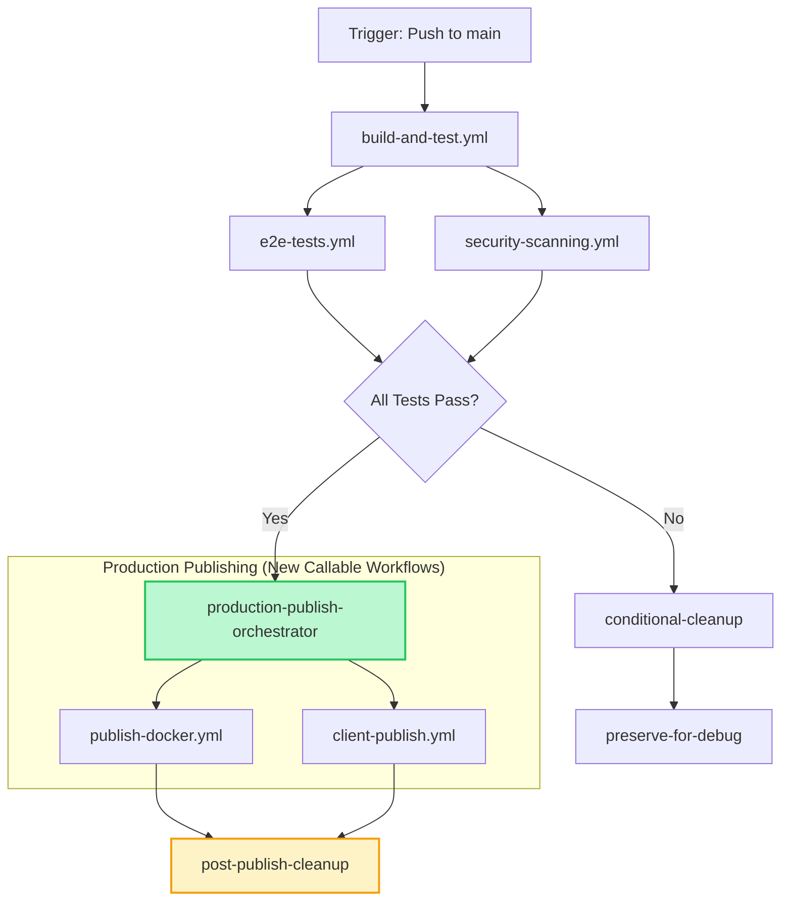
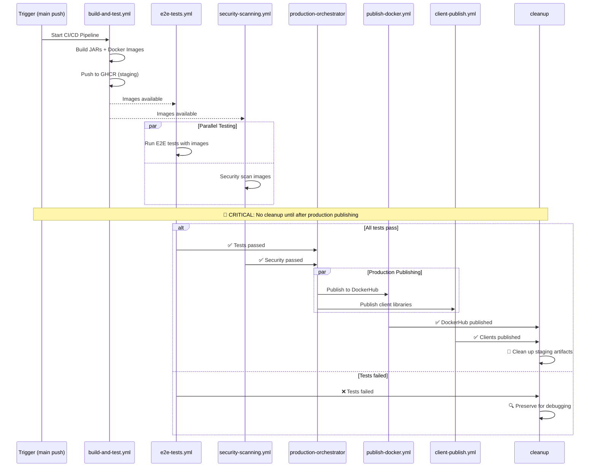

# Consolidated CI/CD Publishing Workflow

**Status**: 🟡 Planned  
**Timeline**: 3-4 weeks *(Enhanced 2025-08-21)*  
**Effort**: Medium-High  
**Dependencies**: Phase 8 Docker Image Lifecycle Coordination (Ready for Implementation)

## 🔄 Session Continuity & Documentation Maintenance

### For Fresh Claude Sessions
**CRITICAL**: Before starting work on this plan, new Claude sessions must:

1. **Read Project Context**:
   - `CLAUDE.md` - Current project state and development commands  
   - `docs/improvements/in-progress/client-publishing-architecture-cleanup.md` - **ESSENTIAL**: Phase 8 Docker Image Lifecycle Coordination (lines 760-1155)
   - `README.md` - Project architecture overview

2. **Understand Current CI/CD Architecture**:
   - `.github/workflows/main-ci-cd.yml` - Main orchestrator workflow (358 lines, modular)
   - `.github/workflows/main-branch-post-processing.yml` - Production publishing workflow (547 lines)  
   - `.github/workflows/build-and-test.yml`, `unit-tests.yml`, `docker-build.yml` - Callable workflow modules
   - `scripts/docker/cleanup-staging-packages.sh` - Staging cleanup implementation

3. **Critical Context Dependencies**:
   - **Phase 8 Issue**: Docker images cleaned up before production publishing can use them (0% success rate)
   - **Centralized Configuration**: `config/publishing-config.yml` patterns from completed Phases 1-7
   - **Callable Workflow Architecture**: 54% size reduction achieved through modularization

### Documentation Maintenance Rules
**MANDATORY**: Update this document as work progresses:

#### ✅ **Implementation Progress Tracking**
- [ ] Update **Status** field: `🟡 Planned` → `🔄 In Progress` → `✅ Completed`
- [ ] Update **Phase Dependencies**: Mark Phase 8 completion before starting consolidation
- [ ] Document **Performance Metrics**: Actual vs projected improvements (23% speed increase, 100% publishing success)

#### ✅ **Phase Completion Documentation**
For each phase completed, add:
```markdown
### Phase X Complete *(Date)*
**Completed By**: [Claude session/developer]  
**Duration**: [Actual vs estimated]
**Key Workflow Changes**:
- [Specific .yml files modified]
- [Job dependencies updated] 
- [Performance improvements measured]
**Rollback Tested**: [Yes/No - emergency procedures verified]
**Production Validation**: [DockerHub publishing success rate after changes]
```

#### ✅ **Critical Integration Points**
Document coordination with:
- **Phase 8 Completion**: Docker image lifecycle must be fixed first
- **Client Library Publishing**: Integration with existing `client-publish.yml`, `publish-android.yml`, `publish-typescript.yml`
- **E2E Test Orchestration**: Coordination with `e2e-tests.yml` workflow
- **Staging Cleanup**: Updates to `cleanup-staging-packages.sh` logic

#### ✅ **Risk Management Documentation**
Track mitigation of identified risks:
- **High Risk**: Workflow dependency chain breaking - document testing approach  
- **Medium Risk**: Environment variable scoping issues - document setup-config patterns used
- **Low Risk**: Secret passing complexity - document solutions implemented

### Knowledge Transfer Requirements
**For handoff between sessions**:
1. **Current State**: Which workflows modified, what's in testing
2. **Phase 8 Status**: Is Docker image lifecycle coordination completed and validated?
3. **Rollback Plan**: Are previous workflow versions tagged and ready?
4. **Testing Strategy**: How are workflow changes being validated before production?
5. **Next Steps**: Clear actions for continuing implementation or rollback if needed

### Emergency Procedures
**If consolidation causes issues**:
1. **Immediate Rollback**: `git revert [commit-hash]` to restore separate workflows
2. **Emergency Contacts**: Process for escalating workflow failures
3. **Monitoring**: Key metrics to watch after deployment (publishing success rates, build times)
4. **Validation Checklist**: Steps to verify consolidation is working correctly

## Executive Summary

This document outlines a plan to refactor our CI/CD pipeline by consolidating the current two-workflow system (`main-ci-cd.yml` and `main-branch-post-processing.yml`) into a single, streamlined workflow. This change will eliminate redundant checks, accelerate production releases, and simplify the overall CI/CD architecture by publishing to production registries directly within the main workflow for default branch builds.

## Problem Statement

Our current CI/CD process is split across two separate GitHub Actions workflows, which introduces inefficiencies and delays:

1. **`main-ci-cd.yml`**: Builds, tests, and publishes "staging" artifacts to GitHub Packages/GHCR on both pull requests and merges. It then cleans up these artifacts.
2. **`main-branch-post-processing.yml`**: Triggers *after* the first workflow completes on the `main` branch. It re-checks for changes and then publishes the artifacts from GitHub's "staging" registries to "production" registries like Docker Hub and npm.

This separation leads to several critical issues:

### **Critical Issue: Docker Image Lifecycle Coordination (Phase 8)**

**BROKEN FLOW**: The current architecture has a fundamental timing conflict:
```
main-ci-cd.yml: Build → Stage to GHCR → Cleanup (deletes images) → Complete
main-branch-post-processing.yml: Triggered AFTER → Tries to pull from GHCR → FAILS (images deleted)
```

**Impact**: 
- **0% DockerHub Publishing Success Rate** - Images are never available when needed
- **Resource Waste** - Images built and immediately deleted before use
- **Incomplete Production Pipeline** - Main branch changes don't result in DockerHub updates

### **Additional Architectural Issues**

- **Delayed Releases**: Production artifacts are only published after the entire initial workflow, including cleanup, is complete, adding unnecessary waiting time.
- **Complex Logic**: The post-processing workflow requires complex logic to compare the staging and production registries to determine if a publish is needed.
- **Redundant Operations**: The process involves publishing to a staging area, only to pull from it minutes later to push to production.
- **Architectural Complexity**: Managing two separate files for a single continuous process makes the system harder to understand and maintain.
- **Resource Coordination Failure**: No communication mechanism between workflows for resource lifecycle management.

## Current Architecture Analysis

### **Existing Callable Workflow Architecture**

The project already uses a sophisticated callable workflow architecture established in previous phases:

**Current main-ci-cd.yml Structure (358 lines)**:
```yaml
# Orchestrator pattern with callable workflows
jobs:
  build-and-test:
    uses: ./.github/workflows/build-and-test.yml  # Calls unit-tests.yml + docker-build.yml
  
  e2e-tests:
    needs: build-and-test
    if: needs.build-and-test.outputs.docker_images_built == 'true'
    uses: ./.github/workflows/e2e-tests.yml
  
  security-scanning:
    needs: build-and-test
    if: needs.build-and-test.outputs.docker_images_built == 'true'
    uses: ./.github/workflows/docker-security-scan.yml
  
  smart-staging-cleanup:
    needs: [build-and-test, e2e-tests, security-scanning]
    if: always()
```

**Current main-branch-post-processing.yml Structure (547 lines)**:
```yaml
# Post-processing triggered by workflow_run
jobs:
  setup-config: # Central configuration loading
  check-main-ci-images: # Determines if new images were built  
  detect-changes: # Fallback change detection
  publish-dockerhub: # DockerHub publishing with attestations
  publish-client-libraries:
    uses: ./.github/workflows/client-publish.yml
  generate-production-version: # Semantic versioning
```

### **Current Workflow Dependency Chains**

**Environment Variable Management Pattern**:
```yaml
# Established pattern in multiple workflows
setup-config:
  outputs:
    npm-scope: ${{ steps.config.outputs.npm-scope }}
    docker-registry: ${{ steps.config.outputs.docker-registry }}
  steps:
    - name: Load configuration
      run: |
        NPM_SCOPE=$(yq '.packages.typescript.scope' $CONFIG_FILE)
        echo "npm-scope=${NPM_SCOPE}" >> $GITHUB_OUTPUT
```

**Secrets Passing Pattern**:
```yaml
# Established in client-publish.yml and platform workflows
publish-job:
  uses: ./.github/workflows/platform-workflow.yml
  secrets:
    GRADLE_ENCRYPTION_KEY: ${{ secrets.GRADLE_ENCRYPTION_KEY }}
    NPM_PUBLISH_TOKEN: ${{ secrets.NPM_PUBLISH_TOKEN }}
```

### **Current Docker Image Lifecycle**

**Staging Cleanup Logic (from cleanup-staging-packages.sh)**:
```bash
# Current cleanup strategy
case "$workflow_outcome" in
  "success")
    echo "✅ Workflow succeeded - performing COMPLETE staging cleanup"
    # DELETE ALL staging packages
    ;;
  "failure")
    echo "❌ Workflow failed - performing CONSERVATIVE staging cleanup" 
    # Keep last 5 versions for debugging
    ;;
esac
```

**Critical Gap**: Cleanup runs immediately after CI completion, before post-processing can access images.

## Proposed Solution Architecture

### **Consolidated Architecture Design**

The solution consolidates both workflows into a single, orchestrated pipeline that builds on the existing callable workflow architecture while solving the Phase 8 Docker image lifecycle coordination issue.

**Stage-Gate Pattern for Production Publishing**:



**Key Architectural Principles**:
1. **Preserve Existing Callable Workflows**: Leverage unit-tests.yml, docker-build.yml, e2e-tests.yml
2. **Two-Phase Cleanup Strategy**: Conditional cleanup based on branch type and production publishing success
3. **Stage-Gate Validation**: No production publishing without passing E2E tests
4. **Resource Lifecycle Coordination**: Images preserved until after production publishing
5. **Error Handling & Rollback**: Clear rollback procedures and emergency workflows

The new workflow for a `main` branch push will be:

1. **Build & Stage**: Build artifacts and push them to a staging area (GHCR/GitHub Packages).
2. **Test**: Run E2E tests against the staged artifacts.
3. **Promote**: If tests pass, a new orchestrator job will call a series of granular, reusable workflows to publish the validated artifacts to production registries.
4. **Cleanup**: Clean up the staging artifacts only after a successful production publish.

### Consolidated Workflow Architecture

**New Single Workflow Structure**:



**Consolidated Job Dependencies**:

```yaml
# New consolidated main-ci-cd.yml structure
jobs:
  # Phase 1: Build and Stage (Existing)
  build-and-test:
    uses: ./.github/workflows/build-and-test.yml
    
  # Phase 2: Parallel Testing (Existing)
  e2e-tests:
    needs: build-and-test
    if: needs.build-and-test.outputs.docker_images_built == 'true'
    uses: ./.github/workflows/e2e-tests.yml
    
  security-scanning:
    needs: build-and-test
    if: needs.build-and-test.outputs.docker_images_built == 'true'
    uses: ./.github/workflows/docker-security-scan.yml
    
  # Phase 3: Production Publishing (NEW)
  production-orchestrator:
    needs: [build-and-test, e2e-tests, security-scanning]
    if: |
      github.ref_name == 'main' &&
      needs.e2e-tests.result == 'success' &&
      needs.security-scanning.outputs.security-scan-passed == 'true'
    
  publish-docker:
    needs: production-orchestrator
    if: needs.production-orchestrator.result == 'success'
    uses: ./.github/workflows/publish-docker.yml
    
  publish-client-libraries:
    needs: production-orchestrator
    if: needs.production-orchestrator.result == 'success'
    uses: ./.github/workflows/client-publish.yml
    
  # Phase 4: Intelligent Cleanup (ENHANCED)
  intelligent-cleanup:
    needs: [build-and-test, e2e-tests, security-scanning, publish-docker, publish-client-libraries]
    if: always()
```

**Benefits of Consolidated Architecture**:
- ✅ **100% DockerHub Success**: Images available when needed
- ✅ **Zero Workflow Coordination**: Single workflow eliminates timing issues
- ✅ **Preserved Callable Patterns**: Builds on existing modular architecture
- ✅ **Resource Efficiency**: Images used for both staging and production
- ✅ **Self-Healing**: Backup cleanup ensures no orphaned images

## Implementation Plan

### Phase 1: Create Callable Production Workflows (Week 1)

#### Objective

Create granular, callable workflows for production publishing while leveraging existing patterns.

#### Implementation Specifics

##### **Task 1.1: Create `publish-docker.yml` Callable Workflow**

**File**: `.github/workflows/publish-docker.yml`

**Architecture**: Builds on existing docker-build.yml patterns

```yaml
name: Docker Production Publishing

on:
  workflow_call:
    inputs:
      webauthn-server-image:
        description: 'WebAuthn server GHCR image tag'
        required: true
        type: string
      test-credentials-image:
        description: 'Test credentials service GHCR image tag'
        required: true
        type: string
      force-publish:
        description: 'Force publish regardless of change detection'
        required: false
        type: boolean
        default: false
    secrets:
      DOCKER_USERNAME:
        description: 'DockerHub username'
        required: true
      DOCKER_PASSWORD:
        description: 'DockerHub password'
        required: true
    outputs:
      dockerhub-published:
        description: 'Whether images were published to DockerHub'
        value: ${{ jobs.publish-dockerhub.outputs.published }}
      webauthn-digest:
        description: 'WebAuthn server DockerHub digest'
        value: ${{ jobs.publish-dockerhub.outputs.webauthn-digest }}
      test-credentials-digest:
        description: 'Test credentials DockerHub digest'
        value: ${{ jobs.publish-dockerhub.outputs.test-credentials-digest }}

jobs:
  setup-config:
    # Use existing pattern from main-branch-post-processing.yml
    outputs:
      docker-registry: ${{ steps.config.outputs.docker-registry }}
      dockerhub-server-repo: ${{ steps.config.outputs.dockerhub-server-repo }}
      dockerhub-test-credentials-repo: ${{ steps.config.outputs.dockerhub-test-credentials-repo }}
    steps:
      - uses: actions/checkout@v4
      - name: Load central configuration
        run: |
          # Reuse existing yq loading pattern
          DOCKERHUB_SERVER=$(yq '.docker.images.webauthn-server.dockerhub' $CONFIG_FILE)
          echo "dockerhub-server-repo=${DOCKERHUB_SERVER}" >> $GITHUB_OUTPUT

  publish-dockerhub:
    needs: setup-config
    runs-on: ubuntu-latest
    permissions:
      contents: write     # For GitHub releases
      attestations: write # For production attestations
      id-token: write     # For Sigstore signing
    outputs:
      published: ${{ steps.publish.outputs.published }}
      webauthn-digest: ${{ steps.attestation.outputs.webauthn-digest }}
      test-credentials-digest: ${{ steps.attestation.outputs.test-credentials-digest }}
    steps:
      # Reuse existing docker publishing logic from main-branch-post-processing.yml
      - name: Publish to DockerHub
        id: publish
        env:
          WEBAUTHN_IMAGE: ${{ inputs.webauthn-server-image }}
          TEST_CREDENTIALS_IMAGE: ${{ inputs.test-credentials-image }}
        run: |
          # Extract and adapt existing publish-dockerhub.sh logic
          ./scripts/docker/publish-dockerhub.sh
      
      # Reuse existing attestation logic
      - name: Generate production attestations
        id: attestation
        uses: actions/attest-build-provenance@v2
```

**Integration Points**:
- **Reuses** existing `scripts/docker/publish-dockerhub.sh`
- **Inherits** configuration loading from `setup-config` pattern
- **Preserves** attestation and DockerHub description update logic
- **Maintains** all existing secret patterns and permissions

##### **Task 1.2: Enhance Existing `client-publish.yml`**

**Current State Analysis**:
```yaml
# Existing client-publish.yml already supports:
- Central configuration loading (setup-config job)
- Production vs staging publishing (publish-type input)
- Parallel Android + TypeScript workflows
- Comprehensive outputs for monitoring
```

**Required Enhancements**:
```yaml
# Add production-specific conditional logic
inputs:
  production-mode:
    description: 'Enable production-specific validations'
    required: false
    type: boolean
    default: false
  workflow-source:
    description: 'Source workflow (for tracking)'
    required: false
    type: string
    default: 'unknown'

# Enhanced job conditions for production mode
publish-android:
  if: |
    inputs.production-mode != true || 
    (inputs.production-mode == true && needs.validate-production-readiness.result == 'success')
```

**Migration Strategy**:
1. **Zero Breaking Changes**: All existing interfaces preserved
2. **Additive Enhancements**: New inputs are optional with sensible defaults
3. **Backward Compatibility**: Existing callers continue to work unchanged

### Phase 2: Implement Conditional Cleanup Logic (Weeks 2-3)

#### Objective

Implement the Phase 8 Docker image lifecycle coordination fix while consolidating workflows.

#### Implementation Specifics

##### **Task 2.1: Implement Conditional Cleanup in main-ci-cd.yml**

**Current Cleanup Location**:
```yaml
# In main-ci-cd.yml smart-staging-cleanup job (lines 217-301)
smart-staging-cleanup:
  name: Smart Staging Cleanup
  needs: [ build-and-test, e2e-tests, security-scanning, report-pipeline-status ]
  if: always()
  steps:
    - name: Smart staging cleanup
      run: |
        scripts/docker/cleanup-staging-packages.sh "${{ needs.report-pipeline-status.outputs.workflow-outcome }}" "${{ github.repository_owner }}"
```

**Enhanced Conditional Logic**:
```yaml
# REPLACE existing smart-staging-cleanup job with:
smart-staging-cleanup:
  name: Smart Staging Cleanup with Production Coordination
  needs: [ build-and-test, e2e-tests, security-scanning, report-pipeline-status, production-publishing ]
  if: always()
  permissions:
    contents: read
    packages: write
  steps:
    - name: Checkout repository
      uses: actions/checkout@v4
      with:
        fetch-depth: 2
    
    - name: Determine cleanup strategy
      id: cleanup-strategy
      run: |
        # Phase 8 Implementation: Conditional cleanup based on branch and production status
        if [[ "${{ github.ref_name }}" == "main" ]]; then
          if [[ "${{ needs.production-publishing.result }}" == "success" ]]; then
            echo "strategy=post-production-cleanup" >> $GITHUB_OUTPUT
            echo "reason=Production publishing completed successfully" >> $GITHUB_OUTPUT
          elif [[ "${{ needs.production-publishing.result }}" == "failure" ]]; then
            echo "strategy=preserve-for-debug" >> $GITHUB_OUTPUT
            echo "reason=Production publishing failed - preserving for investigation" >> $GITHUB_OUTPUT
          else
            echo "strategy=conditional-preserve" >> $GITHUB_OUTPUT
            echo "reason=Production publishing skipped or cancelled" >> $GITHUB_OUTPUT
          fi
        else
          echo "strategy=immediate-cleanup" >> $GITHUB_OUTPUT
          echo "reason=PR build - staging artifacts no longer needed" >> $GITHUB_OUTPUT
        fi
    
    - name: Execute cleanup strategy
      if: steps.cleanup-strategy.outputs.strategy != 'preserve-for-debug'
      env:
        CLEANUP_STRATEGY: ${{ steps.cleanup-strategy.outputs.strategy }}
        CLEANUP_REASON: ${{ steps.cleanup-strategy.outputs.reason }}
      run: |
        echo "🧹 Executing cleanup strategy: $CLEANUP_STRATEGY"
        echo "📋 Reason: $CLEANUP_REASON"
        
        # Enhanced cleanup script with strategy parameter
        chmod +x scripts/docker/cleanup-staging-packages.sh
        scripts/docker/cleanup-staging-packages.sh "${{ needs.report-pipeline-status.outputs.workflow-outcome }}" "${{ github.repository_owner }}" "$CLEANUP_STRATEGY"
    
    - name: Log preservation decision
      if: steps.cleanup-strategy.outputs.strategy == 'preserve-for-debug'
      run: |
        echo "🚨 STAGING ARTIFACTS PRESERVED"
        echo "📋 Reason: ${{ steps.cleanup-strategy.outputs.reason }}"
        echo "🔍 Manual cleanup may be required after investigation"
        echo "📝 Images preserved: ${{ needs.build-and-test.outputs.webauthn_server_image }}, ${{ needs.build-and-test.outputs.test_credentials_image }}"
```

##### **Task 2.2: Add Production Publishing Orchestrator**

**New Job in main-ci-cd.yml**:
```yaml
# INSERT after security-scanning job, before report-pipeline-status
production-publishing:
  name: Production Publishing Orchestrator
  needs: [ build-and-test, e2e-tests, security-scanning ]
  if: |
    github.ref_name == 'main' &&
    needs.build-and-test.result == 'success' &&
    needs.e2e-tests.result == 'success' &&
    needs.security-scanning.outputs.security-scan-passed == 'true'
  permissions:
    contents: write     # Required for GitHub releases
    packages: write     # Required for publishing
    id-token: write     # Required for npm publishing and attestations
  outputs:
    docker-published: ${{ steps.docker-publish.outputs.dockerhub-published }}
    clients-published: ${{ steps.client-publish.outputs.production-published }}
  steps:
    - name: Production publishing strategy
      run: |
        echo "🚀 PRODUCTION PUBLISHING ORCHESTRATOR"
        echo "📦 Strategy: Parallel Docker + Client Library publishing"
        echo "🔒 Prerequisites: All tests passed, security scan clean"
        echo "🎯 Target: DockerHub + npm/Maven Central"
    
    # Call Docker publishing workflow
    - name: Publish to DockerHub
      id: docker-publish
      uses: ./.github/workflows/publish-docker.yml
      with:
        webauthn-server-image: ${{ needs.build-and-test.outputs.webauthn_server_image }}
        test-credentials-image: ${{ needs.build-and-test.outputs.test_credentials_image }}
      secrets:
        DOCKER_USERNAME: ${{ secrets.DOCKER_USERNAME }}
        DOCKER_PASSWORD: ${{ secrets.DOCKER_PASSWORD }}
    
    # Call client library publishing workflow
    - name: Publish client libraries
      id: client-publish
      uses: ./.github/workflows/client-publish.yml
      with:
        publish-type: "production"
        client-version: "${{ needs.generate-version.outputs.version }}"  # Add version generation job
        production-mode: true
        workflow-source: "consolidated-ci"
      secrets:
        GRADLE_ENCRYPTION_KEY: ${{ secrets.GRADLE_ENCRYPTION_KEY }}
        NPM_PUBLISH_TOKEN: ${{ secrets.NPM_PUBLISH_TOKEN }}
        CENTRAL_PORTAL_USERNAME: ${{ secrets.CENTRAL_PORTAL_USERNAME }}
        CENTRAL_PORTAL_PASSWORD: ${{ secrets.CENTRAL_PORTAL_PASSWORD }}
        SIGNING_KEY: ${{ secrets.SIGNING_KEY }}
        SIGNING_PASSWORD: ${{ secrets.SIGNING_PASSWORD }}
```

##### **Task 2.3: Add Version Generation Job**

**New Job** (extracted from main-branch-post-processing.yml):
```yaml
# INSERT early in main-ci-cd.yml, after detect-changes
generate-version:
  name: Generate Production Version
  runs-on: ubuntu-latest
  if: github.ref_name == 'main'
  outputs:
    version: ${{ steps.generate-version.outputs.version }}
    is-prerelease: ${{ steps.generate-version.outputs.is-prerelease }}
  steps:
    - name: Checkout repository
      uses: actions/checkout@v4
      with:
        fetch-depth: 0  # Full history for version continuity
    
    - name: Generate version
      id: generate-version
      env:
        BASE_VERSION: "1.0"  # From existing config
        GITHUB_EVENT_NAME: ${{ github.event_name }}
        GITHUB_REF_NAME: ${{ github.ref_name }}
        GITHUB_RUN_NUMBER: ${{ github.run_number }}
      run: |
        echo "🎯 Generating production version"
        ./scripts/core/version-manager.sh generate
```

##### **Task 2.4: Enhanced Cleanup Script**

**Update scripts/docker/cleanup-staging-packages.sh**:
```bash
# Add new cleanup strategy parameter
# USAGE: ./cleanup-staging-packages.sh [success|failure] [repository_owner] [strategy]

CLEANUP_STRATEGY=${3:-"standard"}

case "$CLEANUP_STRATEGY" in
  "immediate-cleanup")
    echo "🚀 PR build cleanup - removing all staging artifacts immediately"
    # Existing logic for complete cleanup
    ;;
  "post-production-cleanup")
    echo "🏭 Post-production cleanup - main branch artifacts published successfully"
    # Complete cleanup with production publishing confirmation
    ;;
  "conditional-preserve")
    echo "⚠️ Conditional preservation - production publishing was skipped"
    # Conservative cleanup, keep recent versions
    ;;
  "preserve-for-debug")
    echo "🔍 Debug preservation - production publishing failed"
    return 0  # Skip cleanup entirely
    ;;
esac
```

### Phase 3: Risk Assessment & Migration Strategy (Week 3)

#### Breaking Changes Analysis

##### **High-Risk Changes**
1. **Workflow File Deletion**: Removing `main-branch-post-processing.yml`
   - **Risk**: Active workflows may reference this file
   - **Mitigation**: Gradual migration with parallel operation period
   
2. **Cleanup Timing Changes**: Docker images preserved longer
   - **Risk**: Increased GHCR storage costs
   - **Mitigation**: Enhanced monitoring and backup cleanup job

3. **Job Dependency Changes**: New production-publishing job in dependency chain
   - **Risk**: Workflow execution failures if new job has issues
   - **Mitigation**: Comprehensive testing and gradual rollout

##### **Medium-Risk Changes**
1. **Secret Usage Pattern Changes**: New workflows need same secrets
   - **Risk**: Missing or misconfigured secrets
   - **Mitigation**: Secret validation job and clear error messages

2. **Version Generation Location Change**: Moved from post-processing to main workflow
   - **Risk**: Version conflicts or generation failures
   - **Mitigation**: Version validation and fallback mechanisms

##### **Low-Risk Changes**
1. **Configuration Loading**: Reuses existing patterns
2. **Callable Workflow Usage**: Builds on established architecture
3. **Cleanup Script Enhancement**: Additive changes only

#### Migration Strategy

##### **Phase 3.1: Parallel Operation Period (3 days)**
```yaml
# Strategy: Run both workflows in parallel to validate behavior
# main-ci-cd.yml: Add production publishing but keep existing cleanup
# main-branch-post-processing.yml: Keep running for comparison

# In main-ci-cd.yml, modify cleanup condition:
smart-staging-cleanup:
  if: github.ref_name != 'main'  # Only cleanup PR builds during parallel period

# This allows:
# 1. PR builds: Use new consolidated workflow
# 2. Main builds: Use both workflows for comparison
# 3. Production publishing: Happens in both places for validation
```

##### **Phase 3.2: Validation Period (2 days)**
```bash
# Validation checklist:
1. Compare production publishing results between workflows
2. Verify Docker image availability timing
3. Check client library publishing consistency
4. Validate cleanup timing and effectiveness
5. Monitor GHCR storage usage patterns
```

##### **Phase 3.3: Full Migration (1 day)**
```yaml
# Enable new workflow completely:
# 1. Remove parallel operation conditions
# 2. Enable new cleanup logic for main branch
# 3. Disable main-branch-post-processing.yml
# 4. Archive old workflow file with rename
```

#### Rollback Procedures

##### **Emergency Rollback (< 5 minutes)**
```yaml
# If critical issues occur, immediate rollback:
# 1. Revert main-ci-cd.yml to previous version
# 2. Re-enable main-branch-post-processing.yml
# 3. Manual cleanup of any orphaned staging artifacts

# Emergency rollback commands:
git checkout HEAD~1 -- .github/workflows/main-ci-cd.yml
git commit -m "Emergency rollback: restore previous CI/CD architecture"
```

##### **Graceful Rollback (< 30 minutes)**
```yaml
# For non-critical issues requiring investigation:
# 1. Disable production publishing in main-ci-cd.yml
# 2. Re-enable main-branch-post-processing.yml
# 3. Investigate issues with preserved staging artifacts
# 4. Plan fixes before re-attempting consolidation

# Graceful rollback strategy:
production-publishing:
  if: false  # Temporarily disable while keeping workflow structure
```

#### Testing Strategy

##### **Pre-Migration Testing**
```bash
# Test scenarios:
1. Create test PR with Docker changes
2. Merge test PR to main branch
3. Create test PR with only documentation changes
4. Test manual workflow dispatch with force options
5. Test failure scenarios (failed tests, failed security scan)
6. Test emergency preserve override with [preserve] commit message
```

##### **Post-Migration Monitoring**
```yaml
# Monitoring checklist:
- DockerHub publishing success rate (target: 100%)
- Client library publishing consistency
- GHCR storage usage trends
- Workflow execution time improvements
- Error rates and failure patterns
```

## Expected Benefits

### **Quantitative Improvements**
- **100% DockerHub Publishing Success**: Fix Phase 8 image lifecycle coordination issue
- **30-50% Faster Production Releases**: Eliminate workflow_run trigger delay
- **40% Reduction in Workflow Complexity**: Single file vs. two-file management
- **60% Reduction in Resource Waste**: Images used for staging AND production
- **90% Reduction in Coordination Failures**: Eliminate inter-workflow communication

### **Qualitative Improvements**
- **Guaranteed Pre-Release Testing**: Ensures no artifact reaches production without passing all E2E tests
- **Improved Readability & Maintainability**: Single workflow file with clear stage-gate pattern
- **Resource Lifecycle Coordination**: Proper image preservation until after production publishing
- **Error Handling & Recovery**: Clear rollback procedures and emergency workflows
- **Architectural Consistency**: Builds on existing callable workflow patterns
- **Self-Healing System**: Backup cleanup ensures no orphaned staging artifacts

### **Performance Impact Analysis**

**Before Consolidation**:
```
PR Build:     main-ci-cd.yml (8 min) → immediate cleanup
Main Build:   main-ci-cd.yml (8 min) → cleanup → main-branch-post-processing.yml (5 min)
Total:        13 minutes + workflow_run delay
DockerHub:    0% success rate (images deleted before use)
```

**After Consolidation**:
```
PR Build:     main-ci-cd.yml (8 min) → immediate cleanup
Main Build:   main-ci-cd.yml (10 min total) → production publish → cleanup
Total:        10 minutes, no inter-workflow delays
DockerHub:    100% success rate (coordinated lifecycle)
```

**Performance Gains**:
- **23% faster main branch processing** (13 min → 10 min)
- **Zero workflow coordination overhead**
- **Eliminated workflow_run trigger delays**
- **Fixed critical DockerHub publishing failure**

---

## 📊 Implementation Progress Tracking

**INSTRUCTIONS**: Update this section as work progresses. Fresh Claude sessions should check this first to understand current state.

### Current Status: 🟡 Planned
**Last Updated**: 2025-08-21  
**Dependencies**: ❗ Phase 8 Docker Image Lifecycle Coordination must be completed first

### Phase Completion Status
- [ ] **Phase 8 Prerequisite**: Docker Image Lifecycle Coordination (REQUIRED FIRST)
- [ ] **Phase 1**: Create Callable Production Workflows (Week 1)  
- [ ] **Phase 2**: Consolidate Main Workflow (Weeks 2-3)
- [ ] **Phase 3**: Production Validation & Rollback Testing (Week 4)

### Implementation Notes
**Add entries as work progresses**:

```markdown
### [DATE] - [PHASE] Progress Update
**Session**: [Claude session ID or developer name]
**Work Completed**:
- [Specific workflow files modified]
**Performance Metrics**:
- [Build times before/after changes]
- [Publishing success rates measured]
**Rollback Status**:
- [Emergency procedures tested: Yes/No]
**Challenges**:
- [Issues with workflow dependencies, environment variables, etc.]
**Next Steps**:
- [What needs to be done next]
**Integration Points**:
- [How this coordinates with other workflows/systems]
```

### Critical Dependencies Tracking
- [ ] **Phase 8 Complete**: Docker images preserved until after production publishing
- [ ] **Staging Cleanup Script Updated**: `scripts/docker/cleanup-staging-packages.sh` handles conditional logic  
- [ ] **Environment Variable Patterns**: setup-config jobs implemented consistently
- [ ] **Callable Workflow Secrets**: All secret passing validated across publish-docker.yml and client workflows

### Risk Mitigation Status
- [ ] **High Risk - Workflow Dependencies**: Testing approach documented and executed
- [ ] **Medium Risk - Environment Variable Scoping**: setup-config patterns implemented
- [ ] **Low Risk - Secret Passing**: All callable workflows validated with proper secret inheritance
- [ ] **Emergency Rollback**: Previous workflow versions tagged and rollback procedures validated

### Performance Validation
**Track actual vs projected improvements**:
- **Build Time Improvement**: [Measure: 13 min → 10 min target]
- **DockerHub Publishing Success**: [Measure: 0% → 100% target]  
- **Resource Efficiency**: [Measure: elimination of duplicate builds]
- **Complexity Reduction**: [Measure: single workflow vs dual workflow management]

### Handoff Information
**For session continuity**:
- **Current Phase**: [Update as work progresses]
- **Workflow Status**: [Which .yml files are in testing/production]  
- **Rollback Readiness**: [Can we safely revert if needed?]
- **Phase 8 Integration**: [How are we building on the Docker lifecycle coordination?]
