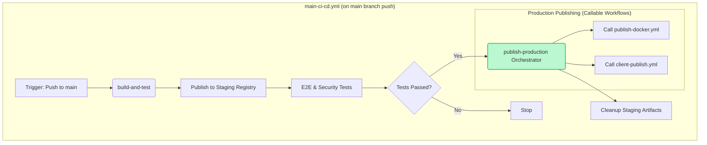

# Consolidated CI/CD Publishing Workflow

**Status**: 🟡 Planned  
**Timeline**: 2-3 weeks  
**Effort**: Medium  
**Dependencies**: None

## Executive Summary

This document outlines a plan to refactor our CI/CD pipeline by consolidating the current two-workflow system (`main-ci-cd.yml` and `main-branch-post-processing.yml`) into a single, streamlined workflow. This change will eliminate redundant checks, accelerate production releases, and simplify the overall CI/CD architecture by publishing to production registries directly within the main workflow for default branch builds.

## Problem Statement

Our current CI/CD process is split across two separate GitHub Actions workflows, which introduces inefficiencies and delays:

1. **`main-ci-cd.yml`**: Builds, tests, and publishes "staging" artifacts to GitHub Packages/GHCR on both pull requests and merges. It then cleans up these artifacts.
2. **`main-branch-post-processing.yml`**: Triggers *after* the first workflow completes on the `main` branch. It re-checks for changes and then publishes the artifacts from GitHub's "staging" registries to "production" registries like Docker Hub and npm.

This separation leads to several issues:

- **Delayed Releases**: Production artifacts are only published after the entire initial workflow, including cleanup, is complete, adding unnecessary waiting time.
- **Complex Logic**: The post-processing workflow requires complex logic to compare the staging and production registries to determine if a publish is needed.
- **Redundant Operations**: The process involves publishing to a staging area, only to pull from it minutes later to push to production.
- **Architectural Complexity**: Managing two separate files for a single continuous process makes the system harder to understand and maintain.

## Proposed Solution Architecture

The solution is to merge all publishing logic into the `main-ci-cd.yml` workflow. Crucially, this new architecture will ensure that **no artifacts are published to production without first passing E2E tests**. To achieve this, a staging area will be used for all builds, including those on the `main` branch.

The new workflow for a `main` branch push will be:

1. **Build & Stage**: Build artifacts and push them to a staging area (GHCR/GitHub Packages).
2. **Test**: Run E2E tests against the staged artifacts.
3. **Promote**: If tests pass, a new orchestrator job will call a series of granular, reusable workflows to publish the validated artifacts to production registries.
4. **Cleanup**: Clean up the staging artifacts only after a successful production publish.

### New Workflow Architecture

## Implementation Plan

### Phase 1: Create Callable Production Workflows (Week 1)

#### Objective

Create or adapt granular, callable workflows for production publishing tasks.

#### Tasks

1. **Create `publish-docker.yml` Callable Workflow**:
    - Create a new file: `.github/workflows/publish-docker.yml`.
    - This workflow will be responsible for pulling a specified Docker image from GHCR, re-tagging it for production, and pushing it to Docker Hub.
    - It will accept inputs like `image-name`, `staging-tag`, and `production-repo`.
    - It will require secrets for Docker Hub credentials.
2. **Adapt `client-publish.yml`**:
    - Review the existing `.github/workflows/client-publish.yml`.
    - Ensure it can be called from the new orchestrator job and that it correctly handles publishing to production npm/Maven registries.
    - Verify it accepts all necessary parameters (e.g., `version`, `npm-token`).

### Phase 2: Consolidate Main Workflow (Weeks 2-3)

#### Objective

Modify `main-ci-cd.yml` to act as an orchestrator that calls the new production workflows.

#### Tasks

1. **Create `publish-production` Orchestrator Job**:
    - In `main-ci-cd.yml`, create a new job named `publish-production`.
    - Set its `if` condition to `github.event_name == 'push' && github.ref == 'refs/heads/main'`.
    - Make it dependent on the successful completion of the `e2e-tests` and `security-scanning` jobs.
2. **Call Production Workflows**:
    - Within the `publish-production` job, add steps to call the reusable workflows:
        - Call `.github/workflows/publish-docker.yml` for the `webauthn-server` and `test-credentials-service` images.
        - Call `.github/workflows/client-publish.yml` for the Android and TypeScript client libraries.
    - Pass the required inputs (image names from the `build-and-test` job outputs) and secrets to these callable workflows.
3. **Modify `final-cleanup` Job**:
    - The cleanup job should now depend on the `publish-production` job.
    - Update its logic to execute different cleanup strategies:
        - **If `github.event_name == 'pull_request'`**: Clean up the staging artifacts as it does now.
        - **If `github.event_name == 'push'` and `needs.publish-production.result == 'success'`**: Clean up the staging artifacts.
        - **If `github.event_name == 'push'` and `needs.publish-production.result != 'success'`**: Skip cleanup to preserve the staging artifacts for debugging.
4. **Remove Old Workflow**:
    - After verifying the new consolidated workflow runs correctly, delete the `.github/workflows/main-branch-post-processing.yml` file.
5. **Update Documentation**:
    - Update any relevant documentation to reflect the new, streamlined, and modular CI/CD process.

## Expected Benefits

- **Guaranteed Pre-Release Testing**: Ensures no artifact reaches production without passing all E2E tests.
- **Improved Readability & Maintainability**: Keeps the main workflow clean and delegates complex logic to specialized, reusable workflows.
- **Faster Production Releases**: Artifacts will be published to production immediately after testing is complete, without waiting for a second workflow to trigger.
- **Reduced Complexity**: A single workflow file will be easier to manage, understand, and maintain.
- **Increased Efficiency**: Eliminates redundant change detection logic.
- **Improved Reliability**: Reduces the number of potential failure points in the release process.
