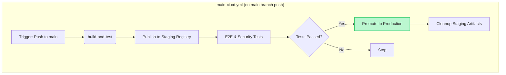

# Consolidated CI/CD Publishing Workflow

**Status**: 🟡 Planned  
**Timeline**: 2-3 weeks  
**Effort**: Medium  
**Dependencies**: None

## Executive Summary

This document outlines a plan to refactor our CI/CD pipeline by consolidating the current two-workflow system (`main-ci-cd.yml` and `main-branch-post-processing.yml`) into a single, streamlined workflow. This change will eliminate redundant checks, accelerate production releases, and simplify the overall CI/CD architecture by publishing to production registries directly within the main workflow for default branch builds.

## Problem Statement

Our current CI/CD process is split across two separate GitHub Actions workflows, which introduces inefficiencies and delays:

1. **`main-ci-cd.yml`**: Builds, tests, and publishes "staging" artifacts to GitHub Packages/GHCR on both pull requests and merges. It then cleans up these artifacts.
2. **`main-branch-post-processing.yml`**: Triggers *after* the first workflow completes on the `main` branch. It re-checks for changes and then publishes the artifacts from GitHub's "staging" registries to "production" registries like Docker Hub and npm.

This separation leads to several issues:

- **Delayed Releases**: Production artifacts are only published after the entire initial workflow, including cleanup, is complete, adding unnecessary waiting time.
- **Complex Logic**: The post-processing workflow requires complex logic to compare the staging and production registries to determine if a publish is needed.
- **Redundant Operations**: The process involves publishing to a staging area, only to pull from it minutes later to push to production.
- **Architectural Complexity**: Managing two separate files for a single continuous process makes the system harder to understand and maintain.

## Proposed Solution Architecture

The solution is to merge all publishing logic into the `main-ci-cd.yml` workflow. Crucially, this new architecture will ensure that **no artifacts are published to production without first passing E2E tests**. To achieve this, a staging area will be used for all builds, including those on the `main` branch.

The new workflow for a `main` branch push will be:

1. **Build & Stage**: Build artifacts and push them to a staging area (GHCR/GitHub Packages).
2. **Test**: Run E2E tests against the staged artifacts.
3. **Promote**: If tests pass, a new job will pull the validated artifacts from staging, re-tag them, and push them to production registries.
4. **Cleanup**: Clean up the staging artifacts only after a successful production publish.

### New Workflow Architecture

## Implementation Plan

### Phase 1: Consolidate Workflows (Weeks 1-2)

#### Objective

Merge the production publishing logic into `main-ci-cd.yml` and ensure it runs conditionally after E2E tests pass on the `main` branch.

#### Tasks

1. **Create `publish-production` Job**:
    - In `main-ci-cd.yml`, create a new job named `publish-production`.
    - Set its `if` condition to `github.event_name == 'push' && github.ref == 'refs/heads/main'`.
    - Make it dependent on the successful completion of the `e2e-tests` and `security-scanning` jobs.
2. **Migrate Publishing Logic**:
    - Move all steps from the `publish-dockerhub` and `publish-client-libraries` jobs in `main-branch-post-processing.yml` into the new `publish-production` job.
    - The logic should be adapted to pull the staged artifacts (e.g., Docker image tagged with the commit SHA from GHCR) and then re-tag and push them to production registries. This removes the need for the complex `detect-changes` logic.
3. **Adapt Input Secrets**:
    - Ensure the `main-ci-cd.yml` workflow has access to the necessary secrets for production publishing (e.g., `DOCKER_PASSWORD`, `NPM_PUBLISH_TOKEN`).

### Phase 2: Adjust Cleanup and Finalize (Week 3)

#### Objective

Modify the cleanup logic to handle both pull request and `main` branch scenarios correctly, then remove the old workflow file.

#### Tasks

1. **Modify `smart-staging-cleanup` Job**:
    - Rename the job to `final-cleanup` for clarity.
    - Update its `if` condition to run `always()`.
    - Add logic within the job to execute different cleanup strategies:
        - **If `github.event_name == 'pull_request'`**: Clean up the staging artifacts as it does now.
        - **If `github.event_name == 'push'` and `needs.publish-production.result == 'success'`**: Clean up the staging artifacts.
        - **If `github.event_name == 'push'` and `needs.publish-production.result != 'success'`**: Skip cleanup to preserve the staging artifacts for debugging.
2. **Remove Old Workflow**:
    - After verifying the new consolidated workflow runs correctly on both PRs and `main` branch pushes, delete the `.github/workflows/main-branch-post-processing.yml` file.
3. **Update Documentation**:
    - Update any relevant documentation in the `docs/workflows` directory to reflect the new, streamlined CI/CD process.

## Expected Benefits

- **Guaranteed Pre-Release Testing**: Ensures no artifact reaches production without passing all E2E tests.
- **Faster Production Releases**: Artifacts will be published to production immediately after testing is complete, without waiting for a second workflow to trigger.
- **Reduced Complexity**: A single workflow file will be easier to manage, understand, and maintain.
- **Increased Efficiency**: Eliminates redundant change detection logic.
- **Improved Reliability**: Reduces the number of potential failure points in the release process.
