# Development Workflow Optimizations

**Status**: 📋 **PLANNED**  
**Priority**: High  
**Estimated Timeline**: 2-4 hours setup + ongoing optimization  
**Dependencies**: Claude Code, GitHub MCP Server, GitHub CLI  

## 🎯 **Project Overview**

Transform the current manual development workflow into a streamlined, semi-automated process using GitHub MCP integration and intelligent automation while maintaining developer control over all commits and changes.

### **Current Workflow Pain Points**
```
Current Manual Flow:
1. Checkout new branch locally                    ⏱️ Manual
2. Ask Claude to make changes (no auto-commit)   ✅ Good
3. Review changes yourself                        ✅ Good (keep)
4. Commit to local branch                         ⏱️ Manual
5. Push branch to GitHub                          ⏱️ Manual
6. Manually create PR via GitHub UI               ⏱️ Manual
7. Fill out PR template manually                  ⏱️ Manual
```

### **Target Optimized Flow**
```
Optimized Semi-Automated Flow:
1. Claude: Create branch with smart naming        🤖 Automated
2. Claude: Make requested changes                 🤖 Automated
3. Developer: Review changes                      ✅ Manual (keep)
4. Claude: Create commit with proper format       🤖 Automated (on approval)
5. Claude: Push branch to GitHub                  🤖 Automated
6. Claude: Create PR with context-aware template  🤖 Automated
7. Claude: Apply relevant labels/assignees        🤖 Automated
```

**Time Savings**: ~5-10 minutes per development cycle  
**Consistency**: Standardized branch names, commits, PR formatting  
**Control**: Developer maintains full review authority  

## 📋 **Implementation Plan**

### **Phase 1: GitHub MCP Server Setup** *(30 minutes)*

#### **1.1 Install GitHub MCP Server**
```bash
# Option 1: Remote server (recommended for Claude Code)
# Install via Claude Code MCP integration
claude mcp add github-server --remote

# Option 2: Local Docker installation (fallback)
docker run -d \
  --name github-mcp-server \
  -e GITHUB_TOKEN=${GITHUB_TOKEN} \
  -p 3000:3000 \
  ghcr.io/github/github-mcp-server:latest
```

#### **1.2 Configure GitHub Authentication**
```bash
# Create GitHub Personal Access Token (PAT)
# Required scopes: repo, read:packages, read:org, workflow

# Set environment variables
export GITHUB_TOKEN="your_github_pat_here"
export GITHUB_OWNER="$(gh api user --jq .login)"
export GITHUB_REPO="mpo-api-authn-server"
```

#### **1.3 Test MCP Integration**
```bash
# Verify Claude can access GitHub via MCP
# Test basic repository access
# Confirm PR creation capabilities
```

### **Phase 2: Workflow Automation Scripts** *(1 hour)*

#### **2.1 Create Workflow Helper Scripts**

**`scripts/workflow/start-task.sh`**
```bash
#!/bin/bash
# Smart branch creation and task initiation
set -e

TASK_DESCRIPTION="$1"
TASK_TYPE="${2:-feature}"  # feature, fix, refactor, docs

if [ -z "$TASK_DESCRIPTION" ]; then
  echo "Usage: $0 'task description' [task-type]"
  echo "Types: feature, fix, refactor, docs, security"
  exit 1
fi

# Generate semantic branch name
BRANCH_NAME="$TASK_TYPE/$(echo "$TASK_DESCRIPTION" | tr '[:upper:]' '[:lower:]' | sed 's/[^a-z0-9]/-/g' | sed 's/--*/-/g' | sed 's/^-\|-$//g')"

echo "🚀 Starting development task: $TASK_DESCRIPTION"
echo "📝 Branch: $BRANCH_NAME"
echo "🔧 Type: $TASK_TYPE"

# Create and checkout branch
git checkout -b "$BRANCH_NAME"

echo ""
echo "✅ Development environment ready!"
echo "🤖 Next: Ask Claude to implement your changes"
echo ""
echo "When ready to complete:"
echo "  ./scripts/workflow/finish-task.sh '$TASK_DESCRIPTION'"
```

**`scripts/workflow/finish-task.sh`**
```bash
#!/bin/bash
# Complete task with automated PR creation
set -e

TASK_DESCRIPTION="$1"
CURRENT_BRANCH=$(git branch --show-current)
TASK_TYPE=$(echo "$CURRENT_BRANCH" | cut -d'/' -f1)

if [ -z "$TASK_DESCRIPTION" ]; then
  echo "Usage: $0 'task description'"
  exit 1
fi

echo "🔍 Finalizing task: $TASK_DESCRIPTION"
echo "📝 Branch: $CURRENT_BRANCH"

# Check for changes
if ! git diff --quiet || ! git diff --cached --quiet; then
  echo "📋 Changes detected - ready for commit review"
  git status
  echo ""
  echo "🤖 Claude will now handle commit and PR creation via MCP"
  echo "   (You retain full review control)"
else
  echo "ℹ️ No changes detected"
  exit 1
fi
```

#### **2.2 Create PR Template System**

**`.github/PULL_REQUEST_TEMPLATE/feature.md`**
```markdown
## 🚀 Feature Implementation

### Purpose
<!-- Brief description of the new feature -->

### Changes Made
- [ ] Core functionality implemented
- [ ] Tests added/updated
- [ ] Documentation updated
- [ ] Integration tested

### Technical Details
<!-- Implementation specifics -->

### Testing
- [ ] Unit tests pass
- [ ] Integration tests pass  
- [ ] E2E tests pass (if applicable)
- [ ] Manual testing completed

---
🤖 Generated with [Claude Code](https://claude.ai/code) assistance
```

**`.github/PULL_REQUEST_TEMPLATE/fix.md`**
```markdown
## 🐛 Bug Fix

### Issue Description
<!-- What bug was fixed? -->

### Root Cause
<!-- What caused the issue? -->

### Solution
- [ ] Root cause identified
- [ ] Fix implemented
- [ ] Tests added to prevent regression
- [ ] Documentation updated (if needed)

### Verification
- [ ] Bug reproduction confirmed
- [ ] Fix verified locally
- [ ] No regression introduced
- [ ] Related functionality tested

---
🤖 Generated with [Claude Code](https://claude.ai/code) assistance
```

### **Phase 3: Claude Code Integration** *(1 hour)*

#### **3.1 Define Workflow Commands**

Create Claude Code workflow patterns for common operations:

**Branch Management:**
- `create-branch <description> [type]` - Smart branch creation
- `switch-to-main` - Safe return to main branch with stash

**Development Cycle:**
- `implement-feature <description>` - Full feature implementation cycle
- `fix-bug <description>` - Bug fix workflow with testing
- `refactor-code <target>` - Code refactoring with validation

**Git Operations:**
- `commit-changes <description>` - Context-aware commit creation
- `create-pr [template]` - Automated PR creation with templates
- `update-pr-status` - Update PR with latest changes

#### **3.2 GitHub MCP Integration Patterns**

**Repository Operations via MCP:**
```typescript
// Example MCP operations Claude can perform
{
  "create_branch": {
    "branch_name": "feature/smart-branch-name",
    "from_branch": "main"
  },
  "create_pull_request": {
    "title": "Context-aware PR title",
    "body": "Template-based PR description",
    "draft": true,
    "labels": ["enhancement", "claude-assisted"]
  },
  "update_pull_request": {
    "pr_number": 123,
    "title": "Updated title",
    "body": "Updated description with progress"
  }
}
```

### **Phase 4: Advanced Workflow Features** *(2 hours)*

#### **4.1 Context-Aware PR Creation**

**Smart PR Template Selection:**
- Analyze git history and file changes
- Auto-select appropriate template (feature/fix/refactor)
- Pre-fill template sections with context

**Automatic Label Assignment:**
- `enhancement` for new features
- `bug` for fixes
- `refactoring` for code improvements
- `documentation` for docs changes
- `claude-assisted` for all Claude-generated PRs

**Intelligent Reviewer Assignment:**
- Code owners for affected areas
- Team members based on expertise
- Automatic draft status for review

#### **4.2 Workflow Quality Gates**

**Pre-commit Validation:**
```bash
# Automated checks before commit
- [ ] Code compiles successfully
- [ ] Tests pass locally
- [ ] Linting rules satisfied
- [ ] No security vulnerabilities introduced
- [ ] Documentation updated (if needed)
```

**PR Creation Validation:**
```bash
# Checks before PR creation
- [ ] Branch is up-to-date with main
- [ ] Conflicts resolved
- [ ] CI/CD compatibility verified
- [ ] Breaking changes documented
```

## 🔧 **Technical Architecture**

### **Component Integration**

```mermaid
graph TB
    Developer[👨‍💻 Developer] --> Claude[🤖 Claude Code]
    Claude --> MCP[GitHub MCP Server]
    Claude --> Scripts[Workflow Scripts]
    MCP --> GitHub[🐙 GitHub API]
    Scripts --> Git[📚 Local Git]
    
    GitHub --> PR[Pull Requests]
    GitHub --> Issues[Issues]
    GitHub --> Actions[GitHub Actions]
    
    PR --> Templates[PR Templates]
    PR --> Labels[Auto Labels]
    PR --> Reviewers[Auto Reviewers]
```



### **Data Flow**

1. **Task Initiation**: Developer describes task → Claude creates branch
2. **Implementation**: Claude makes changes → Developer reviews
3. **Commit Creation**: Claude generates semantic commit message
4. **PR Automation**: Claude creates PR with context-aware template
5. **Integration**: GitHub Actions trigger for validation

### **Security Considerations**

**GitHub Token Permissions:**
- Minimum required scopes only
- Secure token storage (environment variables)
- Regular token rotation schedule

**Review Controls:**
- Developer always reviews changes before commit
- Draft PR status for initial review
- No automatic merging without approval

**Audit Trail:**
- All Claude actions logged
- Clear attribution in commits and PRs
- Traceable workflow decisions

## 📊 **Success Metrics**

### **Quantitative Goals**
- **Time Reduction**: 80% reduction in manual workflow steps
- **Consistency**: 100% of PRs use proper templates
- **Error Reduction**: 90% fewer formatting/process errors

### **Qualitative Improvements**
- **Developer Experience**: Seamless workflow integration
- **Code Quality**: Consistent commit messages and PR structure
- **Team Collaboration**: Better PR context and documentation

### **Measurement Strategy**
- Track time spent on workflow tasks (before/after)
- Measure PR template compliance
- Monitor developer satisfaction scores
- Analyze workflow error rates

## 🚀 **Implementation Timeline**

### **Week 1: Foundation**
- [ ] **Day 1-2**: Set up GitHub MCP server and authentication
- [ ] **Day 3**: Create and test workflow scripts
- [ ] **Day 4**: Design PR template system
- [ ] **Day 5**: Initial Claude Code integration testing

### **Week 2: Integration & Testing**
- [ ] **Day 1-2**: Implement basic workflow commands
- [ ] **Day 3**: Add context-aware PR creation
- [ ] **Day 4**: Create quality gates and validation
- [ ] **Day 5**: End-to-end workflow testing

### **Week 3: Advanced Features**
- [ ] **Day 1-2**: Smart label assignment and reviewer selection
- [ ] **Day 3**: Workflow analytics and monitoring
- [ ] **Day 4**: Documentation and team onboarding
- [ ] **Day 5**: Performance optimization and refinement

## 🔄 **Usage Examples**

### **Feature Development Workflow**
```bash
# 1. Start new feature
./scripts/workflow/start-task.sh "Add user authentication" feature

# 2. Ask Claude to implement
"Please implement user authentication with JWT tokens and middleware"

# 3. Review changes
git diff  # Review all changes

# 4. Complete task (Claude handles rest via MCP)
./scripts/workflow/finish-task.sh "Add user authentication"

# Result: Branch created, changes committed, PR opened with feature template
```

### **Bug Fix Workflow**  
```bash
# 1. Start bug fix
./scripts/workflow/start-task.sh "Fix memory leak in authentication" fix

# 2. Ask Claude to investigate and fix
"Please investigate and fix the memory leak in the auth service"

# 3. Review and test fix
npm test  # Verify fix

# 4. Complete task
./scripts/workflow/finish-task.sh "Fix memory leak in authentication"

# Result: Bug fix committed, PR with fix template, regression tests included
```

## 📚 **Documentation & Onboarding**

### **Developer Guide**
- Quick start guide for new team members
- Command reference and examples
- Troubleshooting common issues
- Best practices and conventions

### **Team Standards**
- Branch naming conventions
- Commit message formats
- PR review processes
- Integration with existing workflows

## 🔮 **Future Enhancements**

### **Phase 2 Features** *(Future)*
- **AI-Powered Code Review**: Claude suggests improvements before PR
- **Automated Testing**: Generate tests for new features
- **Release Management**: Automated changelog and release notes
- **Workflow Analytics**: Detailed productivity metrics

### **Integration Opportunities**
- **Jira/Linear Integration**: Link PRs to tickets automatically
- **Slack Integration**: Workflow notifications and updates
- **Code Quality Tools**: Automated quality checks and suggestions

---

## 📝 **Getting Started**

### **Prerequisites**
- [ ] Claude Code installed and configured
- [ ] GitHub CLI (`gh`) installed and authenticated
- [ ] GitHub Personal Access Token with appropriate scopes
- [ ] Project cloned locally with git configured

### **Quick Setup**
```bash
# 1. Clone setup repository
git clone <your-repo>

# 2. Install GitHub MCP server
claude mcp add github-server --remote

# 3. Configure authentication
export GITHUB_TOKEN="your_pat_here"

# 4. Create workflow scripts
mkdir -p scripts/workflow
# Copy scripts from implementation plan

# 5. Test basic workflow
./scripts/workflow/start-task.sh "Test workflow" feature
```

### **First Usage**
1. Start with a simple task to test integration
2. Verify GitHub MCP connectivity
3. Test end-to-end workflow creation
4. Refine templates and scripts based on experience
5. Gradually adopt for all development tasks

---

*Last Updated: Current Session*  
*Status: Ready for Implementation*  
*Next Milestone: GitHub MCP Server Setup*