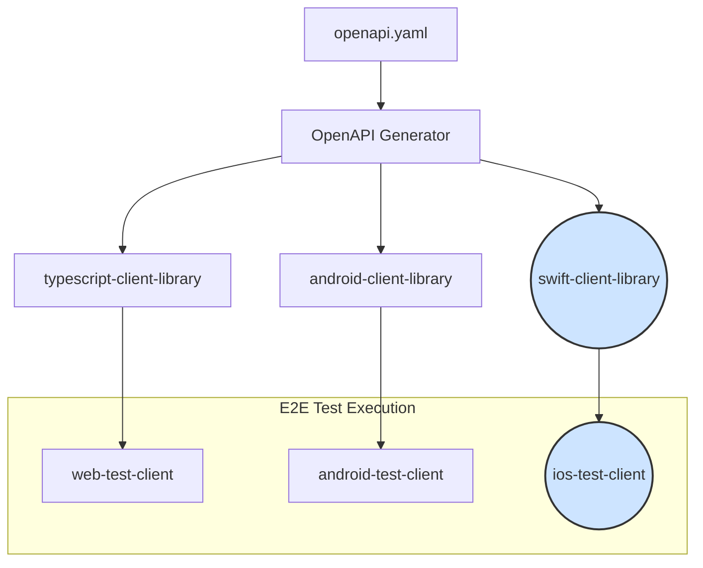

# iOS Test Client Implementation

**Status**: 🟡 Planned  
**Timeline**: 6-8 weeks  
**Effort**: High  
**Dependencies**: Existing OpenAPI specification must be stable.

## Executive Summary

This document outlines the plan to introduce an iOS test client into our end-to-end (E2E) testing ecosystem. By generating a Swift client library from our existing OpenAPI specification and building a dedicated iOS test application, we will extend our automated testing to cover the iOS platform, ensuring a consistent and reliable user experience for our mobile users.

## Problem Statement

Currently, our E2E testing pipeline includes test clients for Android and web, but lacks coverage for the iOS platform. This gap means that we cannot automatically verify the full authentication and registration workflows for iOS users, potentially leading to platform-specific bugs going undetected. To maintain high quality and reliability for our iOS user base, it is crucial to incorporate an iOS client into our testing strategy.

## Solution Architecture

The proposed solution involves adding two new primary components to our architecture:

1. **Swift Client Library**: A new client library will be generated from the `openapi.yaml` specification, specifically for the Swift language. This library will be managed similarly to the existing Android (Kotlin) and web (TypeScript) clients.
2. **iOS Test Client**: A new iOS application project (`ios-test-client`) will be created. This application will consume the Swift client library to perform E2E tests against our backend services running in Docker.

### New Component Diagram



## Implementation Plan

### Phase 1: Swift Client Library Generation (Weeks 1-2)

#### Objective

Automate the generation and publishing of a Swift client library from the OpenAPI specification.

#### Tasks

**1.1 Research and Select OpenAPI Generator**

- **Action**: Evaluate `openapi-generator-cli` with the `swift5` generator.
- **Acceptance Criteria**: Confirm it supports modern Swift features like `async/await` and can generate a Swift Package Manager (SPM) compatible package.

**1.2 Integrate Generator into Gradle Build**

- **Action**: Create a new Gradle task named `generateSwiftClient` in the root `build.gradle.kts`.
- **Details**:
    - This task will execute the `openapi-generator-cli` JAR.
    - Input: `android-client-library/api/openapi.yaml`.
    - Output: A new `swift-client-library` directory.
    - Configuration should be added to specify the generator name (`swift5`), package name (`WebAuthnAPIClient`), and other relevant Swift-specific options.

**1.3 Create `swift-client-library` Directory Structure**

- **Action**: The `generateSwiftClient` task should output the generated code into `/swift-client-library`.
- **Structure**:
  ```
  swift-client-library/
  ├── Sources/
  │   └── WebAuthnAPIClient/
  │       └── (Generated Swift files)
  └── Package.swift
  ```
- **Acceptance Criteria**: The generated output is a valid Swift Package.

**1.4 Configure CI for Swift Client Generation**

- **Action**: Modify the existing client generation CI workflow (e.g., `.github/workflows/generate-clients.yml`).
- **Details**: Add a new step that calls the `generateSwiftClient` Gradle task.
- **Acceptance Criteria**: The `swift-client-library` is successfully generated and archived as a build artifact whenever `openapi.yaml` changes.

### Phase 2: iOS Test Client Project Setup (Weeks 3-4)

#### Objective

Create a functional skeleton for the iOS test client application.

#### Tasks

**2.1 Create `ios-test-client` Project**

- **Action**: Initialize a new Xcode project within a new `/ios-test-client` directory.
- **Configuration**:
    - Language: Swift
    - UI Framework: SwiftUI
    - Lifecycle: App
- **Directory Structure**:
  ```
  ios-test-client/
  ├── ios-test-client.xcodeproj/
  ├── ios-test-client/
  │   ├── ContentView.swift
  │   └── ...
  └── ...
  ```

**2.2 Integrate Swift Client Library**

- **Action**: Add the `swift-client-library` as a local Swift Package dependency.
- **Details**: In Xcode, use "File > Add Packages..." and select the local `swift-client-library` directory.
- **Acceptance Criteria**: The `WebAuthnAPIClient` module can be imported and used within the `ios-test-client` source code.

**2.3 Implement Basic UI**

- **Action**: Create a simple UI in `ContentView.swift`.
- **Components**:
    - A "Run E2E Tests" button.
    - A scrollable `Text` view to display logs and test results.
    - A status indicator (e.g., "Idle", "Running", "Success", "Failed").
- **Acceptance Criteria**: The UI is functional and can trigger a placeholder test action.

### Phase 3: E2E Test Implementation (Weeks 5-6)

#### Objective

Implement the core E2E test logic within the iOS test client using XCTest.

#### Tasks

**3.1 Set up XCTest Target**

- **Action**: Create a new UI Test target in the Xcode project named `E2ETests`.
- **Acceptance Criteria**: A new `E2ETests` folder is created with a template test file.

**3.2 Implement Test Scenarios**

- **Action**: Port the existing E2E test cases from the Android/web clients to new XCTestCase classes in the `E2ETests` target.
- **Scenarios to Implement**:
    1. **Registration Flow**:
        - Initiate registration.
        - Complete registration with mock passkey data.
        - Verify successful registration response.
    2. **Authentication Flow**:
        - Initiate authentication.
        - Complete authentication with mock passkey data.
        - Verify successful authentication response.
    3. **Invalid Registration/Authentication**:
        - Test flows with invalid or expired challenges.
        - Verify appropriate error responses.
- **Details**: The tests will use the `WebAuthnAPIClient` to make network requests to the backend services running in Docker. The test client will need to be configured with the correct base URL for the services.

**3.3 Develop Test Runner and Reporter**

- **Action**: Configure the `E2ETests` scheme to produce JUnit-formatted test reports.
- **Details**: Use a tool like `xcbeautify` or `xctest-junit-reporter` to convert `xcodebuild` output to JUnit XML.
- **Acceptance Criteria**: Running tests from the command line produces a `test-results.xml` file.

### Phase 4: CI Integration (Weeks 7-8)

#### Objective

Integrate the iOS test client into the main CI/CD pipeline for fully automated E2E testing.

#### Tasks

**4.1 Create New CI Workflow for iOS**

- **Action**: Create a new GitHub Actions workflow file: `.github/workflows/ios-e2e-tests.yml`.
- **Workflow Configuration**:
    - `name`: iOS E2E Tests
    - `on`: `workflow_call`
    - `jobs`:
        - `test`:
            - `runs-on`: `macos-latest`
            - **Steps**:
                1. Check out repository.
                2. Set up Xcode environment.
                3. Run the backend services (Docker Compose).
                4. Build the `ios-test-client` using `xcodebuild build-for-testing`.
                5. Run the E2E tests using `xcodebuild test-without-building`.
                6. Generate JUnit XML report.
                7. Upload test results and logs as build artifacts.

**4.2 Orchestrate E2E Test Workflows**

- **Action**: Update the primary E2E test workflow (e.g., `.github/workflows/e2e-tests.yml`).
- **Details**: Add a new job that calls the `ios-e2e-tests.yml` workflow in parallel with the existing Android and web test jobs.
- **Acceptance Criteria**: A failure in the iOS tests causes the main E2E workflow to fail.

**4.3 Update Documentation**

- **Action**: Add a `README.md` to the `ios-test-client` directory.
- **Content**: Include instructions on how to set up the Xcode project, install dependencies, and run the tests locally against the Dockerized services.
- **Acceptance Criteria**: A new developer can successfully run the iOS tests by following the documentation.
