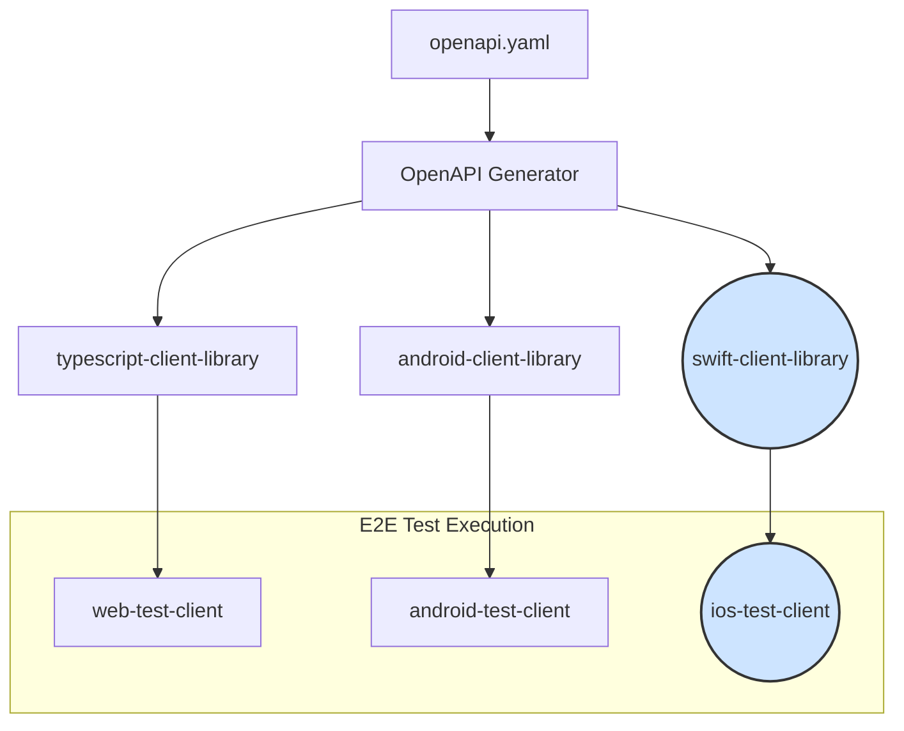

# iOS Test Client Implementation

**Status**: 🟡 Planned  
**Timeline**: 8-10 weeks *(Enhanced 2025-08-21)*  
**Effort**: High  
**Dependencies**: Existing OpenAPI specification must be stable.

## 🔄 Session Continuity & Documentation Maintenance

### For Fresh Claude Sessions
**CRITICAL**: Before starting work on this plan, new Claude sessions must:

1. **Read Project Context**:
   - `CLAUDE.md` - Current project overview and development commands
   - `docs/improvements/in-progress/client-publishing-architecture-cleanup.md` - Active Phase 8 work and completed phases
   - `README.md` - Project setup and architecture overview

2. **Examine Existing Client Implementation Patterns**:
   - `android-client-library/build.gradle.kts.template` - Android client publishing configuration  
   - `typescript-client-library/package.json` - TypeScript client structure
   - `.github/workflows/e2e-tests.yml` - E2E test orchestration patterns
   - `.github/workflows/client-publish.yml` - Client library publishing workflows

3. **Understand Current Architecture**:
   - `webauthn-server/src/main/resources/openapi/documentation.yaml` - API specification source
   - `.github/workflows/main-ci-cd.yml` - Main CI/CD pipeline (358 lines)
   - `config/publishing-config.yml` - Centralized configuration system

### Documentation Maintenance Rules
**MANDATORY**: Update this document as work progresses:

#### ✅ **Implementation Progress Tracking**
- [ ] Update **Status** field: `🟡 Planned` → `🔄 In Progress` → `✅ Completed`  
- [ ] Add **Progress Updates** section with:
  - Date of work session
  - Phase completed  
  - Key decisions made
  - Challenges encountered and solutions
  - Next steps for continuation

#### ✅ **Phase Completion Documentation**
For each completed phase, add:
```markdown
### Phase X Complete *(Date)*
**Completed By**: [Claude session/developer]
**Duration**: [Actual vs estimated]
**Key Deliverables**: 
- [List specific files created/modified]
**Challenges Resolved**:
- [Technical issues encountered and solutions]
**Validation Results**:
- [Test results, performance metrics, etc.]
```

#### ✅ **Technical Decision Log**
Document all architectural decisions:
- OpenAPI generator configuration choices
- iOS WebAuthn framework decisions  
- CI/CD integration approaches
- Package management strategies

#### ✅ **Integration Points Documentation** 
Update when connecting with other systems:
- Links to related workflow modifications
- Dependencies on other improvement plans
- Coordination with existing client library patterns

### Knowledge Transfer Requirements
**For handoff between sessions**:
1. **Current State Summary**: What was completed, what's in progress
2. **Environment Setup**: Specific Xcode versions, iOS Simulator configurations
3. **Build Commands**: Exact commands used for testing and validation
4. **Blockers/Issues**: Any unresolved problems requiring attention
5. **Next Session Start**: Clear first steps to resume work efficiently

## Executive Summary

This document outlines the plan to introduce an iOS test client into our end-to-end (E2E) testing ecosystem. By generating a Swift client library from our existing OpenAPI specification and building a dedicated iOS test application, we will extend our automated testing to cover the iOS platform, ensuring a consistent and reliable user experience for our mobile users.

## Problem Statement

Currently, our E2E testing pipeline includes test clients for Android and web, but lacks coverage for the iOS platform. This gap means that we cannot automatically verify the full authentication and registration workflows for iOS users, potentially leading to platform-specific bugs going undetected. To maintain high quality and reliability for our iOS user base, it is crucial to incorporate an iOS client into our testing strategy.

## Solution Architecture

The proposed solution involves adding two new primary components to our architecture:

1. **Swift Client Library**: A new client library will be generated from the `openapi.yaml` specification, specifically for the Swift language. This library will be managed similarly to the existing Android (Kotlin) and web (TypeScript) clients.
2. **iOS Test Client**: A new iOS application project (`ios-test-client`) will be created. This application will consume the Swift client library to perform E2E tests against our backend services running in Docker.

### New Component Diagram



## Technical Challenges & Solutions

### iOS WebAuthn Limitations & Workarounds

**Challenge: iOS Simulator WebAuthn Restrictions**
- **Issue**: iOS Simulator doesn't support actual WebAuthn/TouchID operations
- **Solution**: Implement comprehensive mock credential generation system
- **Implementation**: 
  - Create `MockAuthenticationServices` wrapper
  - Generate cryptographically valid mock credentials
  - Ensure mock data matches real WebAuthn response format
  - Integrate with existing `webauthn-test-credentials-service`

**Challenge: Certificate Handling for Local Docker Services**
- **Issue**: iOS apps require HTTPS for production-like WebAuthn flows
- **Solution**: Configure development certificates and URL scheme handling
- **Implementation**:
  - Use localhost exception for development
  - Configure NSAppTransportSecurity for local Docker services
  - Implement certificate pinning bypass for test environment

**Challenge: Cross-Platform Test Synchronization**
- **Issue**: Coordinating test execution across iOS, Android, and web platforms
- **Solution**: Leverage existing E2E orchestration patterns
- **Implementation**:
  - Follow Android E2E workflow patterns
  - Use shared test credentials service
  - Implement consistent test result reporting
  - Cache test results to avoid redundant execution

### Swift Package Manager Integration

**Challenge: SPM Publishing to GitHub Packages**
- **Issue**: Swift Package Manager registry support is limited
- **Solution**: Use Git-based package distribution with versioned tags
- **Implementation**:
  - Create dedicated Swift package repository or submodule
  - Use semantic versioning with Git tags
  - Configure GitHub Packages as fallback for staging

**Challenge: Build Caching for Swift Packages**
- **Issue**: iOS builds can be slow without proper caching
- **Solution**: Implement multi-level caching strategy
- **Implementation**:
  - Cache Swift Package Manager dependencies
  - Cache Xcode derived data
  - Cache iOS Simulator images
  - Use cache keys based on Package.swift and source file hashes

### CI/CD Integration Specifics

**macOS Runner Configuration**
- **Xcode Version Management**: Pin to Xcode 15.0 for iOS 17.0 Simulator support
- **iOS Simulator Setup**: Pre-install iOS 17.0 simulator images
- **Docker Networking**: Configure bridge networking for macOS Docker Desktop
- **Performance Optimization**: Use SSD-backed storage for faster builds

**Docker Container Networking on macOS**
- **Host Networking**: Use `host.docker.internal` for iOS Simulator → Docker communication
- **Port Mapping**: Explicit port mapping for WebAuthn (8080) and test service (8081)
- **Service Health Checks**: Implement robust service readiness validation
- **Resource Limits**: Configure memory/CPU limits for CI environment

**Test Result Reporting Integration**
- **JUnit XML Conversion**: Use `xcbeautify` for standardized test output
- **Artifact Collection**: Screenshots, logs, performance metrics
- **PR Comment Integration**: Extend existing comment automation for iOS results
- **Cache Integration**: Reuse cache patterns from Android/web E2E tests

## Revised Implementation Timeline

**Total Timeline**: 8-10 weeks (increased from 6-8 weeks due to technical complexity)
**Critical Path Dependencies**: 
- OpenAPI specification stability
- iOS 16.0+ AuthenticationServices framework compatibility
- macOS runner availability for CI/CD
- Docker Desktop for Mac networking configuration

### Phase 1: Swift Client Library Generation (Weeks 1-3)

#### Objective

Automate the generation and publishing of a Swift client library from the OpenAPI specification.

#### Tasks

**1.1 Research and Select OpenAPI Generator**

- **Action**: Evaluate `openapi-generator-cli` with the `swift5` generator.
- **Acceptance Criteria**: Confirm it supports modern Swift features like `async/await` and can generate a Swift Package Manager (SPM) compatible package.

**1.2 Integrate Generator into Gradle Build**

- **Action**: Create a new Gradle task named `generateSwiftClient` in the root `build.gradle.kts`.
- **Details**:
    - This task will execute the `openapi-generator-cli` JAR.
    - Input: `android-client-library/api/openapi.yaml`.
    - Output: A new `swift-client-library` directory.
    - Configuration should be added to specify the generator name (`swift5`), package name (`WebAuthnAPIClient`), and other relevant Swift-specific options.

**1.3 Create `swift-client-library` Directory Structure**

- **Action**: The `generateSwiftClient` task should output the generated code into `/swift-client-library`.
- **Structure**:
  ```
  swift-client-library/
  ├── Sources/
  │   └── WebAuthnAPIClient/
  │       └── (Generated Swift files)
  └── Package.swift
  ```
- **Acceptance Criteria**: The generated output is a valid Swift Package.

**1.4 Configure CI for Swift Client Generation**

- **Action**: Modify the existing client generation CI workflow (e.g., `.github/workflows/generate-clients.yml`).
- **Details**: Add a new step that calls the `generateSwiftClient` Gradle task.
- **Acceptance Criteria**: The `swift-client-library` is successfully generated and archived as a build artifact whenever `openapi.yaml` changes.

### Phase 2: iOS Test Client Project Setup (Weeks 3-4)

#### Objective

Create a functional skeleton for the iOS test client application.

#### Tasks

**2.1 Create `ios-test-client` Project**

- **Action**: Initialize a new Xcode project within a new `/ios-test-client` directory.
- **Configuration**:
    - Language: Swift
    - UI Framework: SwiftUI
    - Lifecycle: App
- **Directory Structure**:
  ```
  ios-test-client/
  ├── ios-test-client.xcodeproj/
  ├── ios-test-client/
  │   ├── ContentView.swift
  │   └── ...
  └── ...
  ```

**2.2 Integrate Swift Client Library**

- **Action**: Add the `swift-client-library` as a local Swift Package dependency.
- **Details**: In Xcode, use "File > Add Packages..." and select the local `swift-client-library` directory.
- **Acceptance Criteria**: The `WebAuthnAPIClient` module can be imported and used within the `ios-test-client` source code.

**2.3 Implement Basic UI**

- **Action**: Create a simple UI in `ContentView.swift`.
- **Components**:
    - A "Run E2E Tests" button.
    - A scrollable `Text` view to display logs and test results.
    - A status indicator (e.g., "Idle", "Running", "Success", "Failed").
- **Acceptance Criteria**: The UI is functional and can trigger a placeholder test action.

### Phase 3: E2E Test Implementation (Weeks 5-6)

#### Objective

Implement the core E2E test logic within the iOS test client using XCTest.

#### Tasks

**3.1 Set up XCTest Target**

- **Action**: Create a new UI Test target in the Xcode project named `E2ETests`.
- **Acceptance Criteria**: A new `E2ETests` folder is created with a template test file.

**3.2 Implement Test Scenarios**

- **Action**: Port the existing E2E test cases from the Android/web clients to new XCTestCase classes in the `E2ETests` target.
- **Scenarios to Implement**:
    1. **Registration Flow**:
        - Initiate registration.
        - Complete registration with mock passkey data.
        - Verify successful registration response.
    2. **Authentication Flow**:
        - Initiate authentication.
        - Complete authentication with mock passkey data.
        - Verify successful authentication response.
    3. **Invalid Registration/Authentication**:
        - Test flows with invalid or expired challenges.
        - Verify appropriate error responses.
- **Details**: The tests will use the `WebAuthnAPIClient` to make network requests to the backend services running in Docker. The test client will need to be configured with the correct base URL for the services.

**3.3 Develop Test Runner and Reporter**

- **Action**: Configure the `E2ETests` scheme to produce JUnit-formatted test reports.
- **Details**: Use a tool like `xcbeautify` or `xctest-junit-reporter` to convert `xcodebuild` output to JUnit XML.
- **Acceptance Criteria**: Running tests from the command line produces a `test-results.xml` file.

### Phase 4: CI Integration (Weeks 7-8)

#### Objective

Integrate the iOS test client into the main CI/CD pipeline for fully automated E2E testing.

#### Tasks

**4.1 Create New CI Workflow for iOS**

- **Action**: Create a new GitHub Actions workflow file: `.github/workflows/ios-e2e-tests.yml`.
- **Workflow Configuration**:
    - `name`: iOS E2E Tests
    - `on`: `workflow_call`
    - `jobs`:
        - `test`:
            - `runs-on`: `macos-latest`
            - **Steps**:
                1. Check out repository.
                2. Set up Xcode environment.
                3. Run the backend services (Docker Compose).
                4. Build the `ios-test-client` using `xcodebuild build-for-testing`.
                5. Run the E2E tests using `xcodebuild test-without-building`.
                6. Generate JUnit XML report.
                7. Upload test results and logs as build artifacts.

**4.2 Orchestrate E2E Test Workflows**

- **Action**: Update the primary E2E test workflow (e.g., `.github/workflows/e2e-tests.yml`).
- **Details**: Add a new job that calls the `ios-e2e-tests.yml` workflow in parallel with the existing Android and web test jobs.
- **Acceptance Criteria**: A failure in the iOS tests causes the main E2E workflow to fail.

**4.3 Update Documentation**

**4.5 Risk Assessment and Mitigation**

- **Technical Risks**:
  - **macOS Runner Limitations**: Limited availability and higher costs
    - *Mitigation*: Implement intelligent caching and parallel execution
  - **iOS Simulator WebAuthn Constraints**: No real biometric authentication
    - *Mitigation*: Comprehensive mock credential generation with cryptographic validity
  - **Docker Networking Complexity**: macOS Docker Desktop networking issues
    - *Mitigation*: Dedicated network configuration and fallback strategies
  - **Swift Package Registry Limitations**: Limited SPM registry support
    - *Mitigation*: Git-based package distribution with semantic versioning

- **Timeline Risks**:
  - **Xcode/iOS Updates**: Breaking changes in new Xcode versions
    - *Mitigation*: Pin to specific Xcode version, regular compatibility testing
  - **AuthenticationServices Changes**: iOS framework API changes
    - *Mitigation*: Version-specific conditional compilation
  - **CI/CD Integration Complexity**: Multi-platform orchestration challenges
    - *Mitigation*: Iterative integration following proven Android patterns

**4.6 Success Criteria and Acceptance Testing**

- **Functional Requirements**:
  - [ ] iOS E2E tests pass with 100% success rate
  - [ ] Swift client library generates and publishes successfully
  - [ ] iOS test results integrate with PR comment automation
  - [ ] Cache integration reduces redundant test execution by 60%+
  - [ ] End-to-end test execution time under 15 minutes

- **Quality Requirements**:
  - [ ] Code coverage >90% for iOS test client
  - [ ] Zero critical security vulnerabilities in Swift dependencies
  - [ ] Performance benchmarks meet or exceed Android E2E test speed
  - [ ] Documentation enables new developer onboarding in <30 minutes

- **Integration Requirements**:
  - [ ] Seamless integration with existing E2E orchestration
  - [ ] Compatible test result reporting across all platforms
  - [ ] Consistent error handling and logging patterns
  - [ ] Cross-platform API contract validation alignment

**4.7 Post-Implementation Monitoring**

- **Performance Monitoring**:
  - Track iOS E2E test execution times
  - Monitor macOS runner utilization and costs
  - Analyze cache hit rates and build optimization opportunities

- **Quality Monitoring**:
  - Regular Swift dependency security scanning
  - iOS Simulator compatibility testing with new Xcode releases
  - Cross-platform test result consistency validation

- **Maintenance Planning**:
  - Quarterly iOS SDK compatibility reviews
  - Annual Swift Package Manager strategy assessment
  - Continuous optimization of CI/CD resource usage

**4.8 Documentation and Knowledge Transfer**

- **Comprehensive Documentation Package**:
  - `ios-test-client/README.md`: Local development setup and testing guide
  - `docs/development/ios-client-architecture.md`: Technical architecture documentation
  - `docs/workflows/ios-e2e-testing.md`: CI/CD workflow documentation
  - `swift-client-library/README.md`: Client library usage and integration guide

- **Developer Onboarding Materials**:
  - Step-by-step iOS development environment setup
  - Common troubleshooting scenarios and solutions
  - WebAuthn flow diagrams specific to iOS implementation
  - Performance optimization techniques for iOS testing

- **Knowledge Transfer Requirements**:
  - iOS development team training on WebAuthn integration patterns
  - CI/CD team training on macOS runner management and optimization
  - QA team training on iOS-specific test scenarios and validation
  - Security team review of iOS WebAuthn implementation and mock credential generation

---

## 📊 Implementation Progress Tracking

**INSTRUCTIONS**: Update this section as work progresses. Fresh Claude sessions should check this first to understand current state.

### Current Status: 🟡 Planned
**Last Updated**: 2025-08-21  
**Next Review**: [Date when work begins]

### Phase Completion Status
- [ ] **Phase 1**: Swift Client Library Generation (Weeks 1-2)
- [ ] **Phase 2**: iOS Test Client Project Setup (Weeks 3-4)  
- [ ] **Phase 3**: E2E Test Implementation (Weeks 5-6)
- [ ] **Phase 4**: CI Integration (Weeks 7-8)
- [ ] **Phase 5**: Post-Implementation Optimization (Weeks 9-10)

### Implementation Notes
**Add entries as work progresses**:

```markdown
### [DATE] - [PHASE] Progress Update
**Session**: [Claude session ID or developer name]
**Work Completed**:
- [Specific deliverables]
**Decisions Made**:
- [Key architectural/technical decisions]
**Challenges**:
- [Issues encountered and solutions]
**Next Steps**:
- [What needs to be done next]
**Files Modified**:
- [List of files created/changed]
```

### Integration Dependencies
**Track coordination with other systems**:
- [ ] OpenAPI specification stability confirmed
- [ ] Android client patterns analyzed and documented
- [ ] TypeScript client patterns analyzed and documented  
- [ ] E2E test orchestration patterns understood
- [ ] CI/CD pipeline integration points identified

### Handoff Information
**For session continuity**:
- **Current Phase**: [Update as work progresses]
- **Key Blockers**: [Any impediments to progress]
- **Environment Setup**: [What's needed to continue work]
- **Testing Status**: [What has been validated]
