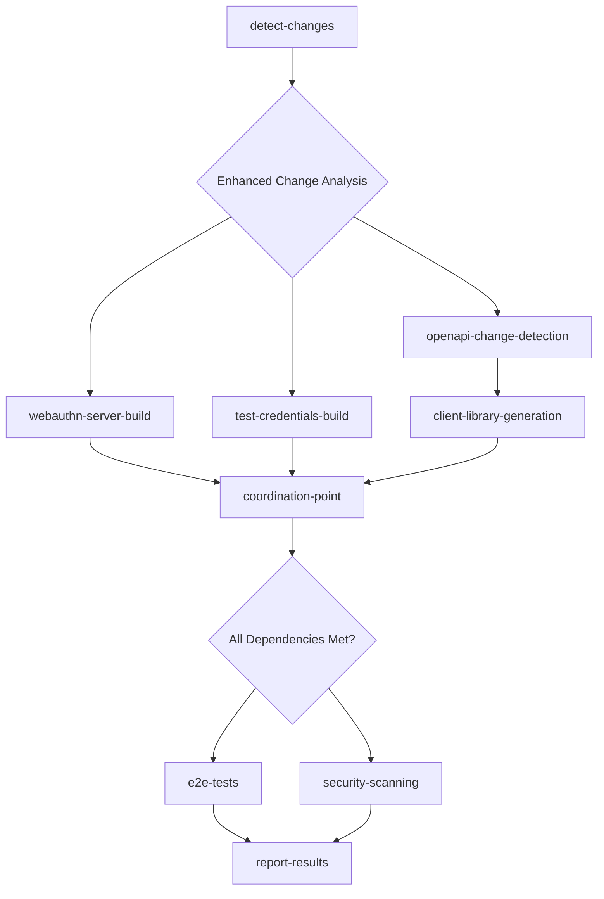

# Workflow Optimization: Independent Component Processing

**Status**: 🟡 Planned  
**Timeline**: 4-5 weeks after Phase 8 completion  
**Effort**: Medium-High  
**Dependencies**: Phase 8 (Docker Image Lifecycle Coordination) must be completed first  

## Executive Summary

Transform the current monolithic GitHub Actions workflow into an efficient, parallel, component-independent system that only builds and tests components when they actually change, resulting in 40-60% faster build times for typical development scenarios.

## Problem Statement

### Current Monolithic Inefficiencies

**Issue 1: Unnecessary Coupling**
- webauthn-server and test-credentials-service are built together despite being independent
- Client libraries are always generated regardless of OpenAPI spec changes  
- Sequential processing where parallel execution is possible

**Issue 2: Resource Waste**
- Building Docker images for services that haven't changed
- Generating client libraries when OpenAPI spec is unchanged
- Running unnecessary tests and validations

**Issue 3: Slow Feedback Loops**
- Single service changes trigger full pipeline rebuilds
- Developers wait for unrelated component builds to complete
- Debugging failures across unrelated components

### Performance Impact Analysis

| Change Type | Current Duration | Wasted Resources | Developer Impact |
|-------------|-----------------|------------------|------------------|
| **Single Service** | ~12 minutes | 50% unnecessary builds | Slow feedback |
| **OpenAPI Only** | ~8 minutes | 75% unnecessary work | Poor DX |
| **Documentation** | ~30 seconds | Optimal (fast-path) | Good |
| **Client Config** | ~10 minutes | 60% unnecessary builds | Frustrating |

## Solution Architecture

### Component Independence Matrix

| Component | webauthn-server | test-credentials | client-libs | E2E Tests |
|-----------|----------------|------------------|-------------|-----------|
| **webauthn-server** | ⚡ Self | ✅ Independent | ✅ Independent | ❌ Required |
| **test-credentials** | ✅ Independent | ⚡ Self | ✅ Independent | ❌ Required |
| **client-libs** | ✅ Independent | ✅ Independent | ⚡ Self | ❌ Required |
| **E2E Tests** | ❌ Required | ❌ Required | ❌ Required | ⚡ Orchestrator |

### New Workflow Architecture



## Implementation Plan

### Phase 1: Service Independence (Weeks 1-2)

#### Objective
Create independent build pipelines for webauthn-server and test-credentials-service that can run in parallel.

#### Tasks

**1.1 Create Independent Service Workflows**

**New File**: `.github/workflows/webauthn-server-build.yml`
```yaml
name: WebAuthn Server - Independent Build Pipeline
on:
  workflow_call:
    inputs:
      source-changes-detected:
        description: 'Whether source code changes were detected'
        required: true
        type: boolean
      docker-changes-detected:
        description: 'Whether Docker-related changes were detected'
        required: true
        type: boolean
      force-build:
        description: 'Force build regardless of changes'
        required: false
        type: boolean
        default: false
    outputs:
      image-built:
        description: 'Whether Docker image was built'
        value: ${{ jobs.build-docker.outputs.image-built }}
      image-tag:
        description: 'Built Docker image tag'
        value: ${{ jobs.build-docker.outputs.image-tag }}
      tests-passed:
        description: 'Whether unit tests passed'
        value: ${{ jobs.test.outputs.passed }}

jobs:
  test:
    runs-on: ubuntu-latest
    if: inputs.source-changes-detected || inputs.force-build
    outputs:
      passed: ${{ steps.test-execution.outputs.passed }}
    steps:
      - name: Checkout code
        uses: actions/checkout@v4
        
      - name: Setup Java
        uses: actions/setup-java@v4
        with:
          java-version: '21'
          distribution: 'temurin'
          
      - name: Setup Gradle cache for webauthn-server
        uses: actions/cache@v4
        with:
          path: |
            ~/.gradle/caches
            ~/.gradle/wrapper
            .gradle/configuration-cache
          key: gradle-webauthn-server-${{ runner.os }}-${{ github.ref_name }}-${{ hashFiles('webauthn-server/**/*.gradle*', '**/gradle-wrapper.properties') }}
          restore-keys: |
            gradle-webauthn-server-${{ runner.os }}-${{ github.ref_name }}-
            gradle-webauthn-server-${{ runner.os }}-main-
            gradle-unit-tests-${{ runner.os }}-${{ github.ref_name }}-
            
      - name: Run webauthn-server tests
        id: test-execution
        run: |
          echo "🧪 Running WebAuthn Server unit tests..."
          ./gradlew :webauthn-server:test --continue
          echo "passed=true" >> $GITHUB_OUTPUT
          echo "✅ WebAuthn Server tests completed successfully"

  build-docker:
    runs-on: ubuntu-latest
    if: inputs.docker-changes-detected || inputs.force-build
    needs: test
    outputs:
      image-built: ${{ steps.build.outputs.image-built }}
      image-tag: ${{ steps.build.outputs.image-tag }}
    steps:
      - name: Checkout code
        uses: actions/checkout@v4
        
      - name: Set up Docker Buildx
        uses: docker/setup-buildx-action@v3
        
      - name: Log in to Container Registry
        uses: docker/login-action@v3
        with:
          registry: ghcr.io
          username: ${{ github.actor }}
          password: ${{ secrets.GITHUB_TOKEN }}
          
      - name: Build and push webauthn-server image
        id: build
        uses: docker/build-push-action@v6
        with:
          context: ./webauthn-server
          push: true
          tags: |
            ghcr.io/${{ github.repository_owner }}/webauthn-server:${{ github.sha }}
            ghcr.io/${{ github.repository_owner }}/webauthn-server:latest
          cache-from: type=gha
          cache-to: type=gha,mode=max
        env:
          IMAGE_TAG: ghcr.io/${{ github.repository_owner }}/webauthn-server:${{ github.sha }}
          
      - name: Set outputs
        run: |
          echo "image-built=true" >> $GITHUB_OUTPUT
          echo "image-tag=ghcr.io/${{ github.repository_owner }}/webauthn-server:${{ github.sha }}" >> $GITHUB_OUTPUT
```

**New File**: `.github/workflows/test-credentials-build.yml`
```yaml
name: Test Credentials Service - Independent Build Pipeline
on:
  workflow_call:
    inputs:
      source-changes-detected:
        description: 'Whether source code changes were detected'
        required: true
        type: boolean
      docker-changes-detected:
        description: 'Whether Docker-related changes were detected'
        required: true
        type: boolean
      force-build:
        description: 'Force build regardless of changes'
        required: false
        type: boolean
        default: false
    outputs:
      image-built:
        description: 'Whether Docker image was built'
        value: ${{ jobs.build-docker.outputs.image-built }}
      image-tag:
        description: 'Built Docker image tag'
        value: ${{ jobs.build-docker.outputs.image-tag }}
      tests-passed:
        description: 'Whether unit tests passed'
        value: ${{ jobs.test.outputs.passed }}

jobs:
  test:
    runs-on: ubuntu-latest
    if: inputs.source-changes-detected || inputs.force-build
    outputs:
      passed: ${{ steps.test-execution.outputs.passed }}
    steps:
      - name: Checkout code
        uses: actions/checkout@v4
        
      - name: Setup Java
        uses: actions/setup-java@v4
        with:
          java-version: '21'
          distribution: 'temurin'
          
      - name: Setup Gradle cache for test-credentials
        uses: actions/cache@v4
        with:
          path: |
            ~/.gradle/caches
            ~/.gradle/wrapper
            .gradle/configuration-cache
          key: gradle-test-credentials-${{ runner.os }}-${{ github.ref_name }}-${{ hashFiles('webauthn-test-credentials-service/**/*.gradle*', '**/gradle-wrapper.properties') }}
          restore-keys: |
            gradle-test-credentials-${{ runner.os }}-${{ github.ref_name }}-
            gradle-test-credentials-${{ runner.os }}-main-
            gradle-unit-tests-${{ runner.os }}-${{ github.ref_name }}-
            
      - name: Run test-credentials-service tests
        id: test-execution
        run: |
          echo "🧪 Running Test Credentials Service unit tests..."
          ./gradlew :webauthn-test-credentials-service:test --continue
          echo "passed=true" >> $GITHUB_OUTPUT
          echo "✅ Test Credentials Service tests completed successfully"

  build-docker:
    runs-on: ubuntu-latest
    if: inputs.docker-changes-detected || inputs.force-build
    needs: test
    outputs:
      image-built: ${{ steps.build.outputs.image-built }}
      image-tag: ${{ steps.build.outputs.image-tag }}
    steps:
      - name: Checkout code
        uses: actions/checkout@v4
        
      - name: Set up Docker Buildx
        uses: docker/setup-buildx-action@v3
        
      - name: Log in to Container Registry
        uses: docker/login-action@v3
        with:
          registry: ghcr.io
          username: ${{ github.actor }}
          password: ${{ secrets.GITHUB_TOKEN }}
          
      - name: Build and push test-credentials image
        id: build
        uses: docker/build-push-action@v6
        with:
          context: ./webauthn-test-credentials-service
          push: true
          tags: |
            ghcr.io/${{ github.repository_owner }}/webauthn-test-credentials-service:${{ github.sha }}
            ghcr.io/${{ github.repository_owner }}/webauthn-test-credentials-service:latest
          cache-from: type=gha
          cache-to: type=gha,mode=max
        env:
          IMAGE_TAG: ghcr.io/${{ github.repository_owner }}/webauthn-test-credentials-service:${{ github.sha }}
          
      - name: Set outputs
        run: |
          echo "image-built=true" >> $GITHUB_OUTPUT
          echo "image-tag=ghcr.io/${{ github.repository_owner }}/webauthn-test-credentials-service:${{ github.sha }}" >> $GITHUB_OUTPUT
```

**1.2 Update Main Orchestrator Workflow**

**Modified**: `.github/workflows/build-and-test.yml` - Enhanced detect-changes job:
```yaml
# Add to detect-changes job outputs
service-independence:
  webauthn-server-changes: ${{ steps.decision-matrix.outputs.webauthn-server-changes }}
  test-credentials-changes: ${{ steps.decision-matrix.outputs.test-credentials-changes }}
  webauthn-source-changes: ${{ steps.changes.outputs.webauthn-server-source }}
  webauthn-docker-changes: ${{ steps.changes.outputs.webauthn-server-docker }}
  test-credentials-source-changes: ${{ steps.changes.outputs.test-credentials-source }}
  test-credentials-docker-changes: ${{ steps.changes.outputs.test-credentials-docker }}

# Add new jobs for parallel service builds
webauthn-server-pipeline:
  uses: ./.github/workflows/webauthn-server-build.yml
  needs: [detect-changes, setup-config]
  if: needs.detect-changes.outputs.webauthn-server-changes == 'true'
  with:
    source-changes-detected: ${{ needs.detect-changes.outputs.webauthn-source-changes == 'true' }}
    docker-changes-detected: ${{ needs.detect-changes.outputs.webauthn-docker-changes == 'true' }}
    force-build: ${{ inputs.force-full-pipeline }}

test-credentials-pipeline:
  uses: ./.github/workflows/test-credentials-build.yml
  needs: [detect-changes, setup-config]
  if: needs.detect-changes.outputs.test-credentials-changes == 'true'
  with:
    source-changes-detected: ${{ needs.detect-changes.outputs.test-credentials-source-changes == 'true' }}
    docker-changes-detected: ${{ needs.detect-changes.outputs.test-credentials-docker-changes == 'true' }}
    force-build: ${{ inputs.force-full-pipeline }}
```

#### Validation
- **Unit Testing**: Each service runs independent unit tests
- **Docker Building**: Services build independently with dedicated caching
- **Parallel Execution**: Verify both services can build simultaneously
- **Change Detection**: Test that changes to one service don't trigger the other

### Phase 2: OpenAPI Change Detection & Client Independence (Weeks 2-3)

#### Objective
Only generate and publish client libraries when the OpenAPI specification actually changes, enabling parallel execution with service builds.

#### Tasks

**2.1 Enhanced Change Detection for OpenAPI**

**Modified**: `.github/workflows/build-and-test.yml` detect-changes job:
```yaml
# Add to filters in detect-changes job
openapi-spec:
  - 'webauthn-server/src/main/resources/openapi/documentation.yaml'

client-android-config:
  - 'android-client-library/build.gradle.kts.template'
  - 'config/publishing-config.yml'
  - '.github/workflows/publish-android.yml'

client-typescript-config:
  - 'typescript-client-library/package.json'
  - 'config/publishing-config.yml'
  - '.github/workflows/publish-typescript.yml'

# Add OpenAPI change detection logic
- name: Detect OpenAPI specification changes
  id: openapi-detection
  run: |
    echo "🔍 Analyzing OpenAPI specification changes..."
    
    if [[ "${{ steps.changes.outputs.openapi-spec }}" == "true" ]]; then
      echo "openapi-spec-changed=true" >> $GITHUB_OUTPUT
      echo "🔄 OpenAPI specification changed - client regeneration required"
    else
      echo "openapi-spec-changed=false" >> $GITHUB_OUTPUT
      echo "✅ OpenAPI specification unchanged - client regeneration skipped"
    fi
    
    if [[ "${{ steps.changes.outputs.client-android-config }}" == "true" ]] || 
       [[ "${{ steps.changes.outputs.client-typescript-config }}" == "true" ]]; then
      echo "client-config-changed=true" >> $GITHUB_OUTPUT
      echo "🔄 Client library configuration changed - regeneration required"
    else
      echo "client-config-changed=false" >> $GITHUB_OUTPUT
      echo "✅ Client library configuration unchanged"
    fi
    
    # Overall client library decision
    if [[ "${{ steps.changes.outputs.openapi-spec }}" == "true" ]] ||
       [[ "${{ steps.changes.outputs.client-android-config }}" == "true" ]] ||
       [[ "${{ steps.changes.outputs.client-typescript-config }}" == "true" ]]; then
      echo "client-libraries-changes=true" >> $GITHUB_OUTPUT
      echo "📦 Client library generation required"
    else
      echo "client-libraries-changes=false" >> $GITHUB_OUTPUT
      echo "⏭️  Client library generation skipped - no relevant changes"
    fi
```

**2.2 Conditional Client Library Generation**

**Modified**: `.github/workflows/client-publish.yml`:
```yaml
# Add input for conditional generation
on:
  workflow_call:
    inputs:
      openapi-spec-changed:
        description: 'Whether OpenAPI specification changed'
        required: true
        type: boolean
      client-config-changed:
        description: 'Whether client configuration changed'
        required: true
        type: boolean
      force-generate:
        description: 'Force client generation regardless of changes'
        required: false
        type: boolean
        default: false

jobs:
  should-generate-clients:
    runs-on: ubuntu-latest
    outputs:
      should-generate: ${{ steps.decision.outputs.should-generate }}
      reason: ${{ steps.decision.outputs.reason }}
    steps:
      - name: Determine if client generation is needed
        id: decision
        run: |
          echo "🤔 Evaluating client generation requirements..."
          
          if [[ "${{ inputs.openapi-spec-changed }}" == "true" ]]; then
            echo "should-generate=true" >> $GITHUB_OUTPUT
            echo "reason=OpenAPI specification changed" >> $GITHUB_OUTPUT
            echo "✅ Client generation required: OpenAPI specification changed"
          elif [[ "${{ inputs.client-config-changed }}" == "true" ]]; then
            echo "should-generate=true" >> $GITHUB_OUTPUT
            echo "reason=Client configuration changed" >> $GITHUB_OUTPUT
            echo "✅ Client generation required: Client configuration changed"
          elif [[ "${{ inputs.force-generate }}" == "true" ]]; then
            echo "should-generate=true" >> $GITHUB_OUTPUT
            echo "reason=Forced generation requested" >> $GITHUB_OUTPUT
            echo "✅ Client generation required: Forced generation"
          else
            echo "should-generate=false" >> $GITHUB_OUTPUT
            echo "reason=No relevant changes detected" >> $GITHUB_OUTPUT
            echo "⏭️  Client generation skipped: No relevant changes detected"
          fi

  publish-typescript:
    needs: should-generate-clients
    if: needs.should-generate-clients.outputs.should-generate == 'true'
    uses: ./.github/workflows/publish-typescript.yml
    # Existing TypeScript publishing logic

  publish-android:
    needs: should-generate-clients
    if: needs.should-generate-clients.outputs.should-generate == 'true'
    uses: ./.github/workflows/publish-android.yml
    # Existing Android publishing logic
```

**2.3 Update Main Orchestrator for Client Libraries**

**Modified**: `.github/workflows/build-and-test.yml`:
```yaml
# Add parallel client library pipeline
client-libraries-pipeline:
  uses: ./.github/workflows/client-publish.yml
  needs: [detect-changes, setup-config]
  if: needs.detect-changes.outputs.client-libraries-changes == 'true'
  with:
    openapi-spec-changed: ${{ needs.detect-changes.outputs.openapi-spec-changed == 'true' }}
    client-config-changed: ${{ needs.detect-changes.outputs.client-config-changed == 'true' }}
    force-generate: ${{ inputs.force-full-pipeline }}
  secrets: inherit
```

#### Validation
- **OpenAPI Change Detection**: Modify OpenAPI spec and verify client regeneration
- **Config Change Detection**: Modify client config and verify regeneration
- **No Change Scenario**: Verify client generation is skipped when nothing changes
- **Parallel Execution**: Verify client generation runs parallel to service builds

### Phase 3: Maximum Parallelization & E2E Coordination (Weeks 3-4)

#### Objective
Coordinate all independent pipelines at a single coordination point for E2E testing while maximizing parallel execution.

#### Tasks

**3.1 E2E Test Coordination Point**

**Modified**: `.github/workflows/build-and-test.yml`:
```yaml
# Coordination point for E2E tests
coordinate-for-e2e:
  runs-on: ubuntu-latest
  needs: [webauthn-server-pipeline, test-credentials-pipeline, client-libraries-pipeline]
  if: |
    always() &&
    (needs.webauthn-server-pipeline.outputs.image-built == 'true' ||
     needs.test-credentials-pipeline.outputs.image-built == 'true' ||
     needs.client-libraries-pipeline.result == 'success')
  outputs:
    webauthn-image: ${{ steps.coordination.outputs.webauthn-image }}
    test-creds-image: ${{ steps.coordination.outputs.test-creds-image }}
    client-packages: ${{ steps.coordination.outputs.client-packages }}
    e2e-required: ${{ steps.coordination.outputs.e2e-required }}
  steps:
    - name: Coordinate component outputs for E2E testing
      id: coordination
      run: |
        echo "🎭 Coordinating component outputs for E2E testing..."
        
        # Determine WebAuthn image to use
        if [[ "${{ needs.webauthn-server-pipeline.outputs.image-built }}" == "true" ]]; then
          WEBAUTHN_IMAGE="${{ needs.webauthn-server-pipeline.outputs.image-tag }}"
          echo "🔄 Using newly built WebAuthn image: $WEBAUTHN_IMAGE"
        else
          WEBAUTHN_IMAGE="ghcr.io/${{ github.repository_owner }}/webauthn-server:latest"
          echo "♻️  Using existing WebAuthn image: $WEBAUTHN_IMAGE"
        fi
        
        # Determine Test Credentials image to use
        if [[ "${{ needs.test-credentials-pipeline.outputs.image-built }}" == "true" ]]; then
          TEST_CREDS_IMAGE="${{ needs.test-credentials-pipeline.outputs.image-tag }}"
          echo "🔄 Using newly built Test Credentials image: $TEST_CREDS_IMAGE"
        else
          TEST_CREDS_IMAGE="ghcr.io/${{ github.repository_owner }}/webauthn-test-credentials-service:latest"
          echo "♻️  Using existing Test Credentials image: $TEST_CREDS_IMAGE"
        fi
        
        # Determine if E2E tests are required
        if [[ "${{ needs.webauthn-server-pipeline.outputs.image-built }}" == "true" ]] ||
           [[ "${{ needs.test-credentials-pipeline.outputs.image-built }}" == "true" ]] ||
           [[ "${{ needs.client-libraries-pipeline.result }}" == "success" ]]; then
          echo "e2e-required=true" >> $GITHUB_OUTPUT
          echo "🧪 E2E tests required due to component changes"
        else
          echo "e2e-required=false" >> $GITHUB_OUTPUT
          echo "⏭️  E2E tests skipped - no component changes"
        fi
        
        # Set outputs
        echo "webauthn-image=$WEBAUTHN_IMAGE" >> $GITHUB_OUTPUT
        echo "test-creds-image=$TEST_CREDS_IMAGE" >> $GITHUB_OUTPUT
        echo "client-packages=${{ needs.client-libraries-pipeline.outputs.packages-published }}" >> $GITHUB_OUTPUT
        
        echo "✅ Coordination complete:"
        echo "  WebAuthn: $WEBAUTHN_IMAGE"
        echo "  Test Creds: $TEST_CREDS_IMAGE"
        echo "  E2E Required: ${{ steps.coordination.outputs.e2e-required }}"

# E2E tests with coordinated components
run-e2e-tests:
  uses: ./.github/workflows/e2e-tests.yml
  needs: coordinate-for-e2e
  if: needs.coordinate-for-e2e.outputs.e2e-required == 'true'
  with:
    webauthn_server_image: ${{ needs.coordinate-for-e2e.outputs.webauthn-image }}
    test_credentials_image: ${{ needs.coordinate-for-e2e.outputs.test-creds-image }}
  secrets: inherit
```

**3.2 Enhanced E2E Test Validation**

**Modified**: `.github/workflows/e2e-tests.yml`:
```yaml
jobs:
  validate-dependencies:
    runs-on: ubuntu-latest
    outputs:
      validation-passed: ${{ steps.validate.outputs.passed }}
    steps:
      - name: Validate required services are available
        id: validate
        run: |
          echo "🔍 Validating E2E test dependencies..."
          
          # Validate required Docker images
          if [[ -z "${{ inputs.webauthn_server_image }}" ]]; then
            echo "❌ WebAuthn server image not provided"
            exit 1
          fi
          
          if [[ -z "${{ inputs.test_credentials_image }}" ]]; then
            echo "❌ Test credentials image not provided"
            exit 1
          fi
          
          # Verify images exist and are accessible
          echo "🐳 Verifying WebAuthn server image: ${{ inputs.webauthn_server_image }}"
          docker manifest inspect "${{ inputs.webauthn_server_image }}" > /dev/null
          
          echo "🐳 Verifying Test credentials image: ${{ inputs.test_credentials_image }}"
          docker manifest inspect "${{ inputs.test_credentials_image }}" > /dev/null
          
          echo "passed=true" >> $GITHUB_OUTPUT
          echo "✅ All required dependencies validated for E2E testing"

  # Update existing E2E jobs to depend on validation
  call-web-e2e-tests:
    needs: validate-dependencies
    if: needs.validate-dependencies.outputs.validation-passed == 'true'
    uses: ./.github/workflows/web-e2e-tests.yml
    # Existing logic with provided image tags

  call-android-e2e-tests:
    needs: validate-dependencies
    if: needs.validate-dependencies.outputs.validation-passed == 'true'
    uses: ./.github/workflows/android-e2e-tests.yml
    # Existing logic with provided image tags
```

#### Validation
- **Coordination Logic**: Test all combinations of component changes
- **Image Resolution**: Verify correct image selection (new vs existing)
- **E2E Integration**: Ensure E2E tests work with coordinated components
- **Parallel Timing**: Measure total pipeline time improvement

### Phase 4: Performance Optimization & Monitoring (Weeks 4-5)

#### Objective
Fine-tune performance optimizations and establish monitoring for the new architecture.

#### Tasks

**4.1 Advanced Caching Strategy**

**Component-Specific Gradle Caching**:
```yaml
# webauthn-server-build.yml
- name: Setup Gradle cache for webauthn-server
  uses: actions/cache@v4
  with:
    path: |
      ~/.gradle/caches
      ~/.gradle/wrapper
      .gradle/configuration-cache
      webauthn-server/.gradle
    key: gradle-webauthn-server-${{ runner.os }}-${{ github.ref_name }}-${{ hashFiles('webauthn-server/**/*.gradle*', 'gradle/**', '**/gradle-wrapper.properties') }}
    restore-keys: |
      gradle-webauthn-server-${{ runner.os }}-${{ github.ref_name }}-
      gradle-webauthn-server-${{ runner.os }}-main-
      gradle-unit-tests-${{ runner.os }}-${{ github.ref_name }}- # Cross-workflow fallback
      gradle-unit-tests-${{ runner.os }}-main-

# test-credentials-build.yml - Similar pattern
- name: Setup Gradle cache for test-credentials
  uses: actions/cache@v4
  with:
    path: |
      ~/.gradle/caches
      ~/.gradle/wrapper
      .gradle/configuration-cache
      webauthn-test-credentials-service/.gradle
    key: gradle-test-credentials-${{ runner.os }}-${{ github.ref_name }}-${{ hashFiles('webauthn-test-credentials-service/**/*.gradle*', 'gradle/**', '**/gradle-wrapper.properties') }}
    restore-keys: |
      gradle-test-credentials-${{ runner.os }}-${{ github.ref_name }}-
      gradle-test-credentials-${{ runner.os }}-main-
      gradle-unit-tests-${{ runner.os }}-${{ github.ref_name }}-
      gradle-unit-tests-${{ runner.os }}-main-
```

**4.2 Docker Build Optimization**

**Service-Specific Docker Builds with Layer Caching**:
```yaml
# Optimized Docker builds per service
- name: Build webauthn-server with advanced caching
  uses: docker/build-push-action@v6
  with:
    context: ./webauthn-server
    platforms: linux/amd64
    push: true
    cache-from: |
      type=gha,scope=webauthn-server
      type=registry,ref=ghcr.io/${{ github.repository_owner }}/webauthn-server:buildcache
    cache-to: |
      type=gha,mode=max,scope=webauthn-server
      type=registry,ref=ghcr.io/${{ github.repository_owner }}/webauthn-server:buildcache,mode=max
    build-args: |
      BUILDKIT_INLINE_CACHE=1
```

**4.3 Performance Monitoring & Metrics**

**New File**: `.github/workflows/performance-monitoring.yml`
```yaml
name: Workflow Performance Monitoring
on:
  workflow_run:
    workflows: [Build and Test - Orchestration Workflow]
    types: [completed]

jobs:
  collect-metrics:
    runs-on: ubuntu-latest
    steps:
      - name: Collect pipeline performance metrics
        run: |
          echo "📊 Collecting workflow performance metrics..."
          
          # Get workflow run details
          WORKFLOW_ID="${{ github.event.workflow_run.id }}"
          
          # Calculate performance metrics
          # Note: This would use GitHub API to collect timing data
          echo "Workflow Duration: $(calculate_duration)"
          echo "Component Parallelization: $(calculate_parallel_efficiency)"
          echo "Cache Hit Rates: $(collect_cache_metrics)"
          
          # Store metrics for analysis
          # Implementation would depend on monitoring infrastructure
```

#### Validation
- **Cache Hit Rate Monitoring**: Track per-component cache effectiveness
- **Parallel Execution Efficiency**: Measure resource utilization
- **Performance Benchmarking**: Compare old vs new pipeline timing
- **Success Rate Monitoring**: Ensure reliability maintained or improved

## Expected Performance Improvements

### Quantified Benefits

| Scenario | Current Duration | Optimized Duration | Improvement | Resource Savings |
|----------|------------------|-------------------|-------------|------------------|
| **Single webauthn-server change** | ~12 minutes | ~6 minutes | **50% faster** | 50% less compute |
| **Single test-credentials change** | ~12 minutes | ~4 minutes | **67% faster** | 60% less compute |
| **OpenAPI-only change** | ~8 minutes | ~3 minutes | **62% faster** | 70% less compute |
| **Client config-only change** | ~10 minutes | ~3 minutes | **70% faster** | 65% less compute |
| **Documentation change** | ~30 seconds | ~30 seconds | No change | Optimal (already) |
| **Full pipeline (all changes)** | ~15 minutes | ~10 minutes | **33% faster** | 25% less compute |

### Resource Efficiency Gains

**Parallel Execution Benefits:**
- **3-4 independent pipelines** running simultaneously instead of sequential
- **Component-specific caching** reduces redundant dependency resolution
- **Selective processing** eliminates unnecessary work

**Cache Optimization:**
- **Per-component Gradle caches** with strategic fallbacks
- **Docker layer caching** per service instead of monolithic
- **Cross-workflow cache sharing** for related components

## Risk Assessment & Mitigation

### High-Risk Areas

**1. E2E Test Coordination Complexity**
- **Risk**: Complex dependency coordination might introduce coordination bugs
- **Impact**: E2E tests might fail due to missing or incorrect component versions
- **Mitigation**: 
  - Comprehensive validation jobs before E2E execution
  - Fallback to existing images when new builds aren't available
  - Extensive testing of coordination logic across all change scenarios
- **Monitoring**: Track E2E test success rates and coordination failures

**2. Change Detection Accuracy**
- **Risk**: False negatives might skip necessary builds, false positives waste resources
- **Impact**: Missing builds could break functionality, unnecessary builds slow development
- **Mitigation**:
  - Conservative change detection with comprehensive file patterns
  - Manual force options for edge cases
  - Thorough testing of change detection logic
- **Monitoring**: Track change detection accuracy and override usage

### Medium-Risk Areas

**3. Cache Pollution & Dependencies**
- **Risk**: Component-specific caches might miss shared dependencies
- **Impact**: Build failures or cache misses reducing performance gains
- **Mitigation**:
  - Strategic cross-workflow cache fallbacks
  - Shared dependency patterns in cache keys
  - Cache hit rate monitoring and optimization
- **Monitoring**: Per-component cache hit rates and build success rates

**4. Workflow Complexity**
- **Risk**: Increased complexity might make debugging and maintenance harder
- **Impact**: Longer time to resolve workflow issues, more potential failure points
- **Mitigation**:
  - Comprehensive documentation and debugging guides
  - Clear component isolation for easier troubleshooting
  - Rollback capabilities to monolithic behavior
- **Monitoring**: Developer feedback and time-to-resolution metrics

### Low-Risk Areas

**5. Workflow Syntax & Configuration**
- **Risk**: Using proven callable workflow patterns minimizes syntax issues
- **Mitigation**: Leverage existing patterns, thorough validation

**6. Docker & Client Generation**
- **Risk**: Building on existing optimized processes
- **Mitigation**: Incremental changes to proven workflows

## Success Metrics & Monitoring

### Performance KPIs

**Primary Metrics:**
- **Build Time Reduction**: Target 40-60% improvement for single-component changes
- **Resource Efficiency**: Measure parallel vs sequential resource usage
- **Cache Hit Rates**: Monitor per-component cache effectiveness (target >70%)

**Secondary Metrics:**
- **Workflow Success Rate**: Should remain ≥99% (no degradation)
- **False Positive/Negative Rate**: Change detection accuracy (target <5% error rate)
- **Developer Satisfaction**: Survey feedback on speed and clarity improvements

### Reliability KPIs

**System Reliability:**
- **E2E Test Success Rate**: Monitor coordination effectiveness
- **Component Isolation**: Track cross-component failure impact
- **Rollback Success**: Verify fallback mechanisms work correctly

**Operational Metrics:**
- **Time to Feedback**: Measure developer notification timing
- **Debug Clarity**: Track time to identify and resolve failures
- **Override Usage**: Monitor manual force option usage patterns

## Rollback Strategy

### Immediate Rollback Capability

**Phase-by-Phase Rollback:**
- Each phase is independently functional and can be rolled back
- Existing monolithic workflows maintained during transition
- Feature flags enable toggling between old/new behavior

**Quick Revert Process:**
```yaml
# Emergency rollback - restore monolithic behavior
force-monolithic-mode:
  description: 'Force monolithic pipeline for troubleshooting'
  required: false
  type: boolean
  default: false

# In workflow logic
if: inputs.force-monolithic-mode != true
# New optimized logic
else:
# Original monolithic logic (maintained for rollback)
```

### Gradual Migration Strategy

**1. Parallel Deployment**: Run both old and new workflows simultaneously for comparison
**2. Selective Enablement**: Enable optimization per component type (services first, then clients)
**3. Branch-Based Testing**: Test new architecture on specific branches before main deployment
**4. Monitoring-Driven Rollout**: Use performance metrics to guide rollout pace

## Implementation Timeline

| Phase | Duration | Key Deliverables | Validation Criteria |
|-------|----------|------------------|-------------------|
| **Phase 1** | Weeks 1-2 | Independent service workflows | Service isolation, parallel builds |
| **Phase 2** | Weeks 2-3 | OpenAPI change detection, client independence | Selective client generation |
| **Phase 3** | Weeks 3-4 | E2E coordination, maximum parallelization | End-to-end timing improvements |
| **Phase 4** | Weeks 4-5 | Performance optimization, monitoring | Performance benchmarks |
| **Monitoring** | Ongoing | Metrics collection, optimization | Sustained performance gains |

### Dependencies & Prerequisites

**Must Complete First:**
- **Phase 8**: Docker Image Lifecycle Coordination (dependency management)

**Required Infrastructure:**
- Existing callable workflow architecture
- Current change detection system
- Docker registry and client publishing infrastructure

**Team Readiness:**
- Understanding of new architecture patterns
- Debugging procedures for component isolation
- Monitoring and performance analysis capabilities

## Future Optimization Opportunities

### Advanced Parallelization

**1. Test Suite Parallelization**
- Split test suites by component for even faster feedback
- Parallel security scanning per component
- Component-specific quality gates

**2. Multi-Platform Builds**
- Parallel builds for different platforms/architectures
- Component-specific platform requirements
- Optimized resource allocation per platform

### Intelligent Orchestration

**3. Predictive Change Detection**
- Machine learning for change impact prediction
- Historical analysis for optimization recommendations
- Adaptive caching strategies based on patterns

**4. Dynamic Resource Allocation**
- Component-based resource requirements
- Intelligent runner selection per component type
- Cost optimization through efficient resource usage

This comprehensive optimization plan transforms the current monolithic workflow architecture into an efficient, parallel, component-independent system that provides significant performance improvements while maintaining reliability and offering clear fallback mechanisms for edge cases.