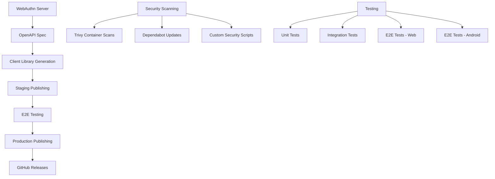

# WebAuthn Server Documentation Index

## 🚀 Quick Start
- [Main Project README](../README.md) - Project overview and getting started
- [Client Library Usage](./setup/client-generation.md) - Using published client libraries
- [Development Setup](./setup/github-packages-setup.md) - Development environment configuration

## 📊 Project Improvements
- [**Improvements Overview**](./improvements/README.md) - Organized tracking of project improvements
- [**Completed**: OpenAPI Client Refactor](./improvements/completed/openapi-client-refactor.md) - Modern client library architecture ✅
- [**Planned**: FOSS Security Implementation](./improvements/planned/foss-security-implementation.md) - Security tooling modernization 📋

## 🛠️ Development
- [Client Library Publishing](./development/workflows/client-library-publishing.md) - Publishing workflows and automation
- [Client Library Staging](./development/client-library-staging.md) - Staging→production patterns
- [Gradle Configuration Cache Compatibility](./development/gradle-configuration-cache-compatibility.md) - Critical patterns for custom Gradle tasks
- [Coding Standards](./development/coding-standards.md) - Code quality guidelines
- [Scripts Usage](./development/scripts-usage.md) - Development script documentation

## 🔒 Security
- [Security Enhancement Research](./security/security-enhancement-research.md) - Security tooling analysis
- [WebAuthn Analysis](./security/webauthn-analysis.md) - WebAuthn-specific security considerations
- [Security Scripts](./development/security-scripts.md) - Security automation documentation

## ⚙️ Setup & Configuration
- [GitHub Packages Setup](./setup/github-packages-setup.md) - Package registry configuration
- [Library Usage Examples](./setup/library-usage.md) - Integration examples
- [MCP Development](./setup/mcp-development.md) - Development tooling setup

## 🔧 Workflows
- [Callable Workflow Secrets](./development/workflows/callable-workflow-secrets.md) - Workflow security patterns
- [Main Branch Post-Processing](./development/workflows/main-branch-post-processing.md) - Production workflows

## 📚 Historical Documentation
- [Implementation History](./history/) - Historical implementation notes and learnings
- [Agent Documentation](./agents/) - Claude Code agent configurations

## 🏗️ Architecture Overview

## 📖 Key Documents by Use Case

### **Setting Up Development Environment**
1. [Main README](../README.md) - Start here
2. [GitHub Packages Setup](./setup/github-packages-setup.md) - Authentication
3. [Development Scripts](./development/scripts-usage.md) - Available tools

### **Using Client Libraries**
1. [Client Generation](./setup/client-generation.md) - Published package usage
2. [Library Usage Examples](./setup/library-usage.md) - Integration code
3. [Client Library Publishing](./development/client-library-publishing.md) - Publishing process

### **Understanding Project Architecture** 
1. [OpenAPI Client Refactor](./improvements/completed/openapi-client-refactor.md) - Modern architecture
2. [Client Library Staging](./development/client-library-staging.md) - Staging patterns
3. [Workflow Documentation](./development/workflows/) - CI/CD automation

### **Contributing & Development**
1. [Coding Standards](./development/coding-standards.md) - Code quality
2. [Gradle Configuration Cache Patterns](./development/gradle-configuration-cache-compatibility.md) - Essential for custom tasks
3. [Security Guidelines](./security/) - Security best practices  
4. [Improvement Planning](./improvements/) - Future work coordination

---

*This documentation is organized to support both new developers getting started and experienced contributors working on specific improvements.*