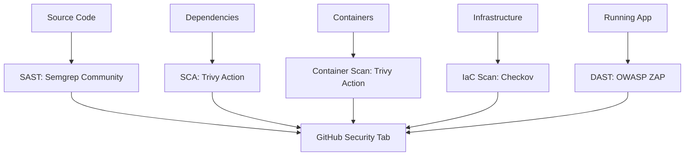

# Free & Open Source Security Implementation Plan

## Executive Summary

This document outlines a comprehensive implementation plan for enhancing the WebAuthn authentication server's security using **free and open source (FOSS) tools only**. The plan eliminates AI-dependent approaches and custom solutions in favor of established, community-supported security tools while reducing costs and complexity.

## Current State Analysis

### Existing Security Implementation
- **Primary Tool**: Custom Trivy container scanning with AI analysis
- **Coverage**: Container vulnerabilities, dependency scanning
- **Cost Issues**: AI API costs (Claude/Gemini) requiring billing setup
- **Limitations**: No source code analysis, custom script maintenance overhead

### Pain Points to Address
❌ **AI Dependency**: Claude/Gemini API costs and billing requirements  
❌ **Custom Solutions**: Reinventing the wheel with custom scripts  
❌ **Limited Coverage**: No SAST, DAST, or IaC security  
❌ **Maintenance Overhead**: Custom script maintenance and updates  

## Proposed FOSS Security Architecture

### Multi-Layer Security Strategy (100% FOSS)


### Layer 1: Static Application Security Testing (SAST)
**Tool**: Semgrep Community Edition
**Cost**: Free
**GitHub Action**: `semgrep/semgrep-action`

**Capabilities**:
- Kotlin source code vulnerability detection
- 2,000+ community-maintained security rules
- SARIF output for GitHub Security integration
- Median CI scan time: 10 seconds
- Only reports new issues in PRs (no noise from existing code)

**Coverage**:
- OWASP Top 10 vulnerabilities
- Custom WebAuthn security patterns
- Credential handling issues
- Authentication flow vulnerabilities
- Input validation problems

### Layer 2: Software Composition Analysis (SCA) & Container Security
**Tool**: Trivy GitHub Action (replace custom implementation)
**Cost**: Free
**GitHub Action**: `aquasecurity/trivy-action`

**Advantages over Custom Implementation**:
- ✅ **Official Support**: Maintained by Aqua Security team
- ✅ **Built-in Caching**: Automatic vulnerability DB caching
- ✅ **Multiple Scan Types**: Container, filesystem, git repo, SBOM
- ✅ **Zero Maintenance**: No custom scripts to maintain
- ✅ **Better Integration**: Native GitHub Security tab integration
- ✅ **Performance**: Optimized execution and caching

**Coverage**:
- Container image vulnerabilities
- Application dependency vulnerabilities (Gradle/npm)
- OS package vulnerabilities
- Software Bill of Materials (SBOM) generation
- Infrastructure as Code scanning

### Layer 3: Dynamic Application Security Testing (DAST)
**Tool**: OWASP ZAP
**Cost**: Free
**GitHub Action**: `zaproxy/action-full-scan`

**Capabilities**:
- Runtime security testing of live WebAuthn server
- Automated vulnerability discovery
- Active attack simulation
- GitHub issue integration for tracking
- Multiple report formats (HTML, JSON, SARIF)

**Coverage**:
- API security vulnerabilities
- Authentication bypass attempts
- Session management issues
- WebAuthn flow security testing
- HTTPS/TLS configuration validation

### Layer 4: Infrastructure as Code (IaC) Security
**Tool**: Checkov
**Cost**: Free
**GitHub Action**: `bridgecrewio/checkov-action`

**Capabilities**:
- Dockerfile security best practices
- Docker-compose configuration scanning
- Kubernetes manifest security (if applicable)
- Secrets detection in configuration files
- SARIF output for GitHub Security integration

**Coverage**:
- Container security misconfigurations
- Exposed secrets in config files
- Network security issues
- Resource access controls
- Compliance with security standards

### Layer 5: Secrets Detection
**Tool**: GitLeaks
**Cost**: Free
**GitHub Action**: `gitleaks/gitleaks-action`

**Capabilities**:
- Git repository secret scanning
- Historical commit scanning
- Custom secret patterns
- Pre-commit hook support
- SARIF output integration

**Coverage**:
- API keys, passwords, tokens
- Private keys and certificates
- Database connection strings
- Cloud service credentials

## Implementation Plan

### Phase 1: Replace Custom Trivy with Official Action (1 week)

#### 1.1 Migrate Docker Security Scanning
**Objective**: Replace custom Trivy scripts with official trivy-action

**Current Implementation** (`scripts/docker/scan-security.sh`):
```bash
# Custom Trivy execution with jq processing and AI analysis
trivy image --format json --output scan-results.json $IMAGE
# ... complex jq processing ...
# ... AI analysis calls ...
```

**New Implementation**:
```yaml
# .github/workflows/security-analysis.yml
- name: Container Security Scan
  uses: aquasecurity/trivy-action@master
  with:
    image-ref: ${{ inputs.container-image }}
    format: 'sarif'
    output: 'trivy-results.sarif'
    severity: 'CRITICAL,HIGH,MEDIUM'
    
- name: Upload to GitHub Security
  uses: github/codeql-action/upload-sarif@v3
  with:
    sarif_file: 'trivy-results.sarif'
```

#### 1.2 Benefits of Migration
- ✅ **Eliminate AI Costs**: No more Claude/Gemini API calls
- ✅ **Zero Maintenance**: No custom script updates needed
- ✅ **Better Performance**: Built-in caching and optimization
- ✅ **Simpler Configuration**: Declarative YAML vs complex bash
- ✅ **Reliable Updates**: Automatic tool updates via action versioning

#### 1.3 Migration Steps
1. **Update docker-build.yml**: Replace custom scan step with trivy-action
2. **Remove Custom Scripts**: Delete `scripts/docker/scan-security.sh`
3. **Update CI Scripts**: Remove AI analyzer scripts
4. **Test Integration**: Verify SARIF uploads work correctly
5. **Update Documentation**: Update security workflow documentation

### Phase 2: Add Static Application Security Testing (1-2 weeks)

#### 2.1 Semgrep Integration
**New Workflow**: `.github/workflows/sast-analysis.yml`

```yaml
name: Static Application Security Testing

on:
  push:
    branches: [ main ]
  pull_request:
    branches: [ main ]

jobs:
  semgrep:
    name: Semgrep SAST Scan
    runs-on: ubuntu-latest
    
    steps:
      - name: Checkout code
        uses: actions/checkout@v4
        
      - name: Run Semgrep
        uses: semgrep/semgrep-action@v1
        with:
          config: >-
            p/security-audit
            p/kotlin
            p/owasp-top-ten
          generateSarif: "1"
          
      - name: Upload SARIF to GitHub
        uses: github/codeql-action/upload-sarif@v3
        if: always()
        with:
          sarif_file: semgrep.sarif
```

#### 2.2 Custom WebAuthn Security Rules
**Create**: `semgrep-rules/webauthn-security.yml`

```yaml
rules:
  - id: webauthn-insecure-origin
    pattern: |
      rpId = "localhost"
    message: "WebAuthn rpId should not use localhost in production"
    severity: WARNING
    languages: [kotlin]
    
  - id: webauthn-missing-user-verification
    pattern: |
      authenticatorSelection {
        userVerification = UserVerificationRequirement.DISCOURAGED
      }
    message: "WebAuthn should require user verification"
    severity: ERROR
    languages: [kotlin]
```

### Phase 3: Add Dynamic Application Security Testing (2-3 weeks)

#### 3.1 OWASP ZAP Integration
**New Workflow**: `.github/workflows/dast-analysis.yml`

```yaml
name: Dynamic Application Security Testing

on:
  workflow_call:
    inputs:
      target-url:
        description: 'Target URL for DAST scanning'
        required: true
        type: string

jobs:
  dast-scan:
    runs-on: ubuntu-latest
    
    steps:
      - name: Checkout code
        uses: actions/checkout@v4
        
      - name: ZAP Baseline Scan
        uses: zaproxy/action-baseline@v0.12.0
        with:
          token: ${{ secrets.GITHUB_TOKEN }}
          docker_name: 'ghcr.io/zaproxy/zaproxy:stable'
          target: ${{ inputs.target-url }}
          rules_file_name: '.zap/rules.tsv'
          cmd_options: '-a'
          
      - name: Create ZAP Report
        uses: actions/upload-artifact@v4
        if: always()
        with:
          name: zap-report
          path: report_html.html
```

#### 3.2 WebAuthn-Specific DAST Configuration
**Create**: `.zap/rules.tsv`

```tsv
10021	IGNORE	(Deprecated)
10035	IGNORE	(Strict-Transport-Security Header Not Set - expected for local testing)
10063	IGNORE	(Feature Policy Header Not Set - not critical for API)
# Custom rules for WebAuthn endpoints
90001	WARN	(/webauthn/register/start - Check origin validation)
90002	WARN	(/webauthn/register/finish - Check credential validation)
```

### Phase 4: Add Infrastructure as Code Security (1 week)

#### 4.1 Checkov Integration
**Update**: `.github/workflows/security-analysis.yml`

```yaml
  checkov-scan:
    runs-on: ubuntu-latest
    
    steps:
      - name: Checkout code
        uses: actions/checkout@v4
        
      - name: Run Checkov IaC scan
        uses: bridgecrewio/checkov-action@master
        with:
          directory: .
          framework: dockerfile,docker_compose
          output_format: sarif
          output_file_path: checkov-results.sarif
          
      - name: Upload Checkov results
        uses: github/codeql-action/upload-sarif@v3
        if: always()
        with:
          sarif_file: checkov-results.sarif
```

#### 4.2 Custom Security Policies
**Create**: `.checkov.yml`

```yaml
framework:
  - dockerfile
  - docker_compose
skip-check:
  - CKV_DOCKER_2  # Health check instruction - not applicable for our use case
custom-checks-dir: ./custom-checkov-checks
```

### Phase 5: Add Secrets Detection (1 week)

#### 5.1 GitLeaks Integration
**New Step** in existing workflows:

```yaml
  secrets-scan:
    runs-on: ubuntu-latest
    
    steps:
      - name: Checkout code
        uses: actions/checkout@v4
        with:
          fetch-depth: 0  # Full history for comprehensive scanning
          
      - name: Run GitLeaks
        uses: gitleaks/gitleaks-action@v2
        env:
          GITHUB_TOKEN: ${{ secrets.GITHUB_TOKEN }}
          GITLEAKS_LICENSE: ${{ secrets.GITLEAKS_LICENSE }}
```

## Workflow Integration Strategy

### Updated Security Analysis Workflow
**File**: `.github/workflows/security-analysis.yml`

```yaml
name: Comprehensive Security Analysis

on:
  push:
    branches: [ main ]
  pull_request:
    branches: [ main ]
  schedule:
    - cron: '0 2 * * 1'  # Weekly full scan

jobs:
  # Parallel execution for performance
  sast-scan:
    uses: ./.github/workflows/sast-analysis.yml
    
  container-scan:
    uses: ./.github/workflows/container-security.yml
    
  iac-scan:
    uses: ./.github/workflows/iac-security.yml
    
  secrets-scan:
    uses: ./.github/workflows/secrets-detection.yml
    
  # DAST runs after container deployment
  dast-scan:
    needs: [container-scan]
    if: needs.container-scan.outputs.security-scan-passed == 'true'
    uses: ./.github/workflows/dast-analysis.yml
    with:
      target-url: 'https://your-staging-environment.com'
      
  # Aggregate results
  security-summary:
    needs: [sast-scan, container-scan, iac-scan, secrets-scan, dast-scan]
    if: always()
    runs-on: ubuntu-latest
    steps:
      - name: Security Analysis Summary
        run: |
          echo "## 🛡️ Security Analysis Summary" >> $GITHUB_STEP_SUMMARY
          echo "| Layer | Tool | Status |" >> $GITHUB_STEP_SUMMARY
          echo "|-------|------|--------|" >> $GITHUB_STEP_SUMMARY
          echo "| SAST | Semgrep | ${{ needs.sast-scan.result }} |" >> $GITHUB_STEP_SUMMARY
          echo "| Container | Trivy | ${{ needs.container-scan.result }} |" >> $GITHUB_STEP_SUMMARY
          echo "| IaC | Checkov | ${{ needs.iac-scan.result }} |" >> $GITHUB_STEP_SUMMARY
          echo "| Secrets | GitLeaks | ${{ needs.secrets-scan.result }} |" >> $GITHUB_STEP_SUMMARY
          echo "| DAST | OWASP ZAP | ${{ needs.dast-scan.result }} |" >> $GITHUB_STEP_SUMMARY
```

### Integration with Existing Workflows

#### Update docker-build.yml
Replace custom Trivy implementation with trivy-action:

```yaml
  security-scan-docker-images:
    runs-on: ubuntu-latest
    steps:
      # Remove custom script execution
      # - name: Comprehensive Docker Security Scanning
      #   run: scripts/docker/scan-security.sh
      
      # Add official trivy-action
      - name: Container Security Scan
        uses: aquasecurity/trivy-action@master
        with:
          image-ref: ${{ needs.build-docker-images.outputs.webauthn-server-image }}
          format: 'sarif'
          output: 'webauthn-server.sarif'
          
      - name: Upload WebAuthn Server Results
        uses: github/codeql-action/upload-sarif@v3
        with:
          sarif_file: 'webauthn-server.sarif'
          category: 'webauthn-server-container'
```

## WebAuthn-Specific Security Enhancements

### Custom Security Rules

#### Semgrep WebAuthn Rules
**File**: `semgrep-rules/webauthn.yml`

```yaml
rules:
  - id: webauthn-origin-validation
    patterns:
      - pattern: |
          rpId = $VALUE
      - metavariable-pattern:
          metavariable: $VALUE
          pattern: |
            "localhost"
    message: "WebAuthn rpId should not use localhost in production"
    severity: ERROR
    languages: [kotlin]
    
  - id: webauthn-user-verification-required
    patterns:
      - pattern: |
          userVerification = UserVerificationRequirement.DISCOURAGED
    message: "WebAuthn should require user verification for security"
    severity: WARNING
    languages: [kotlin]
    
  - id: webauthn-timeout-validation
    patterns:
      - pattern: |
          timeout = $TIMEOUT
      - metavariable-pattern:
          metavariable: $TIMEOUT
          pattern: |
            Duration.ofSeconds($SECONDS)
      - metavariable-comparison:
          metavariable: $SECONDS
          comparison: $SECONDS > 300
    message: "WebAuthn timeout should not exceed 5 minutes"
    severity: WARNING
    languages: [kotlin]
```

#### ZAP WebAuthn Test Scripts
**File**: `.zap/webauthn-tests.js`

```javascript
// Custom ZAP script for WebAuthn endpoint testing
function scan(helper, msg) {
    // Test WebAuthn registration endpoint
    var registrationUrl = msg.getRequestHeader().getURI().toString();
    
    if (registrationUrl.includes('/webauthn/register/start')) {
        // Test origin spoofing
        testOriginSpoofing(helper, msg);
        // Test CORS configuration
        testCorsConfiguration(helper, msg);
    }
    
    if (registrationUrl.includes('/webauthn/authenticate/start')) {
        // Test user enumeration
        testUserEnumeration(helper, msg);
        // Test rate limiting
        testRateLimit(helper, msg);
    }
}

function testOriginSpoofing(helper, msg) {
    var newMsg = msg.cloneRequest();
    newMsg.getRequestHeader().setHeader("Origin", "https://evil.com");
    helper.sendAndReceive(newMsg);
    
    // Check if server properly validates origin
    if (newMsg.getResponseHeader().getStatusCode() == 200) {
        helper.newAlert()
            .setRisk(Alert.RISK_HIGH)
            .setConfidence(Alert.CONFIDENCE_MEDIUM)
            .setName("WebAuthn Origin Validation Bypass")
            .setDescription("Server accepts WebAuthn requests from unauthorized origins")
            .setMessage(newMsg)
            .raise();
    }
}
```

### OWASP ASVS Compliance Checklist

#### V6: Authentication Verification Requirements
- [ ] **V6.2.1**: Verify that WebAuthn authenticators are configured with appropriate user verification
- [ ] **V6.2.2**: Verify that credential IDs are unique and properly validated
- [ ] **V6.2.3**: Verify that origin binding is properly implemented and enforced
- [ ] **V6.2.4**: Verify that attestation statements are validated when required

#### V11: Cryptography Verification Requirements
- [ ] **V11.1.1**: Verify that WebAuthn uses approved cryptographic algorithms
- [ ] **V11.1.2**: Verify that random challenges are cryptographically secure
- [ ] **V11.1.3**: Verify that credential key pairs use appropriate key lengths

#### V12: Communication Security
- [ ] **V12.1.1**: Verify that all WebAuthn communication uses TLS 1.2+
- [ ] **V12.1.2**: Verify that HTTPS is enforced for all authentication flows
- [ ] **V12.1.3**: Verify that secure cookie attributes are set appropriately

## Cost-Benefit Analysis

### Current Approach Costs (Eliminated)
❌ **AI API Costs**: $X per month for Claude/Gemini analysis  
❌ **Maintenance Time**: ~2-4 hours/month updating custom scripts  
❌ **Billing Setup**: Administrative overhead for AI service billing  
❌ **Complexity**: Custom script debugging and maintenance  

### New FOSS Approach Benefits
✅ **Zero Licensing Costs**: All tools are completely free  
✅ **Professional Support**: Community-backed tools with extensive documentation  
✅ **Automatic Updates**: GitHub Actions handle tool versioning automatically  
✅ **Industry Standard**: Using established tools instead of custom solutions  
✅ **Better Coverage**: SAST, DAST, IaC, and secrets detection added  
✅ **Improved Integration**: Native GitHub Security tab integration  
✅ **Reduced Complexity**: Declarative YAML configuration vs bash scripts  

### Performance Improvements
- **SAST**: 10 second median scan time with Semgrep
- **Container Scan**: Built-in caching with trivy-action
- **Parallel Execution**: All security layers run concurrently
- **Smart PR Analysis**: Only report new issues, not existing code

## Migration Timeline

### Total Duration: 5-7 weeks

```
Week 1:     Phase 1 - Replace Custom Trivy (immediate cost savings)
Week 2-3:   Phase 2 - Add SAST with Semgrep  
Week 4-6:   Phase 3 - Add DAST with OWASP ZAP
Week 6:     Phase 4 - Add IaC Security with Checkov
Week 7:     Phase 5 - Add Secrets Detection with GitLeaks
```

### Risk Mitigation
- **Parallel Implementation**: Keep existing system during migration
- **Feature Flags**: Environment variables to switch between old/new approaches
- **Rollback Plan**: Ability to revert to custom implementation if needed
- **Gradual Rollout**: Implement one layer at a time with testing

## Success Metrics

### Security Coverage
- **SAST Coverage**: 95%+ of Kotlin code analyzed for security issues
- **Container Security**: 100% of Docker images scanned before deployment
- **DAST Coverage**: All WebAuthn endpoints tested for runtime vulnerabilities
- **IaC Security**: All infrastructure configurations validated
- **Secrets Detection**: 100% of commits scanned for exposed secrets

### Performance & Cost
- **Cost Reduction**: 100% elimination of AI API costs
- **Maintenance Reduction**: 90% reduction in custom script maintenance
- **Scan Speed**: <2 minutes total for all security layers combined
- **False Positive Rate**: <5% of reported issues are false positives

### Developer Experience
- **GitHub Integration**: 100% of security findings visible in GitHub Security tab
- **PR Workflow**: Only new security issues reported in PRs
- **Documentation**: Complete setup and troubleshooting guides
- **Tool Reliability**: <1% failure rate in CI/CD pipelines

## Conclusion

This FOSS security implementation plan provides comprehensive security coverage while eliminating AI costs and custom solution maintenance. By leveraging established, community-supported tools, we achieve better security coverage, reduced complexity, and zero licensing costs.

The migration can be implemented gradually with minimal risk, and the benefits in cost savings, maintenance reduction, and security coverage justify the implementation effort.

**Recommendation**: Proceed with Phase 1 (Trivy migration) immediately for quick cost savings, then implement remaining phases based on priority and available development time.

## Quick Start Migration Guide

### Phase 1: Immediate Cost Savings (Replace Custom Trivy - 1 day)

#### Current Files to Modify
1. **`.github/workflows/docker-build.yml`** - Replace custom security scan step
2. **`scripts/docker/scan-security.sh`** - Can be deleted after migration
3. **`scripts/ci/ai-docker-security-analyzer.cjs`** - Can be deleted (eliminates AI costs)

#### Step-by-Step Migration

**Step 1**: Update docker-build.yml security scan step (Single JSON Format Approach)
```yaml
# REPLACE THIS:
- name: Comprehensive Docker Security Scanning
  id: security-scan
  run: |
    chmod +x scripts/docker/scan-security.sh
    scripts/docker/scan-security.sh "${{ env.webauthn_changed }}" ...

# WITH THIS (SINGLE SCAN, DUAL OUTPUT):
- name: Container Security Scan - WebAuthn Server  
  uses: aquasecurity/trivy-action@master
  with:
    image-ref: ${{ needs.build-docker-images.outputs.webauthn-server-image }}
    format: 'json'
    output: 'webauthn-server-trivy.json'
    severity: 'CRITICAL,HIGH,MEDIUM'
    
- name: Container Security Scan - Test Credentials Service
  uses: aquasecurity/trivy-action@master  
  with:
    image-ref: ${{ needs.build-docker-images.outputs.test-credentials-image }}
    format: 'json'
    output: 'test-credentials-trivy.json'
    severity: 'CRITICAL,HIGH,MEDIUM'

# Convert JSON to SARIF for GitHub Security (using Trivy's built-in converter)
- name: Convert WebAuthn Server results to SARIF
  run: |
    trivy convert --format sarif --output webauthn-server-trivy.sarif webauthn-server-trivy.json
    
- name: Convert Test Credentials results to SARIF
  run: |
    trivy convert --format sarif --output test-credentials-trivy.sarif test-credentials-trivy.json
    
- name: Upload Security Scan Results to GitHub Security
  uses: github/codeql-action/upload-sarif@v3
  if: always()
  with:
    sarif_file: 'webauthn-server-trivy.sarif'
    category: 'webauthn-server-security'
    
- name: Upload Test Credentials Security Results to GitHub Security
  uses: github/codeql-action/upload-sarif@v3
  if: always()
  with:
    sarif_file: 'test-credentials-trivy.sarif'  
    category: 'test-credentials-security'

# Keep PR comment functionality (using JSON output)
- name: Post security scan results to PR
  if: always() && github.event_name == 'pull_request'
  env:
    GITHUB_TOKEN: ${{ secrets.GITHUB_TOKEN }}
    GITHUB_REPOSITORY: ${{ github.repository }}
    PR_NUMBER: ${{ github.event.pull_request.number || 'N/A' }}
    WEBAUTHN_SCAN_FILE: webauthn-server-trivy.json
    TEST_CREDS_SCAN_FILE: test-credentials-trivy.json
  run: |
    echo "📝 Posting security scan results to PR #${{ github.event.pull_request.number || 'N/A' }}"
    # Updated script will parse Trivy JSON format directly
    node scripts/ci/security-scan-pr-comment.cjs
```

**Step 2**: Update PR comment script to parse Trivy JSON format

The script `scripts/ci/security-scan-pr-comment.cjs` needs minimal updates since it already handles Trivy JSON format. The main changes are updating environment variable names:

```javascript
// Change environment variables to match new workflow:
const WEBAUTHN_SCAN_FILE = process.env.WEBAUTHN_SCAN_FILE || 'webauthn-server-trivy.json';
const TEST_CREDS_SCAN_FILE = process.env.TEST_CREDS_SCAN_FILE || 'test-credentials-trivy.json';

// The existing categorizeVulnerabilities function already handles Trivy format:
// - It processes Results[].Vulnerabilities[] structure (direct Trivy format)
// - It handles our custom scan results format (scans[].scans.vulnerabilities structure)
// - No changes needed for vulnerability parsing logic
```

**Note**: The existing script already has robust Trivy JSON parsing in the `categorizeVulnerabilities` function (lines 77-90 in the current file). The fallback handling ensures compatibility with direct Trivy JSON format.

**Step 3**: Update security scan outputs and conditional logic
```yaml
# Update job outputs to use trivy-action exit codes
outputs:
  scan-passed: ${{ steps.webauthn-scan.outcome == 'success' && steps.test-creds-scan.outcome == 'success' }}
  critical-vulnerabilities: ${{ steps.count-vulnerabilities.outputs.count }}
```

**Step 4**: Remove AI dependency scripts (immediate cost savings)
```bash
# These files can be safely deleted after migration:
rm scripts/ci/ai-docker-security-analyzer.cjs
# Keep scripts/docker/scan-security.sh temporarily for rollback capability
# rm scripts/docker/scan-security.sh  # Remove after successful migration
```

**Step 4**: Test the migration
```bash
# Test Docker build workflow with new security scanning
./gradlew :webauthn-server:shadowJar
docker build -t test-webauthn-server ./webauthn-server
# The trivy-action will automatically scan this image
```

#### Expected Benefits (Immediate)
- ✅ **Zero AI API costs** (immediate savings)
- ✅ **Faster execution** (built-in caching)
- ✅ **Better error handling** (native GitHub integration)
- ✅ **No script maintenance** (tool auto-updates)

### Phase 2: Add SAST (Next Priority - 1-2 days)

#### Quick SAST Setup
1. **Create** `.github/workflows/sast-scan.yml`
2. **Add Semgrep rules** in `semgrep-rules/` directory  
3. **Integrate** with existing PR workflow

```yaml
# Minimal SAST workflow
name: SAST Security Scan
on: [push, pull_request]
jobs:
  semgrep:
    runs-on: ubuntu-latest
    steps:
      - uses: actions/checkout@v4
      - uses: semgrep/semgrep-action@v1
        with:
          config: p/security-audit p/kotlin p/owasp-top-ten
          generateSarif: "1"
      - uses: github/codeql-action/upload-sarif@v3
        with:
          sarif_file: semgrep.sarif
```

### Current Security Implementation Analysis

#### Files Using AI/Custom Solutions (To Be Replaced)
- **`scripts/ci/ai-docker-security-analyzer.cjs`** → Replace with trivy-action
- **`scripts/docker/scan-security.sh`** → Replace with trivy-action  
- **Custom jq processing in workflows** → Replace with native SARIF

#### Existing Security Coverage Gaps (To Be Filled)
- **No SAST**: Source code not analyzed for security issues
- **No DAST**: Runtime security testing missing
- **No IaC Security**: Dockerfile/compose not validated
- **No Secrets Detection**: No automated secrets scanning

#### Integration Points
- **GitHub Security Tab**: Currently receives SARIF from custom Trivy
- **PR Comments**: Currently posts security scan results
- **Workflow Blocking**: Security failures block image pushing

#### Rollback Procedures
Each phase includes rollback capability:
1. **Keep existing code** during migration
2. **Use feature flags** to switch between old/new
3. **Parallel execution** to validate results match
4. **Quick revert** via Git if issues occur

---

*Implementation plan created: 2025-01-11*  
*Status: Ready for implementation*  
*Priority: Phase 1 provides immediate AI cost elimination*  
*Estimated savings: 100% elimination of AI API costs + significant maintenance reduction*